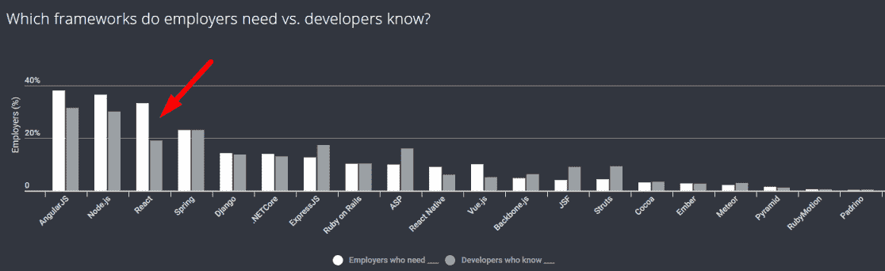

# 本周数字:React 开发者的行业需求

> 原文：<https://thenewstack.io/week-numbers-industry-demand-react-developers/>

今年早些时候，我们[报道了](https://thenewstack.io/blockchain-hot-react-js-top/)React 戏剧性地成为黑客新闻招聘中引用的最高技能。现在，HackerRank 的 [2018 年开发者技能报告](https://blog.hackerrank.com/digging-into-the-2018-developer-skills-report/)提供了更多证据，表明你应该提高使用 JavaScript 框架的能力。该报告基于 39，441 份回复，其中大部分来自开发商，其他来自雇主。

简而言之，33%的雇主需要 React 技能，但只有 19%的开发人员表示他们知道 React。与了解该框架的雇主相比，想要 [Vue.js](https://vuejs.org/) 的雇主受访者是前者的两倍，但总需求远低于领导者。

点击图像放大

尽管 Angular 和 Node.js 有更多的雇主引用它们，但这些框架有更多的开发人员准备满足需求。由于 Angular 已经过渡到较新的版本，所以它的原始版本和较新的 Angular 2 版本之间可能会有很大的差异。一些框架的开发人员懂得这种语言的比例比需要它们的雇主高。 [JavaServer Faces](http://www.oracle.com/technetwork/java/javaee/javaserverfaces-139869.html) (JSF)和 [Struts](https://struts.apache.org/) 是值得注意的例子，因为它们是 Java 而不是 JavaScript 框架。

由于 HackerRank 的社区是围绕编码竞赛和在线培训构建的，因此这一结果意味着该公司应该采取更多措施来推动开发人员学习 React。目前使用 Angular 或 Node.js 的开发人员似乎不会失业。事实上，StackOverflow 的 [2017 年开发者调查](https://insights.stackoverflow.com/survey/2017#technology-most-loved-dreaded-and-wanted-frameworks-libraries-and-other-technologies)表明了对这三者的强烈兴趣。

读者应该注意，雇主的数量不一定代表具体的职位空缺。此外，读者应该小心推断发现，因为样本可能不代表世界范围的社区。

<svg xmlns:xlink="http://www.w3.org/1999/xlink" viewBox="0 0 68 31" version="1.1"><title>Group</title> <desc>Created with Sketch.</desc></svg>