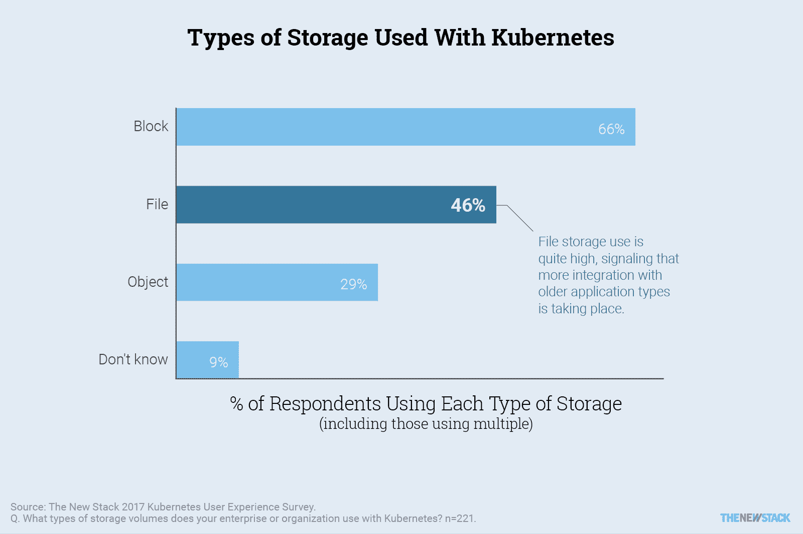
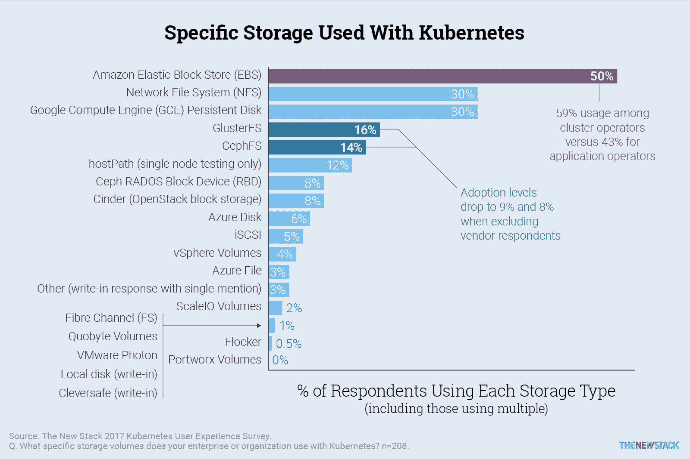
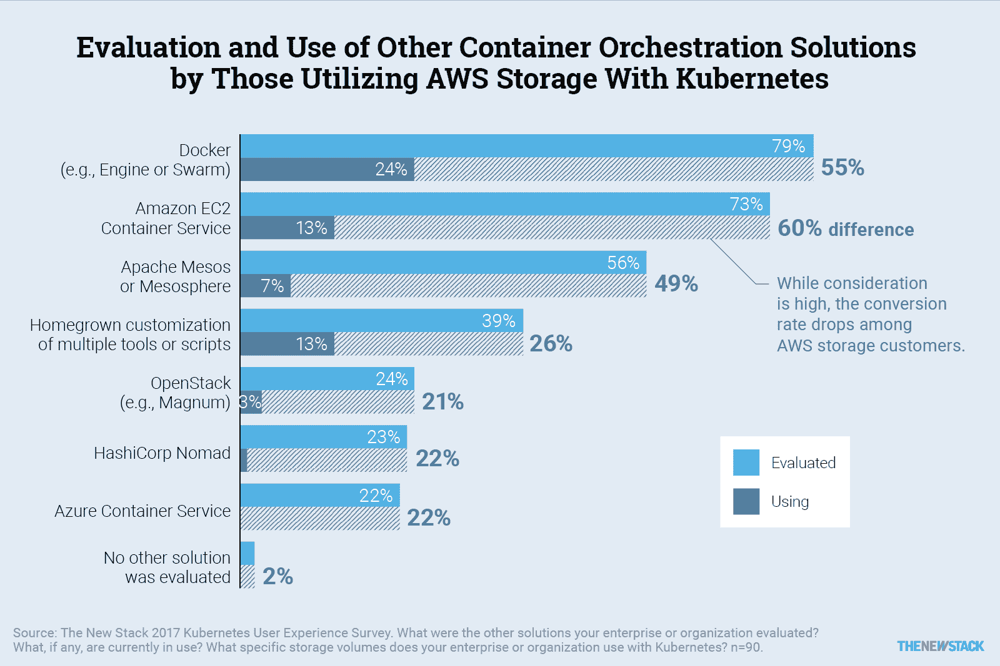

# 本周数字:Kubernetes 的集装箱存储偏好

> 原文：<https://thenewstack.io/week-numbers-innovative-storage-vendors-underperform-entrenched-tech-among-kubernetes-users/>

今天的 [Kubernetes](/category/kubernetes/) 部署中使用的逻辑存储结构类型对正在部署的工作负载的性质提供了一些更深入的揭示。数据块存储是王道，在我们对[Kubernetes 生态系统状态](https://thenewstack.io/ebooks/kubernetes/state-of-kubernetes-ecosystem/)的调查中，三分之二(66%)的受访者认为这与他们的 Kubernetes 实施有关。

很少有部署只使用一种类型的逻辑存储，因此只有不到一半的受访者(46%)将文件存储作为他们正在使用的类型，这很能说明问题。具有微服务架构并利用数据库或数据结构的较新的云原生应用程序通常不需要文件系统，因为它们不通过操作系统与数据交互。46%的数字相当高，表明与旧应用程序类型的集成越来越多。

29%的受访者使用对象存储，这与我们过去看到的对象存储采用率相比相对较高。由于对象存储是可伸缩的，在分布式系统上工作的开发人员可能已经有了这方面的经验。此外，对象存储通常用于为网站交付静态内容，这也是 Kubernetes 的常见工作负载类型。

## 

## 逻辑存储服务提供商

我们向受访者提供了一份具体的逻辑存储系统品牌、项目和技术的列表，并要求他们列举他们的 Kubernetes 部署中使用的所有产品。我们也给了他们一个机会来写我们没有列出的替代方案。其中一些是商业产品或服务，而另一些是开源项目。

部分由于其在云市场的强势地位，[Amazon Elastic Block Storage](https://aws.amazon.com/ebs/)在所有 Kubernetes 实施中被半数(整整 50 %)的调查受访者提及。诚然，与谷歌在云领域的市场份额相比，谷歌在早期 Kubernetes 采用者中的尊重地位可能发挥了更大的说服力，推动了高比例的受访者(30%)引用 [GCE 持久磁盘](https://cloud.google.com/persistent-disk/)。因此，这些结果并不能说明谷歌拥有亚马逊五分之三的市场份额。

另一个表明谷歌在我们群体中可能有优势的指标是，只有 6%的受访者提到使用微软 Azure 品牌的逻辑存储。因此，微软的云市场份额在这里显然被低估了。可能的原因是 Kubernetes 在 2017 年 2 月才成为[微软的官方产品。随着其 Azure 堆栈变得更加广泛可用，除了 Azure 之外，其客户应该有更多的存储选项可用。因此，我们预计 Azure 开发者将比其他云的客户更有可能利用他们直接从主要云服务提供商以外的来源购买的存储。](https://thenewstack.io/understanding-azure-container-service-azure-service-fabric/)

[cyclone slider id = " kubernetes-series-book-1-赞助商"]

由于集群操作员通常属于 IT 运营团队，因此从逻辑上讲，他们更有可能使用内部存储资源。至少在我们的调查参与者中，情况并非如此。大约 59%的集群运营商使用 AWS 存储，但只有 43%的应用运营商(DevOps)使用 AWS 存储。也许使用 AWS 云可以让 SREs 专注于基础设施监控，而不是遭受与管理硬件相关的持续头痛。

许多受访者表示，他们使用特定的基于文件的存储系统，NFS 是最常被提及的(30%)，其次是[GlusterFS](https://www.gluster.org/)(16%)和[ceph fs](https://thenewstack.io/converging-storage-cephfs-now-production-ready/)(14%)。然而，后两者更经常被供应商引用。除去这些供应商，剩下的只有 9%使用 GlusterFS，8%使用 CephFS。很有可能，这些供应商受访者中有许多受雇于 [Red Hat](https://www.openshift.com/) (利用所有这三个系统)或其众多合作伙伴之一。这将符合我们之前看到的趋势，即 [OpenStack](https://www.openstack.org/) 供应商比其他供应商更多地采用 Red Hat 支持的存储标准。

集装箱专用存储解决方案很少被引用。也许随着越来越多的持久性工作负载转移到容器，对专用存储选项的需求可能会增加。另一种可能性与方便有关。用户可能更喜欢他们已经知道的存储或对他们来说最容易访问的存储。后一种解释对于那些追随现已解散的 ClusterHQ 脚步的创业公司来说并不是什么好兆头。

## AWS 会受益吗？

我们向调查参与者提供了一个包含七个容器平台的列表，以及一个没有选择的选项，并要求他们选择他们的组织目前正在评估的以及他们目前正在使用的所有平台。我们在受访者中看到了一组有趣的结果，他们也表示正在将 Amazon AWS 存储服务与其 Kubernetes 部署结合使用。

在对我们的调查做出回应的 Kubernetes 评估者中，将近四分之三(73%)在 Kubernetes 中使用 AWS 存储的受访者对[亚马逊 EC2 容器服务](https://aws.amazon.com/ecs/)给予了一些考虑。高层次的考虑主要是因为 AWS 的整体基础设施即服务(IaaS)市场份额。然而，这些人中很少有人(18%)最终真正使用了 ECS。

展望未来，新的堆栈将继续监测与集装箱相关的存储解决方案的吸收。也许容器的持久存储问题会得到解决。另一种可能是，现有的存储方法将继续存在。

查看我们的新电子书[了解更多信息。](https://thenewstack.io/ebooks/kubernetes/state-of-kubernetes-ecosystem/)

谷歌、[微软](https://azure.microsoft.com/en-us/?v=17.14)、[open Stack 基金会](https://www.openstack.org/)和[红帽](https://www.openshift.com/)是新堆栈的赞助商。

由 [Max Lakutin](https://unsplash.com/@lktnm) 在 [Unsplash](https://unsplash.com/?utm_source=unsplash&utm_medium=referral&utm_content=creditCopyText) 上拍摄的特征图像。

<svg xmlns:xlink="http://www.w3.org/1999/xlink" viewBox="0 0 68 31" version="1.1"><title>Group</title> <desc>Created with Sketch.</desc></svg>