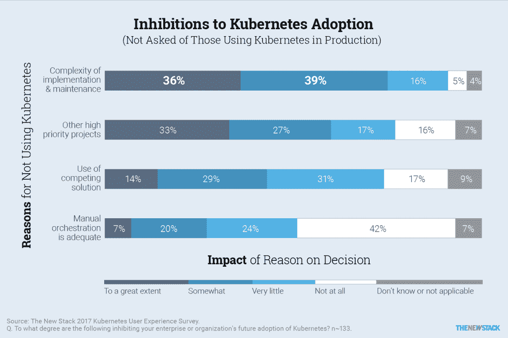
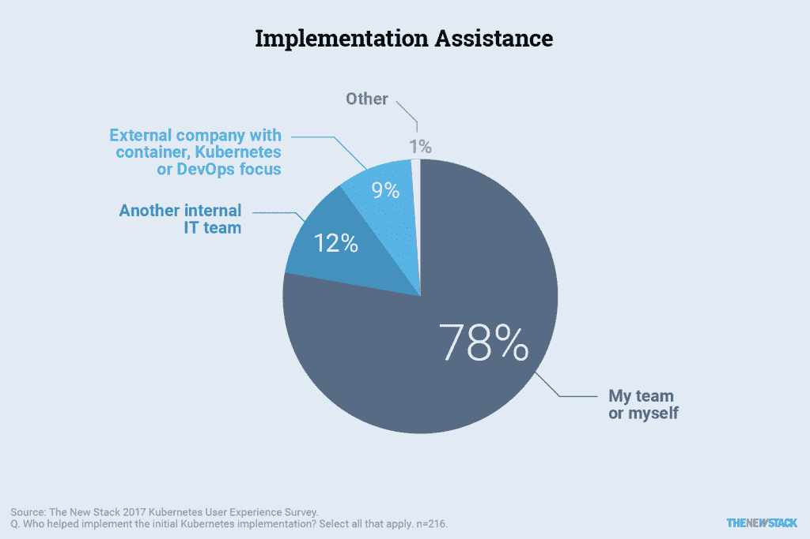
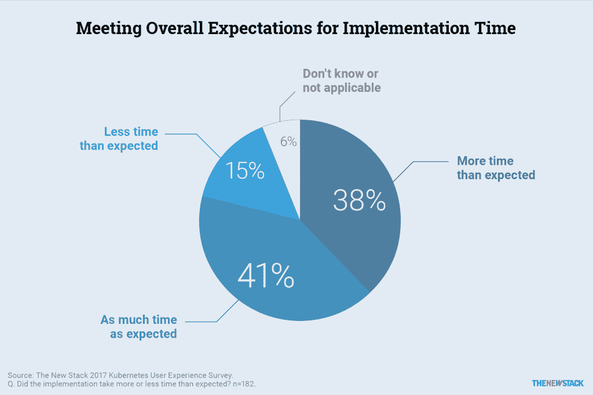
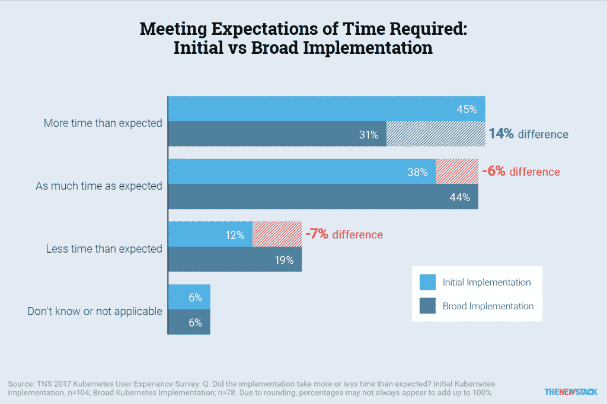
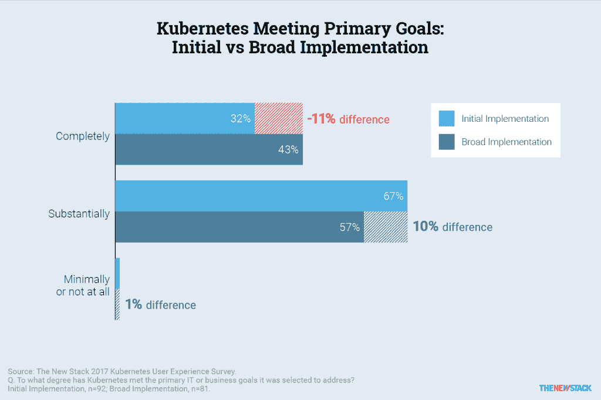

# Kubernetes 实现:好的、坏的和丑陋的

> 原文：<https://thenewstack.io/week-numbers-kubernetes-implementations-good-bad-ugly/>

编者按:在这份摘自新书库电子书的摘录中

[The State of the Kubernetes Ecosystem](https://thenewstack.io/ebooks/kubernetes/state-of-kubernetes-ecosystem/)*, research director Lawrence Hecht asks readers to assess the challenges they may be facing in adopting Kubernetes in production for their organizations, and how they may be responding to them.*

[Kubernetes](/category/kubernetes/) “尽管这个市场现在还很年轻，但在容器编排市场中的感知优势既不确定也不明确。它的生存可能还取决于竞争对手满足客户对编排基本要求的期望的能力。在未来，企业可能会寻找捆绑或包含在更大平台中的解决方案，或者他们可能会在发现已经与他们已经投资的平台捆绑在一起时，简单地接受这些解决方案。

Kubernetes 开发社区需要解决阻碍其采用的因素，尤其是那些尚未做出承诺的评估者。

## 抑制因素和障碍

【T2

正如我们所见，对于过去评估 Kubernetes 但选择了另一条道路的人来说，敏捷性更重要。我们明确地询问了这个小组，以及目前正在评估 Kubernetes 但尚未投入使用的小组，是什么阻碍了他们的采用？

我们给这些小组列出了四类采纳抑制因素，并要求他们按照从“很大程度上”到“不适用”的五分制对每一类进行评分。Kubernetes 实施的复杂性在很大程度上阻碍了 36%的受访者的采用。在这些小组中，四分之三的受访者认为复杂性在某种程度上是一个重要的抑制因素。然而，对复杂性的担忧在那些评估并拒绝 Kubernetes 的组织中更加明显。

[cyclone slider id = " kubernetes-series-book-1-赞助商"]

另一个大的障碍是其他项目的优先级更高。其中五个小组中的大约三名受访者将其他地方的更高优先级项目列为重要问题，三分之一的受访者将 Kubernetes 的低优先级项目评为最高。对于这些公司来说，Kubernetes 的采用可能要等到其他组织发现它的成功。

另一个因素不太可能阻碍采用。受访者明确表示，他们认为手动编排不是一个选项，在这些分组中，只有 7%的受访者将手动编排作为他们的主要抑制因素。在那些不使用 Kubernetes 的组织中，42%的人说手动编排根本不是阻碍因素。只有 14%的受访者表示他们的组织使用竞争解决方案是一个重要的抑制因素。

## Kubernetes 的复杂性名声是否名副其实？

Kubernetes 以实现的复杂性而闻名，尤其是在拒绝将其部署到生产环境中的机构中。那些采用这种声誉的组织是否分享了这种声誉的一部分？

我们问了一些领养者的问题来弄清楚这个问题。为了让您更好地了解该小组与实施的实际关系，大约 78%的受访者告诉我们，他们或他们的团队直接负责实施 Kubernetes。

## 实施时间比预期的长

我们询问这些实现者，他们的组织对 Kubernetes 的实现是否消耗了他们最初估计的那么多时间，或者更多或更少。大约 38%的被调查者说花费的时间比预期的长，而只有 15%的人说花费的时间少。复杂性可能是罪魁祸首，即使只是部分原因。

对于那些说 Kubernetes 的实现比他们预期的要花更多时间的人来说，随着他们的实现经验的增加，这个百分比下降了。具体来说，那些广泛实施的人比那些刚刚开始实施的人低 14 分，因为他们花了太多时间。这清楚地表明，相当多的实现者——尽管肯定不是所有的——一旦投入工作后，确实会对 Kubernetes 感到更舒服。

一位在小企业工作的评论者提供了一些充满希望的见解:

*   *“[它]花费了比预期更多的时间，因为部署和管理 K8s 群集非常复杂，而且一年前的文档记录很差。今天轻松多了。”*

虽然安装和配置阶段可能会导致延迟，但一些评论者解释说，组织动态是最大的时间消耗。以下是一些例子:

*   *“组织和程序上的障碍很难克服。你需要一个全公司的计划来给这个机会。”*[>1000 名员工]
*   *“我们低估了让每个人都采用连续交付所需要的工作量，但是无论如何那都已经过期了。”*【101-1000 名员工】

显然，迁移到微服务架构是一个不能轻易仓促完成的过程。

## 是否存在放松实施的市场机会？

如果 Kubernetes 很复杂，需要时间来实现，那么新兴公司可能有机会提供独特的价值主张来帮助解决问题。也许吧。但到目前为止，还没有。

我们在 Kubernetes 采用的初始和广泛阶段询问参与者，该采用的当前状态是否完全、基本或最低程度地满足了他们组织的期望。虽然只有 32%的初始阶段受访者表示 Kubernetes 完全满足了他们公司的期望，但大约 43%的广泛阶段受访者完全满意。这肯定是正确的方向。尽管只有不到一半的广泛阶段群体完全满意，但请记住，Kubernetes 生态系统或市场只有两岁，比一些分析公司认为的成熟市场的要求年轻整整一年。

[cyclone slider id = " kubernetes-series-book-1-赞助商"]

大约 9%的受访者告诉我们，他们确实依赖外部公司的帮助和支持来在其组织中实施 Kubernetes。似乎雇佣这样的公司确实有一些影响，因为只有五分之一的受访者(20%)表示实施时间比预期的长，这比所有 Kubernetes 用户中 38%的人抱怨耗时有所改善。

只有 31%的广泛实施者表示实施时间比预期的要长，这是另一个进步，这一次有 45%的初次实施者抱怨耗时。

总的来说，Kubernetes 正在赢得期望游戏。根据 Kubernetes 的 173 名生产级用户的调查，整整 99%的用户表示该平台已经完全或基本满足了他们的 IT 或业务目标。诚然，Kubernetes 对这些公司通过了评估阶段。在评估阶段，对被评估产品的期望通常会变得与该产品更加一致。

虽然使用一个平台或供应商发行版应该会使事情变得更容易(至少，供应商是这样说的)，但这只是将那些完全满意的人的比例提高了几个百分点。更多的投资可能带来更高的期望。

## 选择提供实施支持的公司

电子书的解决方案目录包括各种各样的产品和服务，使得 Kubernetes 的实施更加容易。下面是一些为实施 Kubernetes 提供咨询服务和支持的公司。值得注意的是，自发布以来，[云原生计算基金会](https://www.cncf.io/)推出了 [Kubernetes 认证服务商](https://www.cncf.io/certification/kcsp/)计划，帮助企业挑选合格的实施合作伙伴。

*   **Apprenda Kubernetes 支持** **:** 为 Kubernetes 提供专业支持，以处理原始实施和持续运营。Apprenda 提供三层支持，包括按事件付费。
*   **[Endocode](https://endocode.com/kubernetes/) :** 一家德国软件工程公司，为几个与容器相关的项目提供了许多帮助。提供与 Kubernetes 相关的咨询服务。
*   **[Heptio 专业服务和支持](https://www.heptio.com/) :** Heptio 是由 Kubernetes 项目创始人创建的公司，旨在支持和推进开放的 Kubernetes 生态系统。
*   **[jet stack Container Services](http://www.jetstack.io/):**jet stack 是一家咨询公司，致力于帮助企业构建集装箱管理基础设施。
*   Kubernauts:Kubernauts 是一家非营利性组织，提供培训和咨询服务。它管理着 Kubernauts 全球会议。
*   **[Kumina 托管 Kubernetes](https://www.kumina.nl/managed_kubernetes) :** Kumina 是一家提供托管服务的荷兰咨询公司。
*   **LiveWyer，Kubernetes 服务管理人:** LiveWyer 是一家管理 Kubernetes 实施并提供 Kubernetes 培训的咨询公司。
*   **[ReactiveOps](https://www.reactiveops.com/) :** 基于 Kubernetes 定制构建 DevOps 平台。

<svg xmlns:xlink="http://www.w3.org/1999/xlink" viewBox="0 0 68 31" version="1.1"><title>Group</title> <desc>Created with Sketch.</desc></svg>