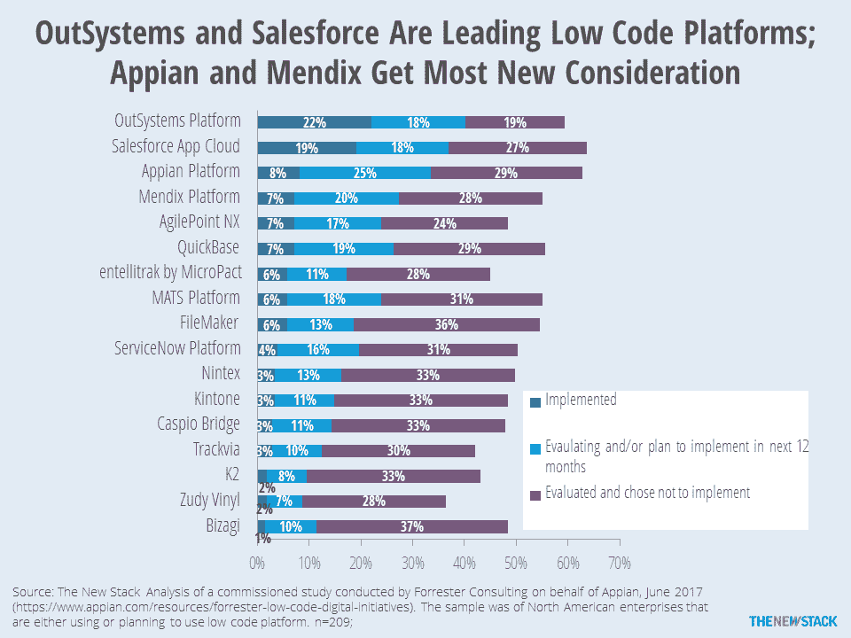

# 本周数字:许多低代码供应商已经被拒绝

> 原文：<https://thenewstack.io/week-numbers-lots-low-code-vendors-already-rejected/>

低代码工具就是这一代的所见即所得。曾经真正的产品类别现在只是描述捆绑到更大产品中的功能。低码平台会面临同样的命运吗？

从理论上讲，这些解决方案降低了开发成本，并支持业务流程转换。事实上，我们仍然不知道这些好处在多大程度上促进了采用。由 [Forrester Research](https://go.forrester.com/) 进行并由业务流程管理供应商 [Appian](https://www.appian.com/) 赞助的对 209 名路线图中低代码的人的[调查显示了哪些公司将会受益。OutSystems](https://www.appian.com/resources/forrester-low-code-digital-initiatives) 是最广泛采用的，有 22%的受访者使用它们。Salesforce 的应用云以 19%的份额紧随其后。我们看到了为什么 Appian 赞助这项调查；25%的受访者正在评估或计划在明年购买。在有机会获得新客户的供应商中， [Mendix](https://www.mendix.com/) 以 20%的份额位居第二。

被问到的其他 13 家供应商中的大多数都面临着巨大的损失。除了一家供应商之外，所有供应商都至少接受了 40%的调查对象的评估。然而，大多数知道这些供应商的人已经评估并拒绝了他们。这表明，要么市场上的顶级供应商远远超过其他人，要么一些产品急于将自己与最新的流行词联系起来。你认为古代的[锉刀匠](http://www.filemaker.com/)符合这个描述吗？

通过 Pixabay 的特征图像。

<svg xmlns:xlink="http://www.w3.org/1999/xlink" viewBox="0 0 68 31" version="1.1"><title>Group</title> <desc>Created with Sketch.</desc></svg>