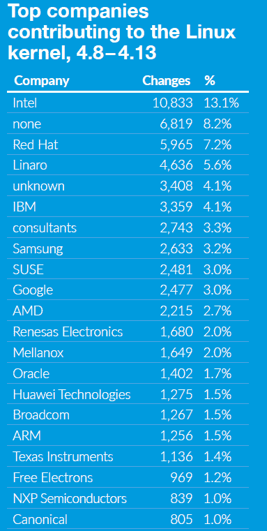
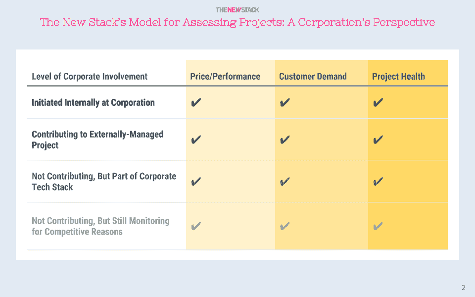

# 本周数字:理解开源项目

> 原文：<https://thenewstack.io/week-numbers-making-sense-open-source-projects/>

评估谁对开源项目做出了贡献并不像对 GitHub API 运行几个查询那么简单。然而，正如我们继续看到的，这并没有阻止人们去尝试。

[雷德莫克](http://redmonk.com/)的[詹姆斯总督](https://twitter.com/monkchips)重复了关于使用 GitHub stars 的风险。我们同意这一点，因为它们可以被游戏化，并且只是在一部分开发者中暂时流行的一种衡量标准。正如我们在之前关于[所写的，GitHub 组织是衡量一个公司开源活动的一个糟糕的方法。](https://thenewstack.io/week-numbers-comparing-corporate-open-source-contributions-github-organizations/)

一个更好但仍有局限性的方法是查看贡献者的电子邮件地址来识别他们的雇主。[谷歌](https://cloud.google.com/kubernetes-engine)的[费利佩·霍法](https://twitter.com/felipehoffa) [使用这种方法](https://medium.freecodecamp.org/the-top-contributors-to-github-2017-be98ab854e87)报告称，微软在 2017 年有超过 1300 名员工推动贡献，其中谷歌提供了 911 名，亚马逊提供了 134 名。正如 Felix 在他的方法论中解释的那样，数据被过滤以排除许多合法活跃的存储库和贡献者。

此外，它排除了那些仅仅提交问题的参与者，以及那些在大部分开发活动中使用版本控制系统的整个组织。

然而，可以对非 GitHub 项目进行类似的分析。例如， [2017 年 Linux 内核开发状态](https://www.linuxfoundation.org/2017-linux-kernel-report-landing-page/)确定了参与最近 Linux 内核开发的顶级组织。不出所料，英特尔、[红帽](https://www.openshift.com/)和 Linaro 名列榜首，许多芯片生产商都出现了。然而，该报告还称，超过 8%的贡献者来自一家名为“none”的公司，另外 4%来自“unknown”这不是一个错误。虽然未知意味着贡献者的身份和/或从属关系不能被识别，但是“无”表示开发者可能在 bit 公司有一份日常工作，但是他们自己在做工作。

有人要做什么？他们能使用 GitHub 统计数据来识别赢家和输家吗？比如，数据能“证明”AWS 不像其他云提供商那样致力于开源吗？公司也许应该对他们的软件开发过程进行基准测试，但是根据什么标准呢？

虽然没有简单的答案，[Linux 基金会](https://www.linuxfoundation.org/)正在通过[社区健康分析开源软件](https://chaoss.community/) (CHAOSS)项目支持标准化工作。在这个小组中有一个[度量委员会](https://wiki.linuxfoundation.org/chaoss/metrics)试图定义与实现无关的度量标准来评估开源社区的健康和可持续性。CHAOSS 度量委员会的目标是建立与实现无关的度量标准来衡量社区活动。

换句话说，他们正在召集许多过去做过这种类型分析的人，并努力就共同变量和将数据应用于各种用例的方法达成共识。也许有一天，我们能够在不争论方法的情况下争论数据。在此之前，请继续关注来自新堆栈的更多[开源软件分析。](/tag/research/)

* * *

虽然一个开源项目有许多利益相关者，但是新的堆栈通常从以下角度评估一个项目:1)开发者；2)社区经理；或 3)公司。下面是一个公司如何评估其参与不同 OSS 项目和基金会的简要框架。

新的堆栈认为，为了具有竞争力，技术提供商需要不断提高性价比，满足客户需求。如果这两个首要问题得到解决，那么商业领袖仍然必须根据风险和盈利能力等因素来评估开放和封闭源代码技术。

### 一些项目健康考虑

*   **常见的活动指标是贡献者、提交、分叉和 GitHub 星级的数量。**一般来说，你拥有的越多，项目就越健康。一个重大挑战是如何权衡近期活动与历史参与。
*   **项目组织接受拉动式请求和解决问题的速度。**专业的软件工程团队通常会解决突出的问题。其他项目需要治理结构来定义社区规则。过程定义是最终产品将保持高质量水平的指标。
*   **公司参与的治理结构和多样性对项目健康至关重要。没有强大的多样性，技术决策不可避免地倾向于一家或另一家公司。**

### **评估项目参与时需要考虑的事情**

*   **对于内部发起的项目:**
    *   其目的是什么？它解决的是内部技术问题还是客户需求？
    *   如果与价格/性能相关，它是最佳方法，还是其他项目更好？
*   **对于参与的项目:**
    *   从公司增加一名开发人员会有什么影响？
    *   为该项目提供资金支持会给公司带来什么好处？
    *   主要目标是使公司能够与外部项目集成吗？如果是，需要多大程度的参与？
*   **对于公司未参与但已参与的项目:**
    *   公司想影响项目方向吗？
    *   这项技术代表了客户的需求吗？如果是这样的话，公司可以做些什么来更好地为顾客服务？
    *   项目应该作为服务提供吗？
*   **对于公司仅监控的项目:**
    *   该技术能否解决性价比问题？
    *   公司是否应该用不同的技术开发有竞争力的产品？

谷歌、Linux 基金会和红帽 T42 都是新堆栈的赞助商。

通过 PXhere 的特征图像[。](https://pxhere.com/en/photo/1022096)

<svg xmlns:xlink="http://www.w3.org/1999/xlink" viewBox="0 0 68 31" version="1.1"><title>Group</title> <desc>Created with Sketch.</desc></svg>