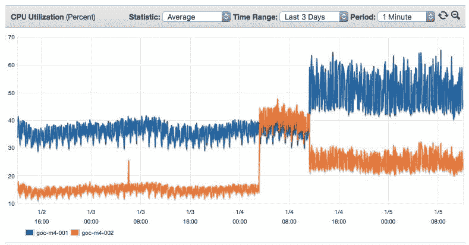

# 本周数字:崩溃补丁损害性能

> 原文：<https://thenewstack.io/week-numbers-meltdown-patches-hurt-performance/>

修复本月早些时候披露的英特尔 Meltdown 安全漏洞所需的补丁正在损害内部系统和云提供商系统的 CPU 性能。

正如我们在中报道的[,](https://thenewstack.io/need-know-meltdown-spectre-cpu-flaws/)[内核页表隔离](https://fedoramagazine.org/kpti-new-kernel-feature-mitigate-meltdown/) (KPTI)方法提供了缓解措施，但对系统性能有负面影响。Red Hat [报告](https://access.redhat.com/articles/3307751?sc_cid=7016000000127NJAAY)称，其基准测试发现许多数据库工作负载的性能下降了 8-19%。Red Hat 指出，云系统的性能可能会受到特别的影响:“由于用户到内核转换的频率增加，我们预计对部署在虚拟来宾中的应用程序的影响将高于裸机。”

事实上，一篇 Sysdig [帖子](https://sysdig.com/blog/making-sense-of-meltdown/)强调了来自整个 Twitterverse 的报告，即对于一系列工作负载来说，影响要严重得多。例如，Darko ronic[的 Riak 性能下降了 50 %, Redis 下降了 40%。根据 Branch Analytics 工程总监 Ian Chan](https://twitter.com/apolloFER/status/949589014977400833) 的[观察，当亚马逊网络服务将 Meltdown 补丁应用于其自己的系统时，运行在 d2.xlarge AMIs 上的生产 Kafka 代理吞噬了 5%至 20%的额外 CPU 使用率。](https://twitter.com/chanian/status/949457156071288833)

AWS 的 ElasticCache 是一项管理 Redis 服务，其用户也担心这会增加他们每月 AWS 账单的费用。下面的图表显示了 [Crowdfire](https://www.crowdfireapp.com/) 的 [Amanpreet Singh](https://twitter.com/ApsOps/status/949251143363899392) 正在监控的 ElasticeCache 实现的 CPU 利用率如何跃升:

至少有一家云提供商，[谷歌](https://cloud.google.com/kubernetes-engine)，在 2017 年的最后几个月里一直在[狂热地工作](https://www.blog.google/topics/google-cloud/protecting-our-google-cloud-customers-new-vulnerabilities-without-impacting-performance/?utm_source=feedburner&utm_medium=feed&utm_campaign=Feed%3A+blogspot%2FMKuf+%28The+Keyword+%7C+Official+Google+Blog%29)，以缓解其自身系统当时悬而未决的性能滞后，至少在新一代处理器出现之前是如此。公司工程师提出了 [Retpoline](https://support.google.com/faqs/answer/7625886) ，这是一种软件二进制修改技术，旨在防止分支目标注入。

“借助 Retpoline，我们无需禁用推测性执行或其他硬件功能。相反，这种解决方案修改程序，以确保执行不会受到攻击者的影响，”谷歌指出。

类似的方法会在其他地方奏效吗？正如 Red Hat [指出的](https://access.redhat.com/articles/3307751?sc_cid=7016000000127NJAAY)，有自己的内核补丁，“即使被禁用，额外的代码和微码更新可能会有轻微的性能影响。”

这个故事的寓意是，即使不需要购买新的芯片，英特尔的安全缺陷仍然可能伤害你的钱包。

TNS 执行主编 Joab Jackson 为本文做出了贡献。

[谷歌](https://cloud.google.com/kubernetes-engine)和[红帽](https://www.openshift.com/)是新栈的赞助商。

<svg xmlns:xlink="http://www.w3.org/1999/xlink" viewBox="0 0 68 31" version="1.1"><title>Group</title> <desc>Created with Sketch.</desc></svg>