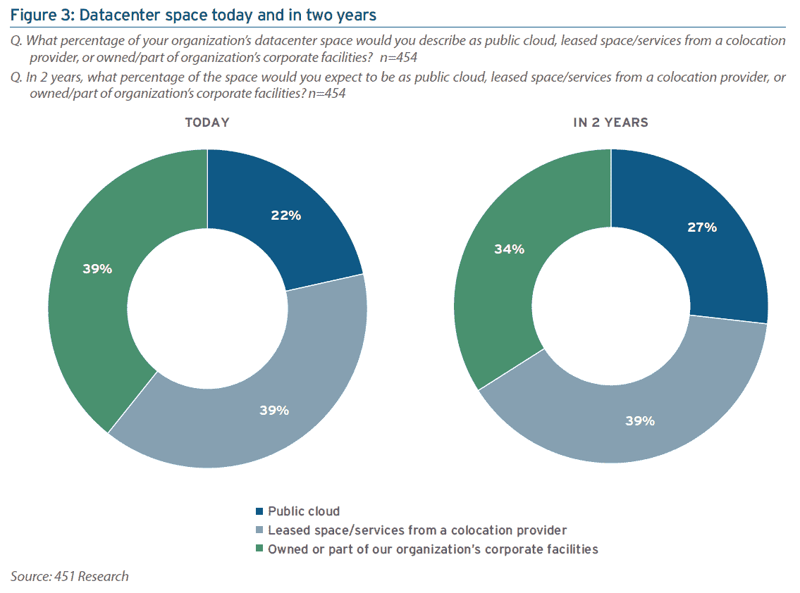
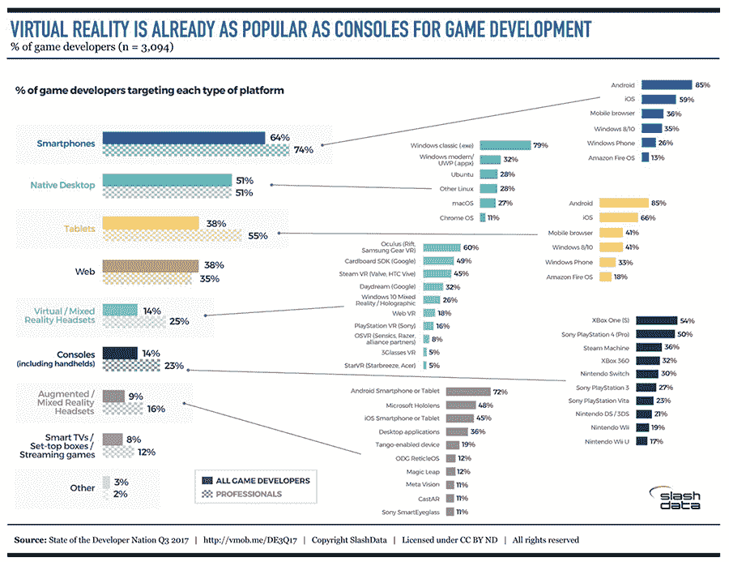

# 本周数字:公共云的繁荣没有伤害到同处一地

> 原文：<https://thenewstack.io/week-numbers-mixed-reality-developers/>

云提供商和超大规模企业继续建设新的数据中心。公共云继续增长，而企业数据中心继续面临预算紧缩。在这种环境下，你会期望亚马逊网络服务、苹果、微软和世界上其他超大规模公司会成为数据中心房地产的主要买家。但这并不总是正确的。根据 CBRE 的说法，2017 年上半年，超大规模公司忙于消化他们在 2016 年购买和租赁的东西。在这段时间里，CBRE 跟踪的 12 笔大型交易中，只有 5 笔是计划拥有或运营数据中心的公司进行的收购。其余的购买是投资者的猜测，他们希望最终出售给超大规模或协同定位提供商。

> 事实上，一些寻求改善延迟的大客户可能会开始要求将其云服务托管在与其托管的 IT 基础架构设备相同的设施中。

施耐德电气和 [451 Research](https://451research.com/) 最近发布的[报告](http://blog.schneider-electric.com/co-location/2017/09/14/colocation-buyers-insights-new-451-research-report/)显示，公共云将以企业运营数据中心为代价继续增长。它还表明，越来越多的公司正在将工作负载从主机托管迁移到公共云，而不是从相反的方向迁移，分别为 62%和 41%。令人着迷的是，这不会影响到 2020 年的共同定位前景，它将保持大约相同的总数据中心容量百分比(以平方英尺计)。随着公共云的增长，托管客户表示，公司拥有的设施将在两年内从目前占数据中心空间的 39%下降到 34%。

共址公司似乎保持生存能力有两个原因。首先，企业不太可能建立新的数据中心。即使他们计划继续运营私有云，他们也更有可能寻求第三方来租赁设施。其次，公共云提供商越来越多地成为托管提供商的客户和合作伙伴。451 Research 研究主管 Rhonda Ascierto 认为这种趋势至少会持续五年。事实上，一些寻求改善延迟的大客户可能会开始要求将其云服务托管在与其托管的 IT 基础架构设备相同的设施中。尽管接受调查的 454 名共置客户中没有人认为这非常重要，但 32%的人认为这非常重要。

* * *

分布式系统看多了会脑残的。本周，我们通过关注你真正关心的东西——电子游戏来扭转局面。你知道 48%的开发者开发游戏吗？大多数人这样做是为了好玩。在一份报告《开发者经济学:2017 年第三季度开发者国家状况》(Developer Economics:State of the Developer Nation Q3 2017)中，我与 [SlashData](https://www.slashdata.co/) 合作撰写了这份报告，其中 8%的受访者专业开发游戏。

就像在其他软件生态系统中一样，为一个平台编写程序的决定最终会对最终出现在您客厅中的硬件平台产生巨大影响。智能手机和台式机仍然是游戏最常瞄准的平台。这些外形的平台选择对于游戏和其他类型的应用程序来说是一样的。像 XBox 和索尼 PlayStation 这样的传统主机正处于被淘汰的边缘。

> 48%的开发者开发游戏

开发人员瞄准这些平台的比例与他们瞄准混合现实耳机的比例相同。对于[虚拟现实](http://thenewstack.us11.list-manage.com/track/click?u=ab6c02b160780b8e6569144f8&id=0d1b4584c9&e=1751031cd1)头戴设备来说， [Oculus](http://thenewstack.us11.list-manage.com/track/click?u=ab6c02b160780b8e6569144f8&id=247d8ca1cc&e=1751031cd1) 是领导者，60%从事应用程序开发的游戏开发者都以其为目标。面向低端( [Cardboard](https://vr.google.com/cardboard/) )和高端( [Daydream](https://vr.google.com/daydream/) )的谷歌 SDK 分别是第二和第四大目标平台。在游戏控制台生产商中，Valve 的 Steam VR 比索尼和微软的产品拥有更大的市场份额。相比之下，[增强现实](http://thenewstack.us11.list-manage1.com/track/click?u=ab6c02b160780b8e6569144f8&id=6b552bba7d&e=1751031cd1)头戴设备的姐妹市场似乎更青睐更成熟市场的现有企业。

谷歌和[微软](https://www.microsoft.com)是新堆栈的赞助商。

通过 Pixabay 的特征图像。

<svg xmlns:xlink="http://www.w3.org/1999/xlink" viewBox="0 0 68 31" version="1.1"><title>Group</title> <desc>Created with Sketch.</desc></svg>