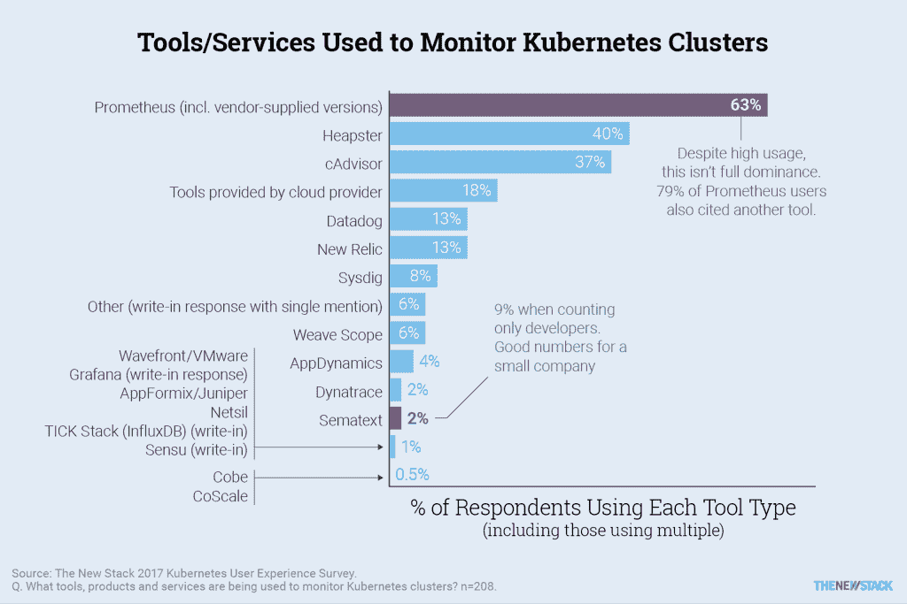
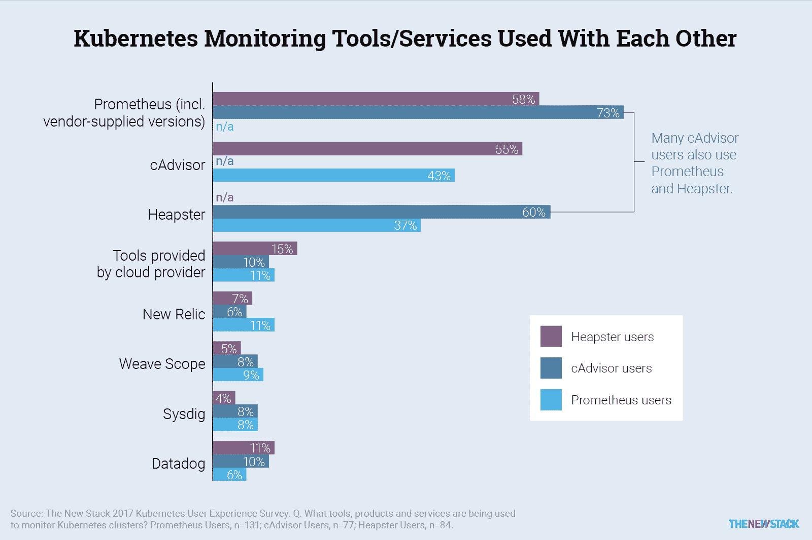

# 本周数字:Kubernetes 的新监测方法

> 原文：<https://thenewstack.io/week-numbers-new-monitoring-methods-take-shape-kubernetes/>

我们的新报告《Kubernetes 生态系统的状态》报告了对 470 名容器用户的调查，其中 62%的用户至少处于 [Kubernetes](/category/kubernetes/) 开源容器编排引擎的初始生产阶段。经过进一步筛选，我们能够从 208 个人那里获得关于他们使用 Kubernetes 的存储和监控技术的详细信息。

 迄今为止，Prometheus 是我们的调查对象中使用最多的监控 Kubernetes 集群的工具。然而，Heapster 也在我们的团队中获得了广泛采用。传统监控供应商的情况并不好，尽管当他们的工具被集成到一个更大的定制监控平台时，其使用水平似乎有所提高。

## 集群监控

组织对用于 Kubernetes 的监控工具的选择充分说明了他们的应用程序部署策略。一个组织可能会优先监控其基础架构而不是应用程序，反之亦然。一个组织选择哪个目标说明了谁来进行监控:开发人员还是操作人员。

[cyclone slider id = " kubernetes-series-book-1-赞助商"]

我们给了 Kubernetes 用户一长串各种类型的系统监控工具，并要求他们选择他们的部署中使用的所有工具。我们给受访者一个机会，让他们写出我们没有列出的备选方案。

在那些回应者中，大约 63%的人使用 Prometheus 监控他们的集群，Prometheus 是一个服务监控组件，其项目像 Kubernetes 一样，由云本地计算基金会领导。但是这并不意味着普罗米修斯已经在其他工具和策略上取得了优势，因为引用普罗米修斯的人中有 79%还引用了另一种工具。现代数据中心监控策略通常包括有意购买工具组合，将数据中心已经使用多年的工具组合在一起。事实上，我们调查的一般组织使用 2.2 技术来监控其集群。

heap ster(40%)也被广泛引用，它专门监控 Kubernetes 的资源使用事件；和[CAD visor](https://hub.docker.com/r/google/cadvisor/)(37%)，一个为 Docker 容器创建的资源使用监视器。

[Sematext](https://sematext.com/) 在应用程序开发人员中知名度更高。大约 9%的回应开发者说他们使用其 Kubernetes 代理，这是全部样本的四倍——对于一家小公司来说是一个好数字。

## 将资源监视器配对在一起

Prometheus 的项目领导可以通过继续与其他工具集成的策略来加强其在数据中心的地位。cAdvisor 的前景尤其看好，其 73%的用户也使用 Prometheus，而 60%的 cAdvisor 用户也有 Heapster。因为 cAdvisor 向其他工具提供数据输入，所以它的按设计集成策略非常有意义。

在我们的调查中，DevOps 专业人员揭示了一种更不干涉的管理 Kubernetes 的方法，表示他们不太可能使用 Heapster 和 cAdvisor。然而，他们也不太可能使用云提供商提供的工具(6%对 18%的受访者)。根据定义，DevOps 应该是应用程序和系统监控的汇聚点。如果确实存在这样的融合点，那么应用程序运营商应该关注并权衡其组织的监控策略，尤其是当它们是由基于供应商和开源的选项拼凑而成时。

Prometheus 用户不太可能提到传统的应用性能管理(APM)和基础设施监控供应商。Datadog 为大约四分之一的非 Prometheus 用户监控 Kubernetes 集群。如果 Datadog 的客户对他们已经采用的监控策略感到满意，他们可能最终根本不会使用 Prometheus。如果没有这一点，随着一些用户转向全堆栈监控解决方案，现有公司将有更多机会。

[云计算原生计算基金会](https://www.cncf.io/)是新体系的赞助商。

由[杰西·加德纳](https://unsplash.com/photos/S7ChB4FBboI?utm_source=unsplash&utm_medium=referral&utm_content=creditCopyText)在 [Unsplash](https://unsplash.com/?utm_source=unsplash&utm_medium=referral&utm_content=creditCopyText) 上拍摄的特写图片。

<svg xmlns:xlink="http://www.w3.org/1999/xlink" viewBox="0 0 68 31" version="1.1"><title>Group</title> <desc>Created with Sketch.</desc></svg>