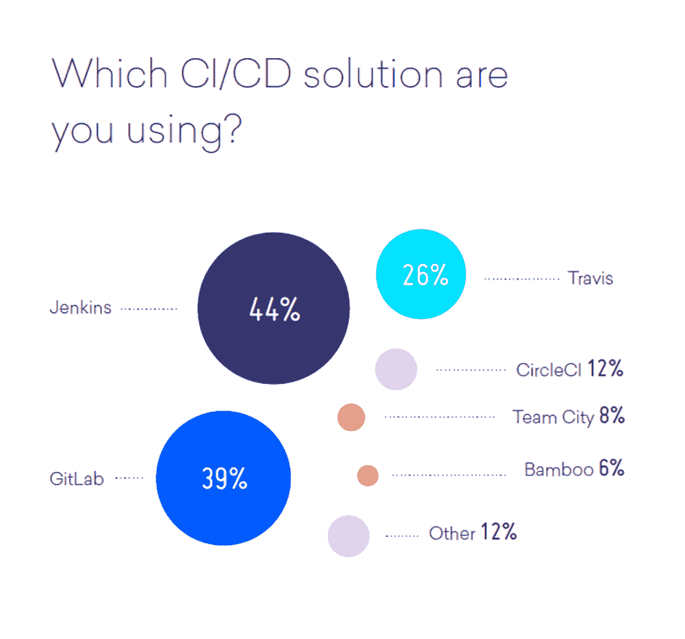

# 本周数字:不是所有的开发者都使用 CI/CD

> 原文：<https://thenewstack.io/week-numbers-not-developers-use-ci-cd/>

最近对[数字海洋的](https://www.digitalocean.com/)社区的[调查](https://blog.digitalocean.com/currents-dec-2017/)发现 42%的人使用 CI/CD。这是一个广泛的范畴，包括持续集成、部署和交付。我们知道，并非所有的开发人员都有相同的需求，为他们的应用程序部署创建和管理管道。事实上，46%不使用 CI/CD 的人说他们的工作流程不需要它。

我们之前的研究表明，较小的组织不太可能使用 CI/CD。因此，传统智慧似乎是正确的，认为许多数字海洋开发人员从事个人项目或小团队工作。尽管这些开发人员希望自动化他们的过程，但是他们不太需要创建正式的管道来支持与更大的团队的协作。当被问及使用什么解决方案时，Jenkins 以 44%的比例位居第一，紧随其后的是 GitLab CI，有 39%的比例。GitLab 相对较高的采用水平可能是因为 DigitalOcean 为它提供了一键安装，而不是为 Jenkins 提供。

展望未来，公司将无法充分利用容器和 DevOps，除非他们接受部署管道的使用。这并不意味着会采用传统的 CI 工具。另一种选择是 PaaS 或云提供商将向客户提供预建管道。在这个愿景中，像 DigitalOcean 这样的公司将专注于提供一个强大的部署仪表板，让开发人员选择是否要将应用程序部署到 VM、容器、功能或上述所有功能的组合。

[DigitalOcean](https://www.digitalocean.com/) 是新堆栈的赞助商。

通过 Pixabay 的特征图像。

<svg xmlns:xlink="http://www.w3.org/1999/xlink" viewBox="0 0 68 31" version="1.1"><title>Group</title> <desc>Created with Sketch.</desc></svg>