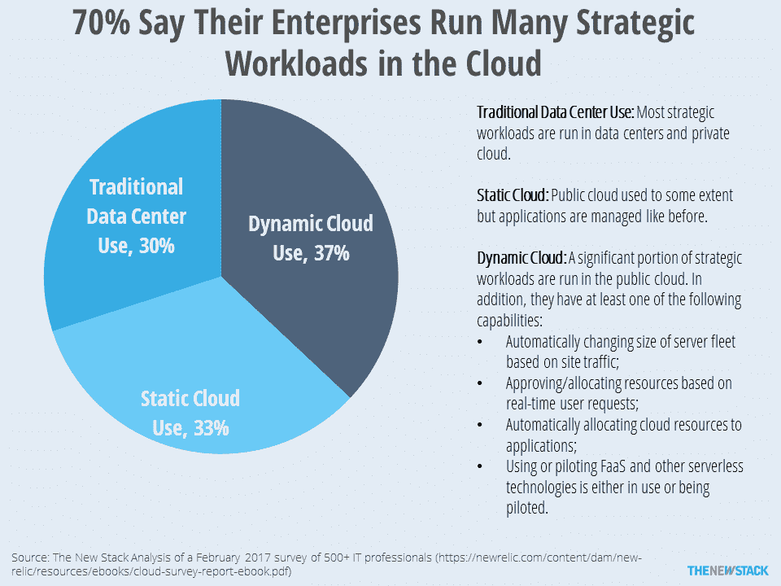
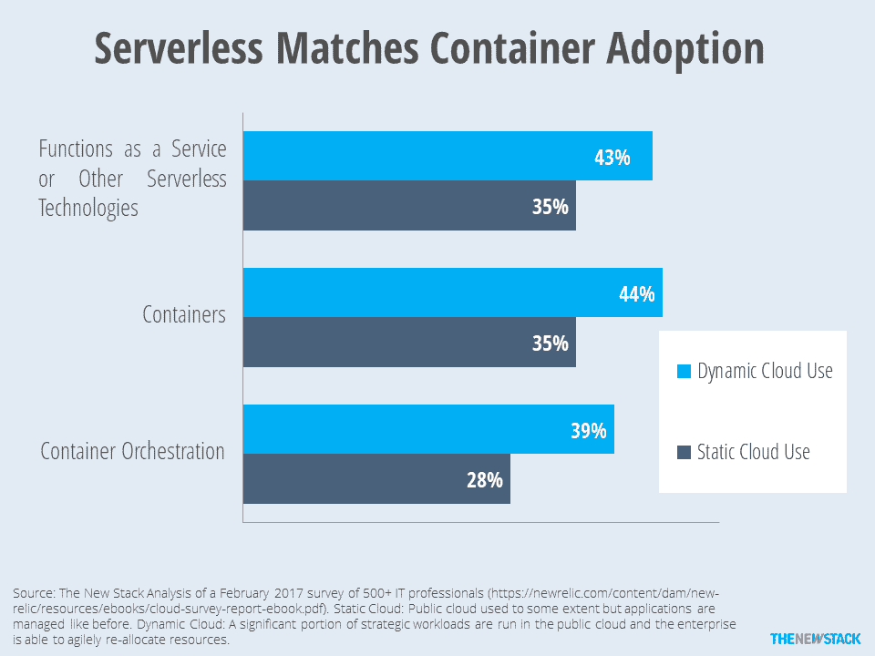

# 本周数字:无服务器的采用与容器不相上下

> 原文：<https://thenewstack.io/week-numbers-serverless-adoption-par-containers/>

43%的企业使用无服务器技术，如“功能即服务”( FaaS ),这些企业在公共云工作负载中运行大量战略工作负载，并且能够动态管理这些工作负载。

如果没有这些资格，很容易误解来自 [New Relic 的](https://newrelic.com/)基于调查的电子书《借助动态云和 DevOps 实现无服务器成功》的发现。 *"* 深入研究后，我们发现调查显示 70%的企业已经将大量工作负载迁移到公共云。在这个群体中，39%的人使用[无服务器](/category/serverless/)，40%的人使用[容器](/category/containers/)，34%的人使用容器编排。

至少从表面上看，现在无服务器技术的采用与容器相当。然而，其在生产应用中的使用深度还有待确定。此外，像所有无服务器的东西一样，我们并不真正知道这个术语的含义。调查问卷闪烁其词，称 FaaS 和 AWS Lambda 等无服务器技术。这个定义似乎非常模糊。

该调查于 2017 年 2 月进行，有超过 500 名参与者，其中 61%的人在拥有 1000 名员工的企业工作。

> 至少从表面上看，现在无服务器技术的采用与容器相当。然而，其在生产应用中的使用深度还有待确定。

我们同意报告的前提，即不同的云成熟度会影响工作效率。定义云的采用水平是一件棘手的事情。根据电子书，旧的传统方法是在私有数据中心或私有云中运行最重要的工作负载。在这项研究中，30%的企业这样做了，这意味着另外 70%的企业在公共云中运行许多工作负载，但可能没有充分利用其“动态”功能。

根据调查，33%是静态云用户。有趣的是，他们已经将工作负载“提升并转移”到云中，以节省资金并专注于核心运营。虽然他们声称已经迁移到公共云，但实际上，他们 80%的战略工作负载主要在私有数据中心运行。其余 37%的受访者将许多战略工作负载迁移到公共云，并努力提高灵活性和自动重新分配资源。然而，即使在这一群体中，绝大多数人在私有云和公共云中运行的工作负载也是一样的。

动态云使用的部分定义是使用或引导无服务器。

这本书只报告了动态云用户的采用率，没有提供在公共云中不运行大量工作负载的企业的详细信息。然而，新的堆栈能够计算静态云采纳者的统计数据。即使在不同水平的“云成熟度”中，无服务器和容器的采用水平看起来也非常相似，但有所不同，因为对动态云使用的描述类似于早期采用者的一般情况。然而，这并不意味着公司对无服务器意味着什么有相同的定义。

动态和静态云用户之间的容器编排差异更大。容器编排支持灵活管理云基础架构所需的资源分配类型。

书中的图表预示着调查结果是关于 FaaS 本身的，但文本揭示了人们实际上是在报告任何类型的无服务器技术的使用，以 FaaS 和 AWS Lambda 为例。它没有提供什么是容器或容器编排的例子。该报告也没有描述这些技术被采用的程度。

换句话说，如果一个开发人员为一个独立的应用程序使用一个 Lambda 函数，这是否意味着整个组织都在使用无服务器？如果调用一个事件激活的服务来支持一个 web 应用程序，这算不算无服务器？如果使用了[微服务](/category/microservices/)和事件驱动架构，是否意味着您的组织已经赶上了无服务器的热潮？

我们没有这些问题的答案，但希望未来的研究描绘出哪些 FaaS 正在被使用。正如我们看到的 VMware 在基础架构服务领域的困难一样，让企业成为自己的云提供商有些困难，特别是当 AWS、Microsoft Azure、Google 和其他公司可以更便宜、更好地做到这一点时。

如果调查参与者声称托管他们自己的无服务器基础架构，示例应提供示例。如果他或她不能给出细节，我们怀疑他们实际上已经过了实验阶段。相反，我们认为许多人将无服务器基础设施等同于提供服务的能力，任何由实时事件触发的服务。这是一个重要的能力，但至少在我们看来，这不是无服务器啦啦队员心目中的计算方面的根本变化。

如果计算即服务和 FaaS 继续是公共云提供商的领域，我们预计管理和监控功能的部署将成为真正的竞争。如果是这样的话，那么真正的无服务器竞赛将是关于启用工具和框架，帮助跨多个云环境编排应用程序。

毫不奇怪，许多人认为就像 [Kubernetes](/category/kubernetes/) 编排容器一样，它也可以编排功能。我们已经看到 Bitnami 的 [Kubeless](http://kubeless.io) 、Platform9 的[裂变](http://fission.io/)和[Apache open whish](http://openwhisk.incubator.apache.org/)成为与 Kubernetes 合作的平台。最后，但同样重要的是，我们必须提到 [Serverless，Inc](https://serverless.com/) ，它将自己定位为一个高级框架，允许用户与多个 FaaS 提供商以及 OpenWhisk 和 Kubernetes 合作。

## 无服务器和开发运维之间的关系

我们知道，许多其他研究也显示了容器、微服务和持续部署管道之间的强相关性。“无服务器”已经成为最新的术语，用来描述 IT 组织如何变得更加敏捷并采用 DevOps 流程。不看具体的技术采用情况，很难确定无服务器对生产力的影响。

正如[2017 年发展状况](https://www.linkedin.com/in/nicolefv/)[报告的作者 Nicole Forsgren](https://puppet.com/resources/whitepaper/state-of-devops-report) 告诉我们的那样，在过程、技术和结果之间进行划分是很困难的。尽管我们对新的遗留方法有问题，但它的结果反映了 Forsgren 的发现，即有能力敏捷地管理其软件开发生命周期的公司确实经历了更好的结果。

然而，和她的发现一样，早期 DevOps 采用者和其他人之间的差异是明显的。这意味着仅仅试验 FaaS 或容器不会自动提高你的底线。相反，它们只是更广泛的流程和架构转型的指标，专家称之为“数字转型”。

[诺亚·西利曼](https://unsplash.com/photos/fxAo3DiMICI?utm_source=unsplash&utm_medium=referral&utm_content=creditCopyText)在 [Unsplash](https://unsplash.com/?utm_source=unsplash&utm_medium=referral&utm_content=creditCopyText) 上的照片。

<svg xmlns:xlink="http://www.w3.org/1999/xlink" viewBox="0 0 68 31" version="1.1"><title>Group</title> <desc>Created with Sketch.</desc></svg>