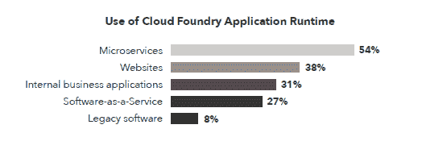
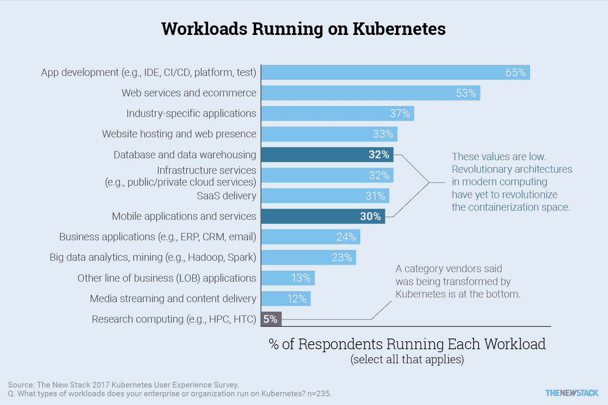
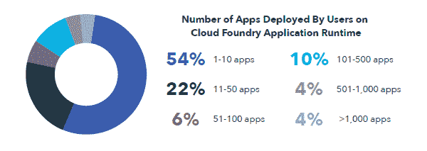

# 本周数字:Cloud Foundry 和 Kubernetes 的工作负载

> 原文：<https://thenewstack.io/week-numbers-state-cloud-foundry-vs-kubernetes-workload/>

IBM/Cloud Foundry 的资深工程师 [Julian Friedman](https://www.linkedin.com/in/julian-friedman-67a27b6/) 声称，他[认为](https://medium.com/@doctor_julz/cf-vs-kube-is-the-difference-who-creates-the-container-f2189960f98c)Cloud Foundry 应用运行时(也就是大多数人说[“Cloud Foundry”](https://www.cloudfoundry.org/)时想到的)是一个运行无状态应用的平台，而新推出的 [CF 容器运行时](https://thenewstack.io/debating-cloud-foundrys-new-container-runtime/)是用于有状态应用的。

“Cloud Foundry 是一个应用程序运行时。这实际上意味着它是一个运行无状态应用的平台。弗里德曼写道，这就是我们所说的“应用”事实上，我个人认为 CF 与无服务器的关系比与 Kubernetes 或其他容器平台的关系更大。抽象是(无状态)功能、(无状态)应用和(有状态)服务。"

Cloud Foundry Foundation 的 [2017 年用户调查](https://www.cloudfoundry.org/user-report-2017/)报告称，54%的受访者使用 Cloud Foundry 运行[微服务](/category/microservices/)，38%用于网站。正如分析师[贾纳基拉姆·MSV](https://www.janakiram.com/)已经[指出的](https://thenewstack.io/ten-commandments-microservices/)，微服务应该被分离，这样有状态和无状态服务就可以在不同的容器上运行。如果遵循这个准则，那么 Cloud Foundry 用户需要一种方法来编排这些容器。这就是新的容器运行时(又名 Kubo)的用武之地，它允许用户管理能够更好地处理状态的 Kubernetes 集群。

这种应用程序对容器的视图解释了由[云本地计算基金会](https://www.cncf.io/)管理的开源容器编排引擎 [Kubernetes](/category/kubernetes/) 如何融入云铸造领域。新的堆栈确实发现了在 Kubernetes 和 Cloud Foundry 上运行的工作负载的相似之处和不同之处。正如我们在电子书《[Kubernetes 生态系统的状态](https://thenewstack.io/ebooks/kubernetes/state-of-kubernetes-ecosystem/)》中所报道的，应用程序开发本身(例如 ide、平台、测试、CI/CD)运行在 65%的生产部署上，53%运行 web 服务，33%运行主机网站。

这些数据支持了 Googler [Kelsey Hightower](https://twitter.com/kelseyhightower) 的[断言](https://twitter.com/kelseyhightower/status/920731336691740672)容器是应用平台的构建模块。web 服务和站点托管之间的下降表明服务可能是“微服务”，这将与 Cloud Foundry 上运行的比例非常匹配。

新堆栈的调查问题更加细致，还表明 32%的人将数据库和数据仓库(本质上是有状态的)放在 Kubernetes 上。

展望未来，Cloud Foundry 的应用程序和容器运行时似乎能够处理几乎任何云原生应用程序。到目前为止，Cloud Foundry 的客户表示，他们在其上运行了 30%的云原生应用。Cloud Foundry 的发展速度可能取决于遗留应用程序被重构为云原生应用程序或新建应用程序被构建来替代它们的速度。仅在使用企业的 Cloud Foundry 内部，就有很大的扩展空间，因为到目前为止，54%的用户在该平台上运行 10 个或更少的应用程序。

最后一点:在 Cloud Foundry 调查的 500 多名用户中，45%的用户使用 Cloud Foundry 的经验不足一年。虽然新用户可能被过度采样，但我们认为已经有新的用户涌入。如上所述，这部分是因为足迹的扩大。然而，Pivotal 的 Richard Seroter 认为可能会有一批新的企业加入进来。我们将密切关注独立数据，以确认这是一种趋势。

【T2

[Cloud Foundry Foundation](https://www.cloudfoundry.org/) 和[Cloud Native Computing Foundation](https://www.cncf.io/)是新堆栈的赞助商。

通过 Pixabay 的特写照片。

<svg xmlns:xlink="http://www.w3.org/1999/xlink" viewBox="0 0 68 31" version="1.1"><title>Group</title> <desc>Created with Sketch.</desc></svg>