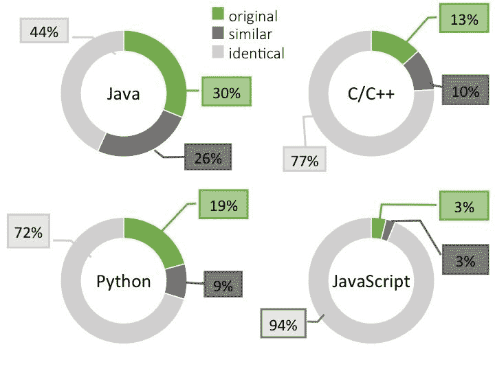

# 本周数字:独特性在 GitHub 上很少见

> 原文：<https://thenewstack.io/week-numbers-uniqueness-rare-github/>

好吧，我承认。我依赖阿德里安·科尔耶阅读密集的计算机科学文章，这些文章中充满了我无法理解的数学知识。在他的博客上，Colyer 承诺每个工作日回顾“一篇来自计算机科学世界的有趣/有影响力/重要的论文”(咻！作为伦敦[加速器](https://www.accel.com/)的风险投资合伙人，他必须花很长时间去上班。

[最近的版本](https://blog.acolyer.org/2017/11/20/dejavu-a-map-of-code-duplicates-on-github/)引起了许多人的兴趣——一篇声称 GitHub 上大多数文件都不是原创的论文。在许多开发者开源世界的核心，GitHub 支持版本控制系统内的协作。事实证明，大多数协作都是建立在他人工作的基础上的。根据 Colyer 研究的论文作者的说法， *[似曾相识:GitHub 上的代码重复图](https://doi.org/10.1145/3133908)，*在用 Java、C++、Python 或 JavaScript 编写的非分叉项目中，82%的文件在另一个项目的代码库中找到。

Java 有最少的重复文件，但是即使在这里，大约一半的其他文件可以被认为是相似的。这些很可能是从另一个存储库中克隆出来的，只做了轻微的修改，比如添加注释、移动代码或添加几行额外的代码。JavaScript 倾向于使用许多较小的文件，这意味着数字有些失真。更重要的是，许多项目包括通过 npm 提供的库。这是一个问题，因为如果库组件被提交为应用程序代码，那么它降低了实现框架和库中上游更改的可能性。

就其本质而言，开源证明了模仿是一种奉承的形式，但这是否走得太远了？当然不是。模仿者万岁。然而，依赖性的流行给安全性和软件质量带来了独特的挑战。有办法解决这些问题。GitHub 已经[创建了工具](https://thenewstack.io/github-applies-machine-learning-alert-project-dependencies/)来识别依赖关系。与许多安全公司一样， [Libraries.io](https://libraries.io/) 已经创建了一些工具来检查您的存储库组件与它们在软件供应链中的原始来源。从度量的角度来看，我们继续就如何跟踪这些类型的生态系统依赖达成共识。敬请关注。

<svg xmlns:xlink="http://www.w3.org/1999/xlink" viewBox="0 0 68 31" version="1.1"><title>Group</title> <desc>Created with Sketch.</desc></svg>