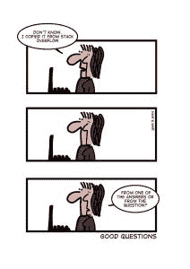

# 本周编程:用 Q Sharp 获得量子

> 原文：<https://thenewstack.io/week-programming-get-quantum-q-sharp/>

虽然我们已经进入了一年回顾(我们有几篇要细读)和一年预测文章的黄金时间，但本周的大新闻可能是微软的量子开发工具包的[预览，“它包括 Q#编程语言、量子计算模拟器和其他资源，供那些想开始为量子计算机编写应用程序的人使用。”如果你想知道，这是“Q 升”(不是“降 R”)的简称。](https://blogs.microsoft.com/ai/2017/12/11/future-quantum-microsoft-releases-free-preview-quantum-development-kit/)

Ars Technica [解释说](https://arstechnica.com/gadgets/2017/12/microsofts-q-quantum-programming-language-out-now-in-preview/)这种语言“旨在将传统的编程概念——函数、变量和分支，以及带有量子调试器的语法突出的开发环境——引入量子计算”,并“向不仅仅是物理学家开放量子计算”根据微软的博客文章，[量子开发工具包](https://www.microsoft.com/en-us/quantum/development-kit)将被深度集成到 [Visual Studio](https://www.visualstudio.com/) 中，带有一个本地量子模拟器，“可以使用一台典型的笔记本电脑模拟大约 30 个逻辑量子位的量子计算能力。”虽然这篇博文提供了一个关于量子计算机的鼓舞人心的视频，充满了主题音乐和在月球上行走的人，[完整的介绍和分步演示视频](https://youtu.be/v7b4J2INq9c)提供了更多信息:

[https://www.youtube.com/embed/v7b4J2INq9c?feature=oembed](https://www.youtube.com/embed/v7b4J2INq9c?feature=oembed)

视频

## 在本周的新闻和公告节目中

*   **和 Atom 1.23 一样简单:** [Atom 1.23 已经发布](https://blog.atom.io/2017/12/12/atom-1-23.html)，带来了“一个新特性，可以让包注册 URI 处理程序，注册隐藏命令，以及编辑器性能的改进。”此外，Teletype 0.3.0 带来了一些性能和连接性的改进，而 Atom 1.24 的测试版修复了一个重要的错误:“在制表符与空格的辩论中，有人编写了最初的切换行注释实现，因为它总是插入空格。现在[将会接受您的设置](https://github.com/atom/atom/issues/16193)。”
*   **用 GitHub Enterprise 2.12 组织起来:** GitHub 宣布了最新版本的 [GitHub Enterprise](https://github.com/blog/2478-introducing-github-enterprise-2-12) ，它带来了“项目板增强、全球 webhooks、存储库归档等等”新特性包括自动化任务、键盘导航、项目板注释、整个企业实例的全局 webhooks、自动 HTTPS 部署等等。新版[现在可以下载](https://enterprise.github.com/releases/2.12.0/download)。
*   **IBM 策划的开源“代码模式”:** IBM [宣布](https://developer.ibm.com/dwblog/2017/speed-innovation-for-developers/)发布[超过 120 个“代码模式”](https://developer.ibm.com/code/?cm_sp=dw-_-ibmcode-_-dwblog-120patterns)，它说“是策划的代码包，一键 GitHub repos，文档和资源，涉及一些最受欢迎的开发领域，包括人工智能，区块链，容器和物联网。”这里的基本思想是，最好有一些你知道可以信任的代码——以避免重新发明轮子——而不必挖掘各种未知的资源来找到它。除了代码模式，该公司还宣布了一个 [Bot 资产交换](https://developer.ibm.com/code/exchanges/bots/)，提供与其代码模式类似的功能，为 Bot 开发人员提供“现成的、特定领域的对话逻辑”。

## 这个星期在这个或那个

*   谁是多任务处理大师？在构建可伸缩的 Web 应用程序时，关注服务器端 I/O 性能以及您选择的语言如何影响它是很重要的。困难在于您选择的语言如何处理系统调用的细节——无论是阻塞的还是非阻塞的。一个很好的类比是去酒吧。阻塞系统调用是指你必须排队等候从一个酒保那里点菜。每个人都等着他们前面的人吃完，即使他们到前面的时候那个人还不知道他们想要什么。不管怎样，你都要等他们。非阻塞系统调用更像一个酒吧，每个人都来到前面，准备好了就点单，酒保可以同时帮助多个人。超越我可能并不完美的类比，[博客文章着眼于 Node vs. PHP vs. Java vs. Go](https://www.toptal.com/back-end/server-side-io-performance-node-php-java-go) 并执行了一系列基准测试。哪一个赢了？你自己看看吧。

来自 Geek & Poke:点击查看原全尺寸漫画。

*   你的编程语言糟透了:我最喜欢的了解一个话题的方式是，经常看着某人发表他们对一个话题未经过滤的想法，然后看着由此引起的被冒犯的网民的激烈争论。例如，这些关于编程语言的咆哮毫无保留，我发现 [Reddit 的讨论](https://www.reddit.com/r/programming/comments/7jcwt9/my_stupid_rants_on_various_programming_languages/)很有启发性。JavaScript 和 Node.js？“完全是狗屎。”Python？“邪教。”去吗？“智障。”然而科特林呢？"呼吸新鲜空气。"

## 去年的这个星期

*   **2017 年 JavaScript 何去何从？**我不知道你是怎么想的，但我喜欢当你把鼠标放在图形上时会变形和添加信息的互动图形，而 2017 年 JavaScript 现状调查正好提供了这一点。该调查“向全球 28，000 多名开发人员提出了 100 多个问题，涵盖了从前端库到后端框架的所有主题”，并展示了 JavaScript 生态系统的状态。正如在 [InfoWorld](https://www.infoworld.com/article/3242216/javascript/state-of-javascript-typescript-rises-angular-falls.html) 中提到的，“开发者更喜欢 ES6、React 和 Express，而 TypeScript、Vue.js 和 GraphQL 引起了强烈的兴趣”。然而，谷歌的角状框架的受欢迎程度有所下降。
*   **来自脸书的你:**虽然你肯定不会在这篇文章中发现任何围绕 React 许可的喧嚣，但脸书的开发者博客花了一点时间回顾了它对整个堆栈[软件的贡献](https://code.facebook.com/posts/874627342705873/2017-year-in-review-software-across-the-stack/?utm_source=codedot_rss_feed&utm_medium=rss&utm_campaign=RSS+Feed)。总结得很快，脸书一直在忙。在过去的一年中，它发布了 113 个新的开源项目，总计近 450 个活动项目，“总共有超过 100，000 个提交，其中近三分之一来自外部贡献者。”(也许巧合的是，InfoWorld 本周提供了一个 [React 教程](https://www.infoworld.com/article/3200374/application-development/react-tutorial-get-started-with-the-reactjs-javascript-library.html)，帮助你开始使用开源 JavaScript 库来构建用户界面。)

## 本周学习

*   **如果你不知道什么是堆栈…** 那么这个基于 GitHub 的[编码面试大学](https://github.com/jwasham/coding-interview-university)就是为你准备的。该课程的作者最终在亚马逊找到了一份工作，他评论说，他们“不知道栈和堆，不知道任何关于树的东西，也不知道如何遍历图形。如果我必须编写一个排序算法，我可以告诉你它不会很好。我用过的每一种数据结构都内置在语言中，我根本不知道它们是如何工作的。”该课程旨在“为新的软件工程师或那些从软件/web 开发转向软件工程的人(需要计算机科学知识)”提供日常课程，涵盖你作为一名 web 开发人员可能从未接触过的所有内容，以便你可以过渡到全栈开发人员。
*   **安全 PHP？那是什么？**我不得不承认，我点击了[2018 年构建安全 PHP 软件指南](https://paragonie.com/blog/2017/12/2018-guide-building-secure-php-software)期待一个笑话。就像，只是一个网站，也许有一个 20 世纪 90 年代的动画“正在建设中的 gif”，只是“没有。”以 48pt 字体，在白色页面中间加粗。这并不是对 PHP 实际安全性的陈述，只是我对这种语言的渗透和偏见，自从世纪之交以来，这种语言几乎运行在我工作过的每一个开源 CMS 和购物车网站上。根据这篇文章的第一步？“抛弃许多[你的]关于开发安全 PHP 应用程序的旧实践和信念”，包括你甚至不相信“这样的壮举甚至是可能的。”

微软是新堆栈的赞助商。

特征图片:[来自某极客的面板&戳漫画](http://geek-and-poke.com/geekandpoke/2016/11/27/good-questions)。

<svg xmlns:xlink="http://www.w3.org/1999/xlink" viewBox="0 0 68 31" version="1.1"><title>Group</title> <desc>Created with Sketch.</desc></svg>