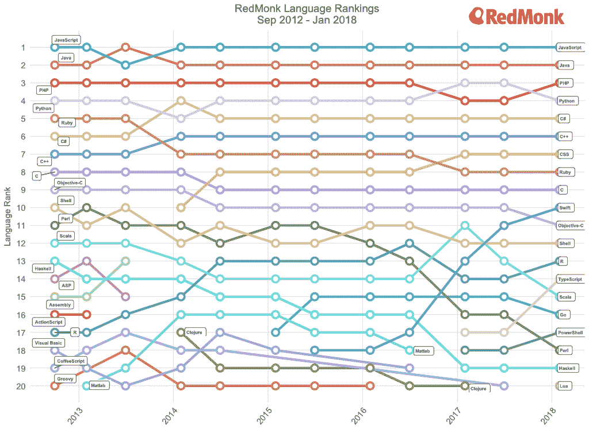

# 本周编程:人工智能的内部运作，或者说是噩梦

> 原文：<https://thenewstack.io/week-programming-inner-workings-ai-aka-stuff-nightmares/>

2018-03-17 06:00:12

本周编程:人工智能的内部运作，或者说是噩梦

# 本周编程:人工智能的内部运作，或者说是噩梦

Mar 17th, 2018 6:00am by [Mike Melanson](https://thenewstack.io/author/mike-melanson/ "Posts by Mike Melanson")

你现在可能已经很熟悉这一点了，但是尽管人工智能可以用于各种任务——从自动化工作到决策等等——但窥视这个过程可能会成为致幻药物和噩梦的素材。本周，谷歌让我们更好地窥视神经网络的内部运作，而不仅仅是令人不安的图像。

但是！如果你碰巧错过了令人不安的部分，不要错过谷歌的[深梦](https://deepdreamgenerator.com/)和像这样的视频。

[https://www.youtube.com/embed/DgPaCWJL7XI?feature=oembed](https://www.youtube.com/embed/DgPaCWJL7XI?feature=oembed)

视频

如果在那之后你还能集中注意力，那么，这就是我们本周在编程世界中发现的情况。

## 本周的节目中

*   **stack overflow 2018 年开发者调查:**根据你在哪里看，最新的 [StackOverflow 开发者调查](https://stackoverflow.blog/2018/03/13/2018-developer-survey-results-live/)要么提供有趣的[分析](https://www.reddit.com/r/programming/comments/8429be/stack_overflow_developer_survey_2018/dvma8d0/)要么提供[调查](https://i.imgur.com/kzvgktw.png) [偏见](https://i.imgur.com/xaS71q6.png)的[指控](https://www.reddit.com/r/programming/comments/8429be/stack_overflow_developer_survey_2018/dvmb2vb/)和大多数公司赞助的这类调查一样，也许我们应该对整件事持保留态度？挑选对你有用的统计数据？无论如何，继续前进——据该公司称，调查似乎表明“开发操作系统和机器学习是当今软件行业的重要趋势。”好吧，这看起来并不难。此外，“只有极少数开发人员说他们会编写不道德的代码”——嗯，这取决于你如何定义“道德”，对吗？哦，还有，我最喜欢的，“开发人员总体上对人工智能提供的可能性持乐观态度”——特别是在他们自己的工作自动化方面。不，真的，当谈到这类事情时，调查有一个很好的样本量。我们说的是 180 个国家的 10 万多名开发人员。值得一看，SDTimes 的文章对几个主题进行了更深入的挖掘。
*   **谷歌的代码之夏向申请者开放:**给你们这些学生(我的意思是，我们都是生活的学生，对吗？)[Google Summer of Code 2018](http://developers.googleblog.com/2018/03/student-applications-open-for-google.html)现已开放申请。但是不，真的，你需要成为一名真正的学生(抱歉)才能参加谷歌的[代码之夏](https://g.co/gsoc)，它通过提供津贴和“充满激情的导师社区”来帮助你“在家工作时学习开源软件开发的细节”从现在到 2018 年 3 月 27 日星期二，在[项目网站](https://g.co/gsoc)接受申请。
*   **Google 开源语义图像分割:**语义图像分割是将图像的不同部分分割成对象，用词来表示——比如“路”、“天”、“人”、“狗”。这就是为什么你的手机现在可以在“[肖像模式”下区分出不同的人。](https://research.googleblog.com/2017/10/portrait-mode-on-pixel-2-and-pixel-2-xl.html)“而现在，Google 已经[决定在 TensorFlow](https://research.googleblog.com/2018/03/semantic-image-segmentation-with.html) 中用 DeepLab 开源语义图像分割。模型 [DeepLab-v3+](https://github.com/tensorflow/models/tree/master/research/deeplab) 在 [TensorFlow](https://www.tensorflow.org/) 中实现，该版本包括建立在[卷积神经网络](https://en.wikipedia.org/wiki/Convolutional_neural_network) (CNN)主干架构之上的 DeepLab-v3+模型。

*   **…以及 AR/VR 的共振音频:**谷歌也宣布本周[开源共振音频](https://www.blog.google/products/google-vr/open-sourcing-resonance-audio/)。Resonance Audio 是去年[推出的 spatial Audio SDK](https://developers.googleblog.com/2017/11/resonance-audio-multi-platform-spatial.html)，它让开发者用似乎来自四面八方的声音创建 ar 和 VR 体验。Google 已经将 Resonance Audio 开源为一个独立的库，以及相关的引擎插件、VST 插件、教程和带有 Apache 2.0 许可的示例。
*   名字里有什么？最后，当然也是最不重要的，在谷歌本周的新闻中，它已经决定[将 Android Wear](https://www.blog.google/products/wear-os/android-wear-its-time-new-name/) 更名为 Wear OS，这对作为开发者的你来说才是真正重要的，因为这可能标志着该公司将在 5 月的谷歌 I/O 上对其智能手表战略做更多的事情。如果你关心的话，请保持警惕。

*   Rust 的官方 2018 年路线图:不久前，我们告诉过你 [Rust 的新纪元发布路线图](https://thenewstack.io/week-programming-rusts-roadmap-epoch-release/)，但看起来那篇博文已经被删除了。也许它说得太多或不够。无论如何，路线图公告现在是官方的， [Rust 的 2018 年路线图](https://blog.rust-lang.org/2018/03/12/roadmap.html)可能会同时公布更多或更少的细节。(我们看不到任何具体的发布日期，比如之前承诺的 9 月 13 日发布。)无论哪种方式，目标似乎都是一样的——提高生产率和可访问性。说到让 Rust 变得可接受(顺便说一句，在之前讨论过的 StackOverflow 调查中，它被认为是最受欢迎的语言之一)，[一个精彩的 Rust 小教程](https://learning-rust.github.io/index.html)本周也在流传，所以如果你想加入，这是一个好的开始。

*   随着时间的推移，语言的流行程度:我喜欢好的图形，我承认这一点。虽然我上周没有收录 Redmonk 的最新语言排名，但本周该公司提供了一张图表，显示了这些排名随时间的变化。有趣的是看到一些语言完全从列表中消失了。然而，正如博客作者指出的，“最引人注目的方面是排名前十的语言有多稳定。”你怀疑 JavaScript 的持久力吗？看看吧，永远坐在第一的位置上。

*   **GCC 8 中改进的错误消息:**我仍然记得 15 年前在我的第一批开发人员工作中使用一些无名模板语言，并处理非特定的错误消息。你看，前一个家伙有 3 万行代码(评论？那些是什么？！)并且在这个过程中丢失了一个分号。我的工作就是找到它。好吧，谢天谢地，随着 GCC 8 中最新的[可用性改进，C 开发人员的错误代码并没有那么糟糕，而且它们会变得更好。查看帖子的完整细节，如果你有任何建议，我会建议你提出来，因为作者似乎正在密切关注并为下一个版本做笔记——例如，](https://developers.redhat.com/blog/2018/03/15/gcc-8-usability-improvements/)[编辑错误消息的语法，使其更具可读性](https://news.ycombinator.com/item?id=16597982)。
*   **使用 Google Colab 进行免费的机器学习模型训练:**这是来自 [HackerNoon](https://hackernoon.com/) 的一个简单的方法[在 Google 的 GPU 上免费训练你的机器学习模型](https://hackernoon.com/train-your-machine-learning-models-on-googles-gpus-for-free-forever-a41bd309d6ad)。谁不喜欢免费？正如作者指出的，“训练你的模型无疑是机器学习中最耗时、最昂贵的部分。在 GPU 上训练您的模型可以让您的速度提高近 40 倍，将 2 天的时间变成几个小时。”然而，有了 [Google Colab](https://colab.research.google.com/) ，你只需用你的 Google 账户登录，就能“获得 12 小时不间断访问 k80 GPU 的无限供应”
*   **IOT 的 JavaScript:**这一篇来自我们自己的网页，TheNewStack 着眼于 [JavaScript 如何通过 Fitbit 使用](https://thenewstack.io/fitbit-%e2%9d%a4%ef%b8%8fs-jerryscript-javascript-breaks-internet-things/) [JerryScript](https://github.com/jerryscript-project/jerryscript) 进入物联网，这是一个为支持 IOT 而构建的轻量级 JavaScript 引擎。根据这篇报道，Fitbit 的 Ionic 版本“代表了 JerryScript 在生产中使用的首批实例之一”，并且“标志着 JavaScript 社区在物联网生产环境中获得 JavaScript 的工作取得了重大胜利。”与此同时，Fitbit 发布了其 SDK，允许开发者为 Fitbit OS 创建应用程序，这标志着 Fitbit 首次向外部开发者开放其平台。JerryScript 在 JavaScript 中脱颖而出，因为它可以在“资源受限的设备(如微控制器)上运行，这要归功于它能够在 RAM 小于 64KB 的设备上运行，引擎代码所需的 rom 空间小于 200KB。”
*   **GitHub 的 Atom 1.25:** GitHub 发布了其钟爱的 IDE 的最新版本， [Atom 1.25](http://blog.atom.io/2018/03/15/atom-1-25.html) ，其中包括“GitHub 包的改进，改进的语法高亮和代码折叠，Python 和 HTML 语言的改进等等。”例如，对于 Python，tokenizer 现在支持[函数注释](https://github.com/atom/language-python/pull/228)、[异步函数](https://github.com/atom/language-python/pull/231)、[字符串格式化](https://github.com/atom/language-python/pull/224)、 [f 字符串](https://github.com/atom/language-python/pull/227)和[二进制字符串](https://github.com/atom/language-python/pull/232)，并且在 HTML 文档中，样式属性[被标记为 CSS](https://github.com/atom/language-html/pull/170) 。编辑器还对代码折叠做了一些聪明的改变，这在博客文章中有很好的说明——可以说它不再依赖于缩进。

<svg xmlns:xlink="http://www.w3.org/1999/xlink" viewBox="0 0 68 31" version="1.1"><title>Group</title> <desc>Created with Sketch.</desc></svg>

新的堆栈更新一份本周最重要新闻的时事摘要&分析。

新的堆栈不会出售您的信息，也不会与无关的第三方共享。如果继续，您同意我们的

[Terms of Use](/terms-of-use/)

和

[Privacy Policy](/privacy-policy/)

.