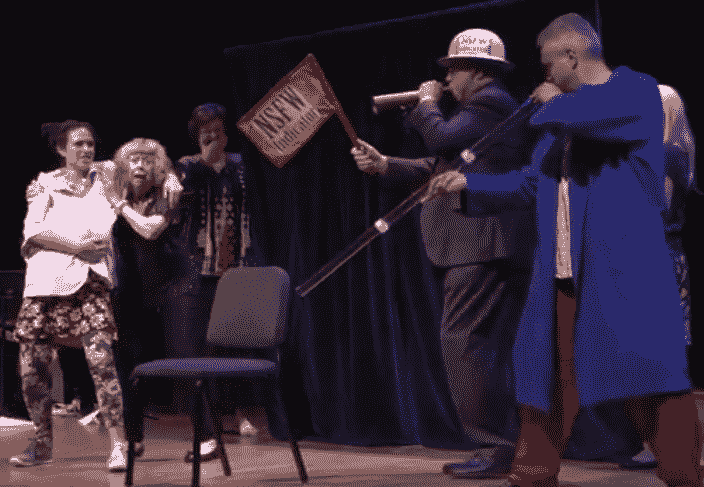

# 怪异科学:液态 y 猫和 2017 年搞笑诺贝尔奖的其他研究

> 原文：<https://thenewstack.io/weird-science-liquid-y-cats-research-2017s-ig-nobel-awards/>

27 年来，[马克·亚伯拉罕斯](https://twitter.com/MarcAbrahams)一直在颁发[搞笑诺贝尔奖](https://www.improbable.com/ig-about/winners/)，表彰“首先让人发笑，然后引发思考”的科学成就上周的年度活动在各大社交媒体平台播出——YouTube、脸书直播、Twitter、Instagram 和 Snapchat——亚伯拉罕斯告诉观众，经过特别编辑的音频版本将在感恩节后的公共电台“科学星期五”播出。

如果成功的秘诀在于跳出思维定势，那么亚伯拉罕斯可能正在培养下一代天才，带领哈佛桑德斯剧院的观众超越科学显而易见的实际应用，进入更加陌生的领域。

也更加有趣。

## 漫长的时间

也许这一切都证明了如果你保持一种好玩的态度，你能取得多大的成就。亚伯拉罕斯还是《不可思议研究年鉴》的编辑和联合创始人，这是一本每年出版六期的科学幽默杂志，所以他已经知道如何在上周的颁奖典礼上让严肃的主题变得有趣。这个愚蠢的仪式以纸飞机开始，所有的纸飞机都瞄准了一个“人体机场”——一个戴着护目镜、头盔的人和一个目标——之后，混乱以适当的科学盛况开始。

但是飞机发布会是由流体动力学博客 [FYFD](http://nicolesharp.com/fyfd/) 的现实世界创造者妮可·夏普(Nicole Sharp)介绍的，在整个活动中分散着来自严肃科学世界的几位人物——包括几位真正的诺贝尔奖获得者。就连活动的传统“欢迎欢迎”演讲也来自现实世界的教授让·伯克·格里森，这位 85 岁的脑科学专家显然是从克利夫兰飞来发表这两个词的演讲。

“欢迎！”*【戏剧性停顿】*“欢迎！”

永远不要低估这些自由独立的思想家的潜力。2000 年，物理学家安德烈·海姆因用磁铁悬浮青蛙的工作赢得了搞笑诺贝尔奖——10 年后，[因石墨烯的工作获得了真正的诺贝尔奖](http://www.improbable.com/2010/10/05/geim-becomes-first-nobel-ig-nobel-winner/)

今年，为了保持搞笑诺贝尔奖的不敬精神，主持人是凯伦·霍普金，她是科学日历*的发明者，她告诉大厅今年的搞笑诺贝尔奖获得者来自五大洲。然后，亚伯拉罕斯带着令人想起格劳乔·马克斯的面无表情的严肃，亲自到场，扔出一架自己的纸飞机，感谢活动的赞助商，并宣布了今年仪式的主题:不确定性。*

 *“是这样吗？!"亚伯拉罕斯对台下的人开玩笑说…

今年的奖项由埃里克·马斯金(他因在机制设计方面的工作而分享了 2007 年诺贝尔经济学奖)和奥利弗·哈特(他因在契约理论方面的工作而分享了 2016 年诺贝尔经济学奖)颁发。92 岁的罗伊·格劳伯(Roy Glauber)因在光学相干量子理论方面的工作而获得了 2005 年诺贝尔奖，他也被介绍为“一个 20 年来谦逊地将纸飞机从这个仪式的舞台上赶走的人。”

该奖项授予在世界各地学术期刊上发表真实论文的作者，包括著名的《英国医学杂志》和《人类神经科学前沿》。

例如，马克-安托万·法丁将流变学——研究物质流动的科学分支——应用于猫是否是液体的问题。他在跟进一项发表在明显非学术网站 [BoredPanda](http://BoredPanda.com) 上的“元研究”,该研究指出猫确实[具有容器的形状](https://www.boredpanda.com/cats-are-liquids/)。

> [查看 imgur.com 的帖子](https://imgur.com/s7JtV)

> [查看 imgur.com 的帖子](https://imgur.com/UuNSR)

“猫被证明是一个丰富的流变研究模型系统，无论是在线性还是非线性领域，”法丁在一篇论文中总结道，CNET 将其描述为“对非流变学家来说，令人惊讶的严肃和几乎不可读”

像今年搞笑诺贝尔奖的许多获奖者一样，法丁亲自前来领奖。但是，当然，有一个转折。一名八岁的女孩将在规定的时间内发表获奖感言，她被描述为“迷人、讨人喜欢、永远可爱的小甜甜”，如果有人发言太长，她会被要求反复呼喊“请停止，我很无聊”。

为了照亮整个过程，活动还特别推出了“人类聚光灯”——两个银色皮肤的人都拿着手电筒。

https://www.instagram.com/p/BZCcFw3Ar5o/

舞台上甚至有一个“社交媒体捕蝶器”，向各种社交媒体平台提供实时更新。

https://www.instagram.com/p/BZCXNJ-gsee/?taken-by=ignobels

## 继续表演

“好吧，让我们结束吧，”亚伯拉罕斯开玩笑说，这时司仪霍普金拿着一个装满奖品的牛皮纸购物袋走过来，准备分发——“一个支撑着问号复制品的人头复制品”获奖者还获得了证书——由真正的诺贝尔奖获得者签名——外加 10 万亿美元的现金奖励。真的。

问题是它们是 10 万亿津巴布韦元的钞票——一种不再流通的 T2 货币。

尽管这些钞票是由诺贝尔奖的真正获奖者发放的。

仪式从今年的物理奖得主开始，也是小甜甜 Poo 在他结束演讲时的首次亮相。

“基本上我在报纸上说的是……”

“请停下来。我很无聊。请停下来。我好无聊……”

该活动的官方 YouTube 频道指出，获奖者“自费从世界各地来到典礼现场，从一群真正困惑的诺贝尔奖获得者手中领奖……”

澳大利亚研究人员描述了他们在[进行的迪吉里杜管演奏如何有效治疗睡眠呼吸暂停的实验](http://www.bmj.com/content/332/7536/266?ref=driverlayer.com)，这对他们来说一定是一段不平凡的旅程。他们穿着睡衣走上讲台，其中一人竟然*对着麦克风弹奏*澳大利亚乐器。下面是他们的演讲是如何结束的。

“所以我们很高兴获得这个荣誉，这个奖项。我现在还可以告诉你另一项研究……”

“请停下来。我很无聊。请停下来。我好无聊……”

使用先进的大脑扫描技术来测量厌恶奶酪的神经基础的研究人员之一。

在“科学一刻”节目中，程序也曾被中断过两次——例如，当诺贝尔奖获得者埃里克·马斯金介绍两个主持人用弹簧创造了一个驻波时(赢得了观众真诚的掌声)。

但混乱从未停止。这次活动还包括一部新的三幕迷你歌剧“无能歌剧”的全球首演，这部歌剧显然是基于彼得原理。(第一句:“一个心理学家走进一家酒吧……”——在那里，他不可避免地以同情一个同样无能的酒保而告终。)当他们进行到第三幕时，主持人凯伦·霍普金实际上已经拿着一杯酒——尽管其关于邓宁-克鲁格效应的结局实际上非常令人心酸。

[https://www.youtube.com/embed/yNwLfRpNHhI?start=4884&feature=oembed](https://www.youtube.com/embed/yNwLfRpNHhI?start=4884&feature=oembed)

视频

还有一个名为 24/7 讲座的特殊部分，再次邀请了几位现实世界中的杰出研究人员和学者。首先，他们会花 24 秒的时间对他们的工作进行复杂的技术描述，“然后，在短暂的停顿之后，用 7 个词就可以清楚地概括出来。”当然，有一个裁判——一个名为约翰·贝瑞塔的真正的职业裁判——在第 24 秒的时候吹响了哨子。

第一位发言者是 Alexsandra Przegalinska，他是波兰 Kozminski 大学的人工智能和技术哲学教授，他对人-机器人交互的前沿研究得到了以下简洁的总结:

"会说话的机器人被认为是愚蠢的。"

亚伯拉罕斯宣布，下一个演示——一只毛腿吸血蝙蝠在绳子和滑轮上下降——已经被取消，因为他们放错了他们的毛腿吸血蝙蝠。(“如果你碰巧发现它，请通知引座员。”)

亚伯拉罕随后介绍了他们新的“赢得一个空盒子”比赛，诺贝尔奖获得者埃里克·马斯金首先检查盒子，确认它确实是空的。获胜者是参加者，他的节目在第六页上有一张鳄鱼在一杯咖啡里游泳的照片。接下来是第二次纸飞机大洪水——持续时间正好 30 秒。

然后，诺贝尔奖获得者奥利弗·哈特介绍了另一个科学时刻——一个失败的实验，变成了两个穿着白大褂的人摆弄他们的设备的一个长片段，但没有成功。

https://www.instagram.com/p/BZChGOXgIsI/

当三个紧张的舞台工作人员抬着一个标有“警告！纽约律师威廉·j·马龙(William J. Malone)指出，“鳄鱼”——去掉了黄色胶带，然后被事件的“工作不安全”指示器警告不要继续进行，他同意如果任何事情看起来不合适，就鸣喇叭。

产科奖颁给了西班牙的一个团队，因为他们在婴儿舱上的工作，这是一种 FDA 批准的阴道扬声器，可以将 iPhone 中的音乐直接广播到孕妇的腹部。“我们已经发现了胎儿听觉是如何工作的，”玛丽莎·洛佩兹·泰吉恩在演讲结束时告诉观众。“胎儿在子宫外几乎听不到噪音。胎儿的听觉能力在他们只有 11 厘米——4 英寸——的时候就开始了，而且胎儿……”

“请停下来。我很无聊。请停下来。我好无聊……”

这个活动以另一个传统——再见演讲——结束，由脑科学专家让·伯克·格里森主持。

“再见！”*【戏剧性停顿】*“再见！”

然后某个地方有人开始玩泰迪熊的野餐…

* * *

# WebReduce

通过 Reddit 的特征图片[。](https://www.reddit.com/r/aww/comments/p0iu5/a_sink_full_of_cat/)

<svg xmlns:xlink="http://www.w3.org/1999/xlink" viewBox="0 0 68 31" version="1.1"><title>Group</title> <desc>Created with Sketch.</desc></svg>*