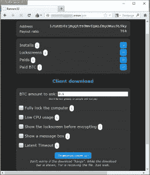

# 欢迎来到基于 Node.js 的跨平台恶意软件时代

> 原文：<https://thenewstack.io/welcome-age-node-js-based-multi-platform-malware/>

鉴于 Node.js 的多功能性，JavaScript 运行时被部署用于邪恶目的只是时间问题。这一切都发生了。上周末，基于 Node.js 构建的名为 Ransom32 的新勒索软件的细节浮出水面。

由于 Node 和 JavaScript 的多平台能力，该恶意软件很可能是第一个跨平台的 JavaScript 勒索软件包，能够同样容易地从 Windows、Linux 和 Mac 用户那里勒索金钱(尽管迄今为止该漏洞仅针对 Windows 用户)。

12 月 29 日首次[报道，Ransom32 构建于](http://securityaffairs.co/wordpress/43250/cyber-crime/ransom32-crypto-ransomware.html) [NW.js](http://nwjs.io/) 之上，这是一个基于节点的框架，用于在 Windows 桌面上运行 JavaScript 应用程序和节点模块。基于 [WebKit](https://webkit.org/) 布局引擎，NW.js 提供了一种运行代码的方式，这些代码原本是为浏览器编写的，可以直接在操作系统之上运行。

对于恶意软件制作者来说，NW.js 非常方便，因为它消除了浏览器在运行 JavaScript 代码时设置的安全限制，暴露了底层操作系统的全部功能。

it 安全公司 [Emsisoft](https://www.emsisoft.com/en/) 的研究员 Emsisoft 的 [Fabian Wosar](https://twitter.com/fwosar?lang=en) 在一篇详述勒索软件工作原理的博客文章[中解释道:“因此，虽然 JavaScript 通常被严密地限制在你的浏览器中，不能真正触及它运行的系统，但 NW.js 允许更多的控制和与底层操作系统的交互，使 JavaScript 能够做几乎所有像 C++或 Delphi 这样的“普通”编程语言可以做的事情。](http://blog.emsisoft.com/2016/01/01/meet-ransom32-the-first-javascript-ransomware/)

在这种情况下，一旦被秘密安装，Ransom32 就会对电脑上的用户文件进行加密，因此在支付比特币费用之前，用户无法访问这些文件。

对于 Wosar 来说，Ransom32 不同寻常的本质在于它的分量，超过 22MB，比大多数恶意软件的 1MB 大得多。该软件包包括 NW.js、Node 和运行恶意软件的基于 JavaScript 的代码。

到目前为止，这种勒索软件通过传统方法传播，即通过垃圾邮件将该软件作为附件，通常巧妙地命名为让用户点击它。一旦发生这种情况，包含在自解压 WinRAR 文件中的软件会将自己安装在用户的机器上，这样恶意软件就会在每次计算机启动时执行。

该软件包还包括一个 Tor 客户端，通过端口 85 与后端“命令和控制”服务器通信，以处理诸如传输加密用户数据的密钥、指定提交赎金的地址等任务。

"使用 CTR 作为块模式，使用 AES 和 128 位密钥对文件进行加密。为每个文件生成一个新的密钥。该密钥是使用 RSA 算法和第一次通信期间从 C2 服务器获得的公钥加密的，”Wosar 写道，并指出软件包的质量表明 Ransom32 是一项专业工作。

Softpedia [在一篇关于攻击的文章](http://news.softpedia.com/news/ransom32-is-a-javascript-based-ransomware-that-uses-node-js-to-infect-users-498342.shtml)中指出，就像今天越来越多的恶意软件一样，Ransom32 实际上是作为一种勒索软件即服务来提供的。客户可以通过 Tor 网络“暗网”门户定制自己的软件版本。该软件的作者抽取 25%的提成，然后将剩下的赎金转给客户。

指明您的首选消息框，让人们知道他们的所有数据现在都被锁定？勒索软件即服务。

Softpedia 指出，传统上，这种恶意软件是用 C++等语言编写的。但是 NW.js 提供了“将运行时和你的 NW.js 打包到一个可执行文件中”的优势。所以你不需要依赖用户已经安装了某种现有的框架。

使 Ransom32 特别成问题的是，因为它包括 NW.js 这一合法程序，反恶意软件和服务提供商很难开发出识别恶意软件包的签名。

然而，有一点是肯定的，Ramsom32 只是很可能是一长串基于 JavaScript 的跨平台恶意软件中的第一个。

“黑客从根本上来说是群居动物，当他们看到某个东西在工作时，它不可避免地会被其他人复制。因此，假设犯罪者看到了合理的经济收益，那么几乎可以肯定的是，我们将在 2016 年看到更多这种类型的攻击，”基于云的网络安全技术公司 Seculert 的首席执行官理查德·格林在一封电子邮件中写道。“有趣的是，模仿者会添加什么类型的功能，使其比目前流通的变种更加危险。”

图片来自 [Emsisoft](https://www.emsisoft.com/en/) 。

<svg xmlns:xlink="http://www.w3.org/1999/xlink" viewBox="0 0 68 31" version="1.1"><title>Group</title> <desc>Created with Sketch.</desc></svg>