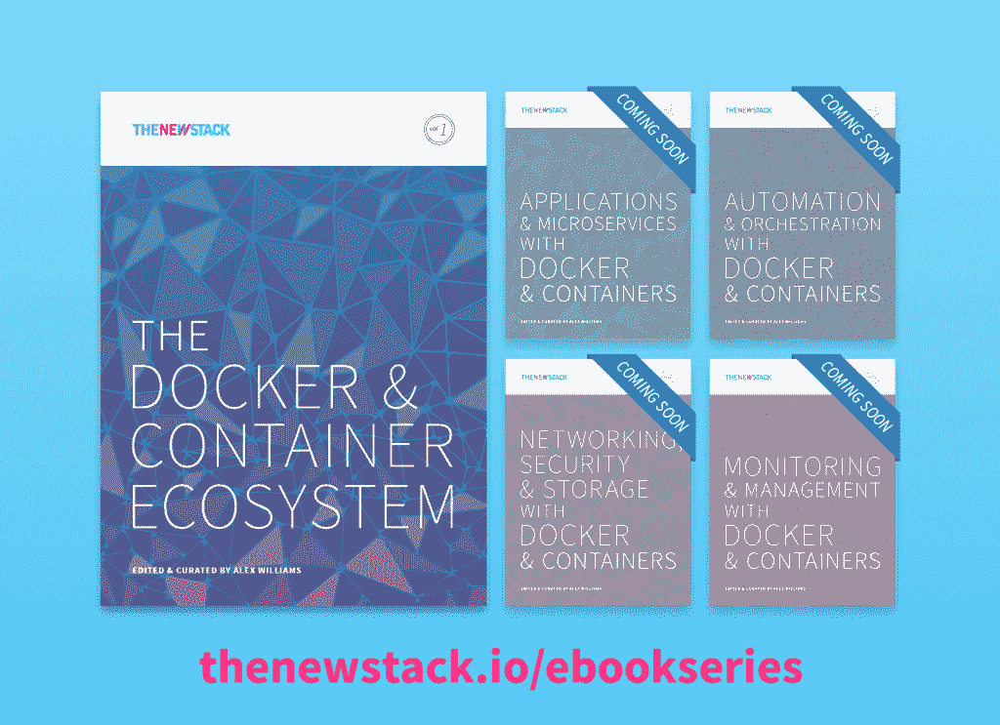

# 欢迎来到我们的电子书:码头和集装箱生态系统

> 原文：<https://thenewstack.io/welcome-to-our-ebook-the-docker-and-container-ecosystem/>

欢迎阅读我们关于 Docker 和容器生态系统的五部分系列的第一本电子书。这里是[下载](http://www.thenewstack.io/ebookseries)页面。

在这本电子书中，我们在超过 120 页的篇幅中概述了 Docker 和 container 移动的重要性，以及它对如何大规模开发和管理应用程序所带来的变化。这本电子书有 12 个章节和 160 多家公司和产品的目录。

电子书中包括:

*   看看开源生态系统如何定义生态系统。
*   一项供应商调查显示了容器如何推动 IT 市场的转变。
*   Go 编程语言如何对 Docker 和容器生态系统起到如此重要的作用。
*   跨分布式资源管理 Docker 和容器的方式。

这些日子将有助于定义一个不断变化的技术堆栈，它比技术专家在企业全盛时期可能梦想的要短暂得多。今天，我们谈论的应用程序远不止运行它们的机器。这些机器现在是一种资源——而不是服务器场、网格甚至云。这种资源和我们所知道的任何物质资源一样真实。

【T2

我们要感谢 IBM，思科和 Docker，我们的系列赞助商，使这个电子书系列成为可能。

该系列将在 1 月份继续，重点关注应用程序开发和微服务。

专题图片:[Thierry ehrmann](https://www.flickr.com/photos/home_of_chaos/5930995102/in/photolist-a36Udf-4i3QFK-7ByEvk-8f9zmW-8f6mPH-e5h4zA-3cvWFH-3cvWCM-8mMP5e-8mQWXu-6H94h8-3cAnf1-3cAnhJ-3cAnby-3cvWHp-3cAncw-8mSQse-qvmc5X-8mVZc5-8mMPca-8mVZi5-6bwpmk-3adnbo-3a8RN4-3a8RP8-fUs4bf-3a8RGH-qLWi5i-3a8RDP-3adnao-8tYoMq-8mQXiw-3a8Rvi-3admQu-3admU9-3a8Ru4-3adn2C-3a8RyM-3a8RFn-3adn3Y-qJmEeB-3bW4jH-3c1ujW-3a8Rmv-3a8RpZ-3a8RAc-8HkrQL-3a8RJ4-xy5YT7-wDoFKj)的[集装箱边界双年展 2011 DDC _ 5207】](https://www.flickr.com/photos/home_of_chaos/5930995102/in/photolist-a36Udf-4i3QFK-7ByEvk-8f9zmW-8f6mPH-e5h4zA-3cvWFH-3cvWCM-8mMP5e-8mQWXu-6H94h8-3cAnf1-3cAnhJ-3cAnby-3cvWHp-3cAncw-8mSQse-qvmc5X-8mVZc5-8mMPca-8mVZi5-6bwpmk-3adnbo-3a8RN4-3a8RP8-fUs4bf-3a8RGH-qLWi5i-3a8RDP-3adnao-8tYoMq-8mQXiw-3a8Rvi-3admQu-3admU9-3a8Ru4-3adn2C-3a8RyM-3a8RFn-3adn3Y-qJmEeB-3bW4jH-3c1ujW-3a8Rmv-3a8RpZ-3a8RAc-8HkrQL-3a8RJ4-xy5YT7-wDoFKj)由 2.0 在 [CC 下授权。](https://creativecommons.org/licenses/by/2.0/)

<svg xmlns:xlink="http://www.w3.org/1999/xlink" viewBox="0 0 68 31" version="1.1"><title>Group</title> <desc>Created with Sketch.</desc></svg>