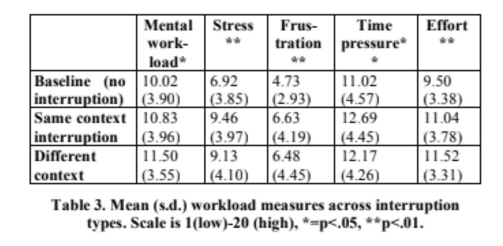
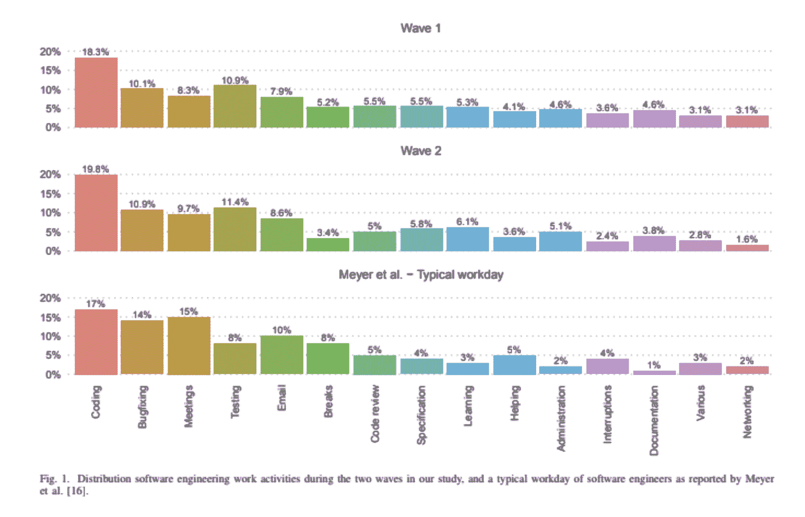

# 欢迎来到“PRty”:包含一切的拉取请求

> 原文：<https://thenewstack.io/welcome-to-the-prty-the-all-inclusive-pull-request/>

 [马坦密山

马坦密山是一名工程师转行 PM 转行创始人。他是 Livecyle 的联合创始人兼首席执行官，Livecyle 是一家早期初创公司，专门从事实时环境之上的协作。Matan 在领导研发组织和领导产品方面拥有十多年的经验，无论是在企业还是初创公司，从开始到推出再到收入。他还喜欢定期为 PMF 之前的初创公司提供咨询。对解决研发相关的技术和人际问题充满热情。](https://www.linkedin.com/in/matan-mishan-593b9250/?originalSubdomain=il) 

私人聚会听起来总是像你希望被邀请的事情，超级有趣和独家。事实上，这种排他性的诱惑也经常被用作一种商业策略。通过秘密的 VIP 发布会和提前使用的部署策略，品牌试图利用“FOMO”的力量来围绕他们的产品或服务制造轰动效应。

有趣的是，当查看开发团队工作流内部时，您会发现 PR (pull request)工作流形式的类似模式，主要用于开发人员到开发人员的交互。git 工作流推动了这种类型的专有流程在工程组织中的流行，git 工作流使编码人员能够在他们熟悉的上下文流程中工作。

但与营销策略和品牌建设不同，在工程背景下采用这种方法有其缺点。没有其他利益相关者的参与，工程团队实际上可能会发现他们自己正遭受更忙乱的反馈循环、持续的中断和更慢的整体决策过程。

一个更具包容性的工作流程的好处可能是巨大的，最近的一项研究[量化了“非多元化和多元化组织之间的员工绩效差异高达 12%”。此外，根据该研究，“多学科团队——包括业务角色，而不仅仅是 IT——利用他们的专业知识和经验的多样性来实现更快的决策。"](https://www.gartner.com/smarterwithgartner/diversity-and-inclusion-build-high-performance-teams)

因此，如果一个多学科的团队从业务交付的角度来看整体上表现得更好，也许这些从多学科结构中衍生出来的相同的生产力原则可以为较少包含的开发过程产生更好的结果？

## 一瞥独家房产

但是，在我们邀请其他利益相关者参加这个聚会之前，让我们首先了解一下对相关开发人员起作用的是什么。

代码评审格式在工程组织中是非常标准的，并且基本上由这个典型的拉请求工作流组成，该工作流是随着 git 工作流的开始而创建的。

常见的工作流通常如下所示:

1.  1.  写代码
    2.  打开一个 PR
    3.  执行代码审查
    4.  解决未解决的问题或意见
    5.  验证更改
    6.  合并公关

当前的代码评审实践有几个主要的好处:

1.  **微审查**:通常审查者只检查代码的最后更改，因此当利用最佳实践打开 PR 时，通常不需要审查多上下文代码行，因为目标是通过更小的拉式请求将任务分成更小的任务。这种工作方式旨在使审核者花费最少的时间，而不会成为一天工作中的累赘或重大事件。我们可以从 Palantir 等公司的博客上看到一些关于最佳实践的建议:“如果一个代码评审对超过 5 个文件进行了实质性的修改，或者花了超过 1-2 天的时间来编写，或者花了超过 20 分钟来评审，考虑将它分成多个独立的 Cr。”
2.  **上下文注释**:每当你发现代码的特定部分有改进的空间(并且总是有改进的空间)，你可以直接将你的注释添加到相关的代码行中，为代码所有者提供应该改进的地方的完整上下文。引用特定的代码行不会留下模糊的空间。
3.  可操作的建议:作为一个评审者，你可以简单地在你的评论中写代码，以尽可能清楚地表达你想要的结果。这使得代码所有者能够从您的注释中学习，并选择是否完全、部分地实现它们，或者以类似的方式实现更改。如果与建议有冲突，很容易在这个特定的背景下讨论。
4.  **直观的工作流程**:代码所有者和代码评审者对彼此的期望有着共同的理解。这种理解有助于异步工作，而不会在开发过程中产生任何瓶颈。如果设计和产品评审的工作方式和代码评审一样会怎样？

很明显，PR 工作流对于开发人员到开发人员的评审非常有效。但是，当我们需要向流程中添加额外的利益相关者时，会发生什么呢——这个流程是如何进行的呢？这不仅仅是一个理论问题，而是一个非常实际的问题。这实质上是组织在走出代码本身的界限，进入产品和功能设计领域时所面临的挑战。

当涉及到设计新功能或产品时，工程只是拼图的一部分——在这个过程中还有其他同样重要的功能，如设计师、项目经理和质量保证——每个功能都有不同的工作流程和思维模式。

你甚至可以说他们说完全不同的语言，所以我们可以忘记代码建议或上下文注释的好处。当涉及到开发过程时，这些额外的涉众将会有许多他们自己的问题要提出，这些问题的重要性不亚于代码审查，并且有些同样紧迫。而且这些评论有的可能连最新版本都没有关联，更不用说某个具体的 PR 了。

这种模糊性和缺乏上下文反过来又造成了一个忙乱的反馈循环，通常包括:

1.  会议邀请相当于“轻拍肩膀”，邀请您参加计划外的推进会议，以了解为什么某些事情没有按照定义或要求实施。
2.  在你心爱的任务管理工具上打开了多个新标签。
3.  一个共享文档，列出了多个问题和一些截图。只是为了确保每个人都尽可能地喜欢它——它包括了一个超级过时的产品版本的错误和评论。
4.  期望这份文件将引发你的最爱之一——另一次会议！

忙乱的反馈循环对编码人员的影响不能被夸大:

1.  由于断章取义的干扰而产生的压力和挫折感。

上表摘自《中断工作的成本:更多的速度和压力》(2008 年，Mark，Gudwith & Klocke)，显示了精神负荷、压力和挫败感如何随着中断而显著增加，尤其是当它们被认为脱离了背景时。

2.高成本的上下文在开发中的多个特性之间切换

来自《新冠肺炎·疫情时期软件工程师的日常生活》(2021，Russo，Hanel，Altnickel 和 van Berkel)的数据清楚地表明，上下文切换越少——无论是电子邮件、中断还是休息(通常被认为是为了提高生产率)，编码就越少。

3.更多的会议只是为了让所有利益相关者达成共识。

《哈佛商业评论》最近也发表了一篇文章[协作超载正在降低生产力](https://hbr.org/2021/09/collaboration-overload-is-sinking-productivity)，该文章关注会议对整体生产力的影响。

“这些互动减少了 30%的专注时间(定义为每天两个多小时不间断地专注于一项任务或项目的时间)。”

如果这些你听起来很熟悉，你并不孤单。编码人员和其他利益相关者之间的摩擦是一个由来已久的痛点，几乎存在于每个工程组织中。

谢天谢地，我是来试着让你振作起来的！接下来的事情可能会帮助你一劳永逸地消除这个反馈循环。

## 全包的房子！

在我作为工程经理的大部分职业生涯中，我一直专注于消除这种摩擦。当考虑以上所有内容时，对我来说相当明显的是，我们应该利用代码审查和 PR 工作流中固有的相同核心优势，并将它们应用到所有相关的利益相关者中。称之为“PRty”这意味着:

1.  任何利益相关者的任何反馈都是根据上下文设计的
2.  所有讨论都是异步进行的，并被记录在案
3.  可操作的问题将在相关工作流程中以 PR 粒度提供

虽然这看起来相当简单，但这回避了一个问题:为什么这不会发生在现实生活中？

答案在于代码对其他利益相关者的访问方式。

1.  今天的代码评审在很大程度上发生在组织的 git 提供者内部，在那里其他的涉众并不真正操作，或者经常甚至没有一个帐户能够有意义地参与评审。
2.  其他利益相关者依赖开发人员提供给他们的部署环境来体验最新版本。如果您正在使用其中任何一种:
    1.  生产中的特征标志
    2.  单一暂存环境
    3.  有限数量的开发环境

这种“开发人员心态”可能是沟通中一些摩擦和破裂的根本原因，这导致了与其他利益相关者的破坏性和忙乱的反馈循环，这些利益相关者高度依赖于您提供给他们的预览。

他们有什么工具来分享他们的反馈？人们将使用他们所掌握的工具和他们熟悉的流程来完成工作。因此，如果 Zoom 和吉拉是他们提供的提供反馈的工具，那么只有加入 Zoom 呼叫或打开多个票证来分享他们的反馈才有意义。

## 我们能利用技术来影响文化吗？

因此，为了真正改变现有的范例，我们需要尝试将所有的多学科功能整合到同一个开发工作流程中。我一直在探索的一种在培养更多协作过程中非常有效的方法是利用短暂的和可共享的环境。这些环境可以使这个聚会包罗万象，同时仍然为流程中所有相关和高价值的利益相关者保持自然的工作流。

有许多短暂环境的例子已经为其他用例解决了类似的挑战。其中的一些是:当一个特定的变更被触发时，自动运行你的 E2E、集成或者 UAT 测试。短暂的环境是可以无限次数地自动创建的临时的类似舞台的环境。在我们的多学科利益相关者的环境中，这意味着他们基本上会有一个为联合项目中的任何 PR 或分支自动生成的预览。

在产品开发工作流程中采用这种方法有多种好处:

1.  **任何利益相关方对项目及其进展的可访问性**。因为这个短暂的环境有一个唯一的 URL，所以它本质上是可以共享的，这使得任何人都有可能在他们想要或被要求的任何时候点击并体验这个过程。
2.  **背景问题——报道**。将问题报告耦合到这样一个环境中，为代码所有者提供了更大的上下文，以及在一个正常运行的再现环境中轻松再现问题的能力。
3.  **从长远来看，这些环境的编排和管理将成为版本控制时间机器**。如果任何一个环境在任何给定的时间都是现成可用的，那么在它们之间进行遍历和在旧版本之间进行比较就变得很容易了。把一个更短的根本原因分析看作是好处，只是没有从你的 SCM 构建和部署以前版本的繁重工作。

## 由短暂环境驱动的利益相关者之间的协作

一旦我们使协作的短暂环境成为工程组织的新常态，这种协作模式可以进一步发展，以加速和简化业务交付。这可以通过向微评论和上下文评论添加一层可操作的建议和直观的工作流来实现。

例如，假设我们为每个 PR 生成了一个短暂的环境，那么将它与一个用于问题报告的工具连接起来，同时将工具的输出集成到组织 SCM 中的实际 PR，这将是相当简单的。

让我们来看一下这与每项优势的对应关系:

1.  **可行的建议**:在报告短暂环境中的问题时，用户还可以添加更多功能，如控制台日志、网络调用，甚至 CSS 更改(一些设计师和项目经理喜欢通过浏览器中的开发工具来完成)。
2.  **直观的工作流程**:将这些问题直接发送到 SCM 无缝嵌入到 git 工作流程中，并提供与代码审查相同的输出，保持熟悉的工作流程。

多年来，已经有足够的数据表明，更多协作和多学科的工作文化——无论是 DevOps、Fullstack、squads 和 guilds 等学科，还是简单的传统多样性和包容性，都具有明显的商业优势。工程实践已经落后了，并且对于组织中的其他涉众来说仍然是一个相当排他的过程。我认为是时候为开发团队升级这些过时的过程了。

通过更新这种模式，我们可以获得直接的业务和生产效益，同时创建更具包容性和更令人愉快的工程流程。所以让我们通过一个更包容的政党来开始一场革命吧！

<svg xmlns:xlink="http://www.w3.org/1999/xlink" viewBox="0 0 68 31" version="1.1"><title>Group</title> <desc>Created with Sketch.</desc></svg>