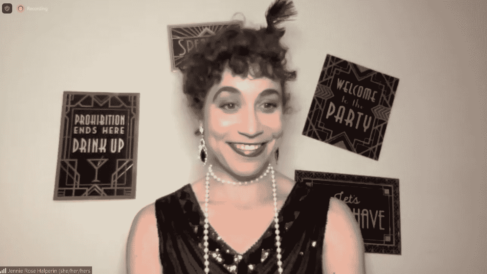
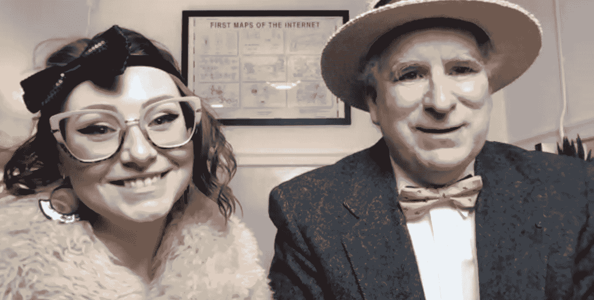
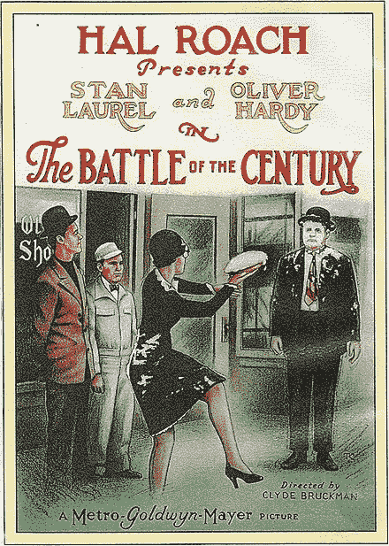

# 创造力的源泉:为什么公共领域很重要

> 原文：<https://thenewstack.io/wellspring-of-creativity-why-public-domain-matters/>

本月早些时候，数十万件创意作品进入了公共领域。

[杜克大学公共领域研究中心](https://web.law.duke.edu/cspd/publicdomainday/2023/)的一个网页上写道:“它们本应在 2003 年进入公共领域，在此之前它们已经拥有了 75 年的版权。”。但在此之前，国会按下了 20 年的暂停键，将他们的版权期限延长至 95 年

这是一个许多人和组织都非常关心的问题——周四有 200 多人参加了在 T4 举行的虚拟庆祝活动。互联网档案馆[承诺](https://blog.archive.org/2022/11/30/the-best-things-in-life-are-free-two-ways-to-celebrate-public-domain-day-in-2023/)将有“来自开放世界的历史学家、图书管理员、学者、活动家和其他领导人，包括额外的赞助组织图书馆未来、SPARC、作者联盟、公共知识和杜克公共领域研究中心”出席

在美国，当版权被授予一个创造性的作品时，比如一首歌、一部电影或一本书，该作品的创作者有专有权做他们想做的事情。这个想法是版权给了所有者一个机会在一段固定的时间内从作品中获利，目前是 95 年。今年，所有创作于 1928 年 1 月 1 日之前的作品都进入了公共领域。

根据杜克中心的说法，这意味着 1927 年发布的歌曲“现在任何人都可以免费复制、表演、录制、改编或插入到他们自己的歌曲中”(尽管这些歌曲的录音仍然受到不同版权的保护)。公共领域的电影、歌曲和出版物现在都可以自由分享和复制——“无需许可或付费……社区影院可以放映这些电影。青年管弦乐队可以公开演奏这些音乐，无需支付许可费。”

今年的虚拟庆祝活动始于来自湾区蓝草乐队[的吉他手埃里克·耶茨演唱新解放的歌曲，如“生活中最好的东西是免费的”](https://en.wikipedia.org/wiki/Hot_Buttered_Rum_(band))

“难道这不是事实吗，”耶茨在歌曲结束时说。

## 我们现在能做什么

耶茨的表演只是我们这些人如何开始享受公共领域作品的新地位的一个例子。后来，我问电影保护主义者罗布·伯恩(Rob Byrne )( T1 ),既然 1927 年的电影也进入了公共领域，我们该怎么处理它们。“你想做什么都可以！”伯恩回答道。“比方说，你拥有一部公开发行的电影的拷贝——然后你可以展示它，如果你想的话，还可以要钱。你可以重新混音。你可以用它的夹子和材料。你可以把它发布在互联网上。免费的！不附带任何条件！”

这包括从弗里茨·兰的先锋科幻电影*大都市*到劳雷尔和哈代的*世纪之战*中史诗般的馅饼大战

[https://www.youtube.com/embed/KPGCRU1ExrY?feature=oembed](https://www.youtube.com/embed/KPGCRU1ExrY?feature=oembed)

视频

互联网档案馆甚至举办了一场[公共领域日混音比赛](https://blog.archive.org/2022/11/30/public-domain-day-2023-remix-contest-the-internet-archive-is-looking-for-creative-short-films-made-by-you/)，为从 1927 年以来的各种收藏中创作的最佳短片提供现金奖励。所有参赛作品都计划于周五在旧金山总部举行的一场以 1927 年为主题的特别庆祝派对上放映。公共领域的积极分子也在周四的虚拟活动中穿着庆祝服装。

詹妮·罗斯·哈尔佩林，倡导团体图书馆未来的主任，庆祝 1927 年的公共领域作品。

布鲁斯特·卡尔和杰米·乔伊斯来自互联网档案馆。

1927 年的书籍和期刊也失去了版权——包括几部著名的小说作品。杜克大学(Duke University)临床法学教授詹妮弗·詹金斯(Jennifer Jenkins)说，“你可以自由地重新想象人物、事件、场景和意象，并在你自己的故事、戏剧和电影中使用它们。”。

例如，夏洛克·福尔摩斯这个角色现在终于公开了，“所以神秘迷们，开动你们的引擎吧。你可以写你的福尔摩斯故事了！”

詹金斯把公共领域比作一种缪斯女神，称之为“创造力的源泉”。或者，正如杜克大学的公共领域中心所说，“未来的作者可以合法地建立在过去的基础上——重新构思书籍，将其拍成电影，改编歌曲和电影……每个人都可以建立在它们的基础上，翻拍它们，呈现它们的新版本，或者将它们用于教育或仅仅是娱乐。”

该中心还引用了前美国版权登记处的 Karyn A. Temple 的话，他将公共领域称为版权作品的“下一阶段”，这“为作者提供了创作新事物的灵感和原材料。”

[https://www.youtube.com/embed/nAp7fhUd7u0?start=607&feature=oembed](https://www.youtube.com/embed/nAp7fhUd7u0?start=607&feature=oembed)

视频

这个过程总是发生在我们周围。2021 年,《纽约时报》注意到，F. Scott Fitzgerald 的《了不起的盖茨比》*现在有多个[漫画](https://www.amazon.com/Great-Gatsby-Graphic-Novel/dp/1982144548/ref=asc_df_1982144548/%20) [小说](https://www.canterburyclassicsbooks.com/books/the-great-gatsby-a-graphic-novel-9781645176275/)和[插图](https://www.amazon.com/Great-Gatsby-Novel-Illustrated/dp/0762498137/ref=sr_1_7) [版本](https://www.amazon.com/Great-Gatsby-Deluxe-Illustrated/dp/1949846377)——更不用说像迈克尔·法里斯·史密斯的小说*尼克*这样的衍生作品，以及更复杂的改编作品，如《同性恋盖茨比》 和 [*了不起的盖茨比*](https://www.amazon.com/Great-Gatsby-Undead-Kristen-Briggs/dp/B08SGWTC4J)*

 *“所有这些新作品都受到评论界的好评，或者版权所有者会认可吗？不，”杜克中心解释道。“但它们仍是我们文化的一部分，时间会证明它们是否会在市场上获得回报，或者是否有持久的吸引力。”

杜克中心的网页提出了另一种可能性:以一种纠正的方式重新想象过去的作品，以解决他们使用种族偏见和诽谤的问题。

“公共领域是我们历史的宝库——记录了我们文化的所有部分，而不仅仅是我们喜欢的部分……正是因为作品不再受版权所有者的控制，它们的美和丑才能被今天的学者和公民自由探索；所有者不能再坚持只展示一个删节过的、清理过的、隐藏了原作重要方面的版本。”

## 珍贵的保存

但是公共领域的地位不仅仅允许创作者创作新的衍生作品。这对保存现存的作品也很重要。像互联网档案馆、谷歌图书和纽约公共图书馆这样的网站现在可以在网上获得这些作品，杜克大学的中心说这“有助于获得否则可能被历史遗忘的文化材料。”

在周四的活动中，詹金斯指出，1927 年的绝大多数作品目前“已经不流通了——但现在它们是公共领域，可以存档并以更多格式提供。或者，正如杜克中心所说，“任何人都可以将它们从默默无闻中拯救出来，并让它们变得可用，在那里我们都可以发现、享受它们，并为它们注入新的生命。"

对一些作品来说已经太晚了——比如 1927 年的惊悚片《午夜后的伦敦》，现在显然已经永远失传了。“1930 年前创作的电影只有 15%幸存下来，”电影保护主义者 Byrne 告诉虚拟观众，“超过 80%的电影丢失了——永远消失了——一帧都没有留下。”

杜克中心的网站解释说，许多无声电影“被销毁或丢弃，以清理存储空间，或被熔化，以获得其基底中包含的银。没有被破坏的胶片被允许腐烂。”他们还指出，尽管版权法中有一些许可，但“老电影已经解体，在罐子里腐烂，而保护主义者急切地等待它们进入公共领域，以便他们可以合法地数字化它们。”

一份来自国会图书馆的 [2013 年报告](https://www.loc.gov/static/programs/national-film-preservation-board/documents/pub158.final_version_sept_2013.pdf)强调这是允许电影版权失效的一个重要优势。一旦进入公共领域，印刷品就会被企业家收购，并在商业开发过程中保存下来。简而言之:“一些独立制作的电影的公共领域地位鼓励了它们的生存。”

正是因为这个原因，杜克中心现在为我们新的“访问我们的文化遗产——访问可能被遗忘的资料……实证研究表明，公共领域的书籍[更便宜](http://www.minnesotalawreview.org/articles/property-rights-efficient-exploitation-copyrighted-works-empirical-analysis-public-domain-copyrighted-fiction-bestsellers/),有更多版本和格式,并且[更有可能出版](http://papers.ssrn.com/sol3/papers.cfm?abstract_id=2290181)(2021 年《纽约时报》甚至提到“[了不起的盖茨比*供过于求*](https://www.nytimes.com/2021/01/14/books/the-great-gatsby-public-domain.html)”——这部 1925 年的小说在版权最终到期后，由四家不同的出版商推出了新版本。)

但这显然比其他选择更好。杜克指出, *Metropolis* 实际上在 1955 年就进入了公共领域——但是在 1996 年通过的新立法下又回到了版权状态。从那时起，“对于绝大多数——可能是 99%——1927 年以来的作品，*没有版权所有者从持续的版权中获得经济利益。然而，他们仍然是禁区，没有好的理由。*

想到无数的创造性作品以最糟糕的情况告终，令人难过:当它们进入公共领域时，它们已经不复存在了。

像这样的结果是公共领域的倡导者热切希望避免的。

* * *

# WebReduce

<svg xmlns:xlink="http://www.w3.org/1999/xlink" viewBox="0 0 68 31" version="1.1"><title>Group</title> <desc>Created with Sketch.</desc></svg>*