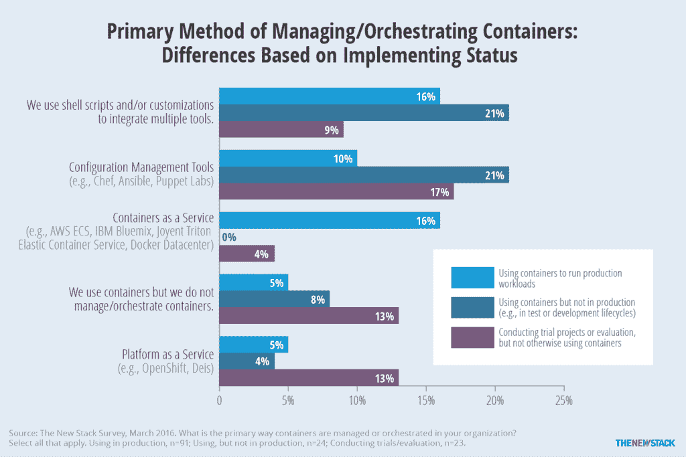

# 我们在 Kubernetes 上支付:“它改变了我们的业务”

> 原文：<https://thenewstack.io/wepay-kubernetes-changed-business/>

我们经常听说执行良好的容器编排可以简化 IT 和业务流程。在 3 月份的谷歌云平台大会上，我们通过电子支付服务提供商 [WePay](https://go.wepay.com/) 的证明看到了行动上的成功，该公司将其单一应用程序分解为一组服务，这些服务通过谷歌开源 [Kubernetes](/category/kubernetes/) 容器编排引擎进行协调。

“这真的改变了我们的整个业务，”WePay 的首席工程师理查德·斯廷伯格在随后的采访中说。“Kubernetes 不会把你放在一个盒子里。您可以在此基础上进行构建。”

本周，Google [发布了 Kubernetes](https://thenewstack.io/kubernetes-1-3-supports-stateful-applications-federated-clusters/) 的最新版本，1.3 版，它具有企业友好的特性，比如支持有状态应用程序。

WePay 创建了一个 PCI 认证的系统来处理信用卡支付，充当企业和消费者之间的中间人。最初，该公司将服务构建成一个单一的应用程序，由 PHP 处理主要部分。该公司经历了棘手的性能问题，这些问题可能会妨碍整体系统。例如，一个只用于内部调试的 API 日志服务对数据库的查询如此频繁，以至于降低了性能。

该公司现在正在将其分解为一组更小的服务。它冻结了新功能，同时将单片应用切割成更小的服务。

展望未来，Kubernetes 似乎为 WePay 提供了公司拓展新方向所需的灵活性。“我们看着路线图，可以看到对我们有帮助的功能，”Steenburg 说

WePay 向基于服务的架构的转变分两步展开。起初，开发团队剥离了一些功能，将它们添加到 Docker 容器中。部署过程仍然涉及单独启动容器，所以我们转而使用 Ansible，为每个虚拟机安装一个容器。

然而，使用像 Ansible 这样的 SCM(软件配置管理)产品有它的挑战。也就是说，WePay 无法自动扩展其服务。

Steenburg 说:“每次部署时，如果您想要添加更多节点，您需要返回并更改部署脚本，因此扩展是非常手动的，每次发生这种情况时，都有停机的风险，因为您实际上是在更改部署它的东西，以便处理更多节点。”。

Ansible 确实提供了滚动更新的能力，Steenburg 承认这可以节省时间。但这是 Kubernetes 提供的开箱即用功能。所以公司的下一步是迁移到 Kubernetes。

起初，Kubernetes 确实提出了重新思考建筑的挑战。特定的工作将不再局限于特定的机器。该公司不得不将其运营视为一个纯粹的[状态机](http://blog.markshead.com/869/state-machines-computer-science/)，拥有一整套完全独立于硬件的相互关联的流程，并且没有任何特殊的硬件需求。“我觉得这样很好，因为你想在模型中保持纯粹。你不会想超出这个范围的，”Steenburg 说。

使用 Kubernetes 的另一个最初挑战是，开源编排引擎没有提供加密消息流量的方法，该公司需要这样做来保持支付卡行业数据安全标准( [PCI](https://www.pcicomplianceguide.org/pci-faqs-2/) )的合规性。当 Kubernetes 实例化 pods 时，它为它们提供本地主机名，因此它们无法通过网络外的第三方认证机构进行验证。

因此，该公司建立了一个 Kubernetes side pod，以提供基于 Nginx 和 Kube DNS 的内部认证机构(CA)服务，可用于签署加密消息。

“付款很难。与银行合作很难，与监管机构合作也很难，最大的问题是欺诈和识别欺诈，这是我们将一直承担的责任，基本上每天都要与之斗争，因为这就是我们所处的行业，”Steenburg 说。

看起来很快，WePay 将会有一个足够灵活的架构来克服这些挑战。

<svg xmlns:xlink="http://www.w3.org/1999/xlink" viewBox="0 0 68 31" version="1.1"><title>Group</title> <desc>Created with Sketch.</desc></svg>