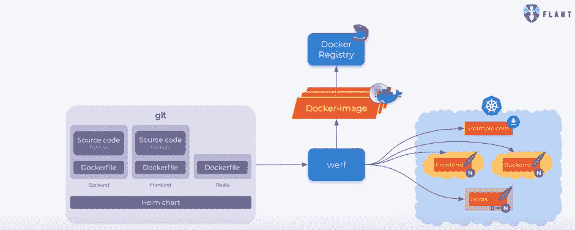

# WERF 从命令行自动化基于 Kubernetes 的 GitOps

> 原文：<https://thenewstack.io/werf-automates-kubernetes-based-gitops-workflows-from-the-command-line/>

基础设施服务提供商 [Flant](https://flant.com/company/about-us) 的一个名为 [Werf](https://werf.io/) 的新项目承诺了一种建立 GitOps 风格的部署管道的简单方法，其中 git 存储库中的代码变化触发适当的容器被重新构建并被推送到 Kubernetes 部署中——所有这些都是自动的。

“它将注册中心的状态与 git 的状态同步，并将 Kubernetes 的状态与 git 中的状态同步，”Flant 首席技术官 [Dmitry Stolyarov](https://www.linkedin.com/in/distol) 在最近由[云本地计算基金会](https://www.cncf.io/)主办的网络研讨会上解释道。

[GitOps](https://thenewstack.io/what-is-gitops-and-why-it-might-be-the-next-big-thing-for-devops/) 是由 Kubernetes 平台提供商[weaver works](https://www.weave.works/)推广的一个术语，其想法是“[让 git 成为云原生操作的控制中心](https://thenewstack.io/gitops-git-push-all-the-things/)”。一旦对 git 存储库中的代码进行了更改，就会启动一个自动化的工作流来重新构建应用程序并将其投入生产。这种方法还可以用于存储和更新系统配置，为基础设施即代码操作奠定基础。

Weaveworks 自己开发了一个名为 Flux 的工具，这是一个 CNCF 沙盒项目，使用 Kubernetes 操作器来运行 GitOps 工作流。Werf 采用了一种更简单的方法:该界面是一个命令行界面，因此它可以被插入到持续集成(CI)工作流中，或者由开发人员从笔记本电脑上运行。

在幕后，Werf 从存储库中的代码构建图像，并向 Kubernetes 提交一个 Helm 清单来运行生成的容器。它跟踪系统的状态，为每个 Docker 文件计算一个摘要，然后对照清单进行检查。“如果不匹配，它会将 Kubernetes 中的状态更改为 git 中指定的状态，”Stolyarov 解释这一收敛过程时说。

这种方法不鼓励直接在 Kubernetes 中篡改容器，因为任何更改都会很快被新的 Docker 映像覆盖。它还提供了 **helm install** 或 **kubectl apply** 所没有的反馈级别，因为它将实际验证新的更新实际上是可操作的，这些信息都不是这些工具例行提供的。

Stolyarov 指出，主题上保持了 Kubernetes 的航海主题，“Werf”是造船地点的荷兰语单词。

查看本演示中的演示，了解 Werf 是如何工作的:

[https://www.youtube.com/embed/oh4N2wBJCc8?start=2230&feature=oembed](https://www.youtube.com/embed/oh4N2wBJCc8?start=2230&feature=oembed)

视频

<svg xmlns:xlink="http://www.w3.org/1999/xlink" viewBox="0 0 68 31" version="1.1"><title>Group</title> <desc>Created with Sketch.</desc></svg>