# JavaScript 中的承诺:入门

> 原文：<https://thenewstack.io/what-are-promises-in-javascript/>

下面的文章简要介绍了承诺的概念。承诺对 JavaScript 来说是新东西(在 [ES6](https://thenewstack.io/fat-arrow-points-way-easy-es6-goodies-busy-js-devs/) 中引入)，并且经常被误解。这个概念基本上是在花式品牌的熟悉想法的再利用。

承诺是执行异步代码的一种方式。因为 JavaScript 是一种单线程语言，所以必须创建工具来实现这一点，因为它不会在本地发生。

我将通过两个详细的例子来说明承诺是什么样子，如何*。然后*语句被链接在一起，什么导致了*。catch* 要触发，在哪里可以触发。最后一个主题是在多行代码中执行承诺时的执行顺序，以及从外部 API 来看，成功的承诺解析与失败的承诺是什么样的。

## 异步代码有何不同

同步代码很容易理解。这很像写作本身。

我先写这一行。而现在是先读。

哦，我们到了。这一行现在正在执行。

诸如此类。

诸如此类。

但是使用[异步代码](https://thenewstack.io/3-types-of-asynchronous-programming/)，代码文件更像是菜谱。读一点，量一量，剁碎，再加点蒜……有指示，有行动，通过文字，一行行可能开始是按顺序读的，但是不同的过程比其他的要花更长的时间。也就是说，应用程序或晚餐进程绝不会因为服务器响应或虾串需要比预期更长的时间来完成而停止。

## **一诺千金的解剖**

承诺是一个对象，表示异步操作的最终实现。它以三种状态存在:

*   **待定**:这里是起点。“承诺”即使应用程序继续执行文件中更底层的代码，在某个时候也会有这个问题的答案。
*   **完成/解决**:承诺成功解决。满足的条件为真或返回了数据。
*   **失败/拒绝**:承诺履行过程中出现错误时的承诺结果。

此外，了解这些方法:

*   **。然后:**用于处理成功承诺的 JavaScript 方法。
*   **。catch:** 如何捕获错误。

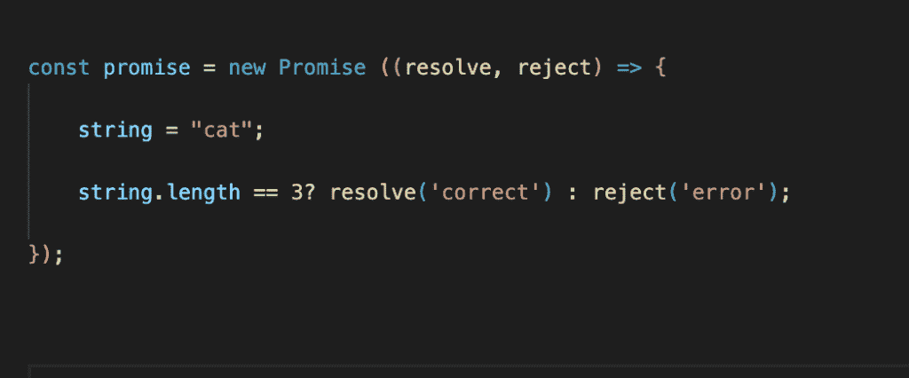

创建了一个新的承诺类，其中包含两个参数:resolve 和 reject。在这个非常基本的例子中，有一个值。如果字符串值正确，它将解析“正确”，如果不正确，它将拒绝“错误”。简单。

让我们解决承诺。

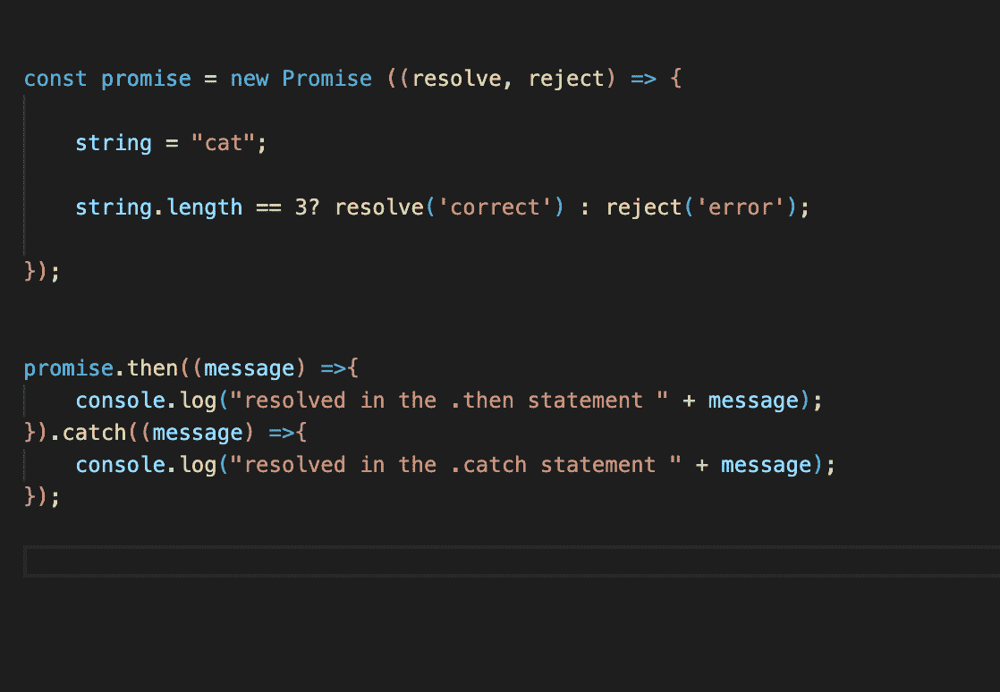

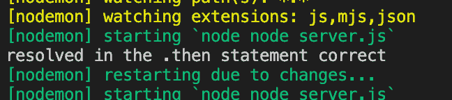

这是条件语句为假时的样子。

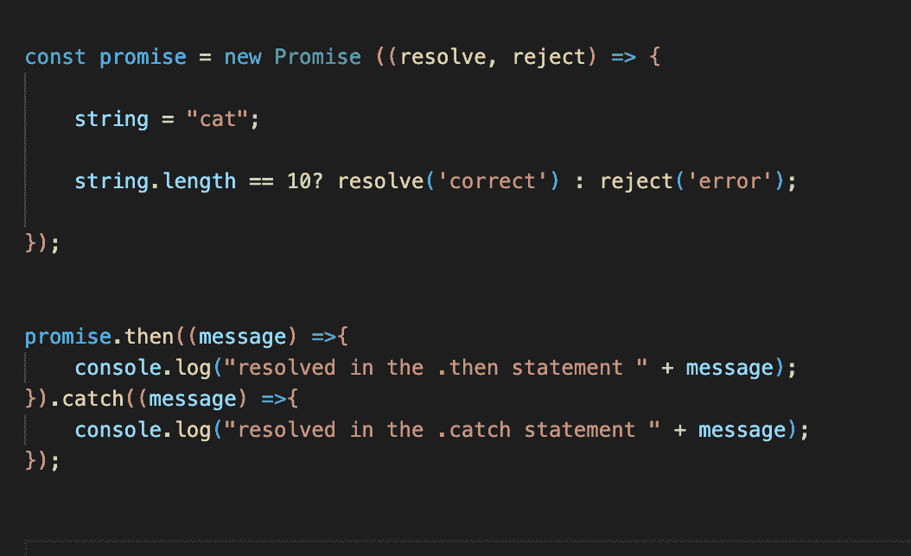

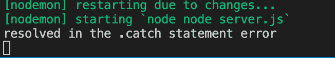

这是非常基本的，不太可能是承诺的用例。

## **避开回调地狱**

回调地狱:一个模糊但描述性的术语。太多的回调。深层嵌套。功能通常不会受到损害，但可读性是一个噩梦，这往往会损害功能，尤其是在代码更新时，尤其是当更多的工程师正在处理它时。

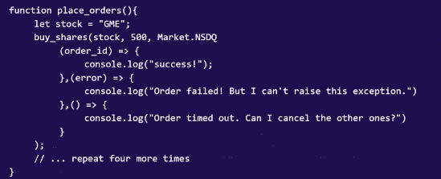

上图是回调地狱的开始(来自我的文章 [3 类异步编程](https://thenewstack.io/3-types-of-asynchronous-programming/))。如果你谷歌回拨地狱有很多很多更糟糕的图片，不能列入这篇文章的原因是复制写作。

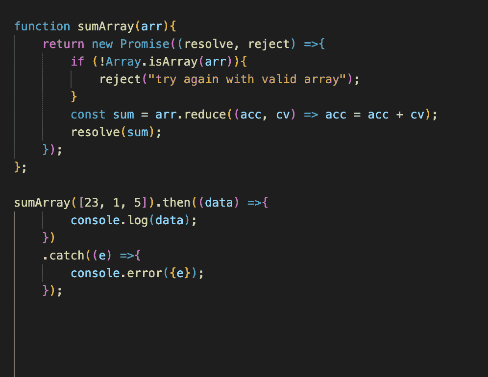

上面的例子建立在第一个例子的基础上。这个函数接受一个数据结构，如果它实际上是一个数组，它就解析它的元素的和，否则就拒绝这个承诺。答案是 console.log 29。

如果传入一个字符串呢？

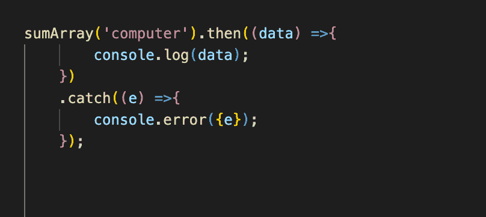

传入{e} 会将错误作为错误对象返回，这在更高级的用例中很有用。

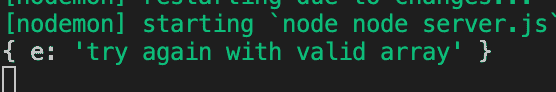

太好了，管用。

如果我们想得到总数，找到除以 2 后的余数，然后减去 50 呢？*。然后*可以被链接起来，看起来像这样。不断地将数据从一个传递到下一个，然后继续下去。

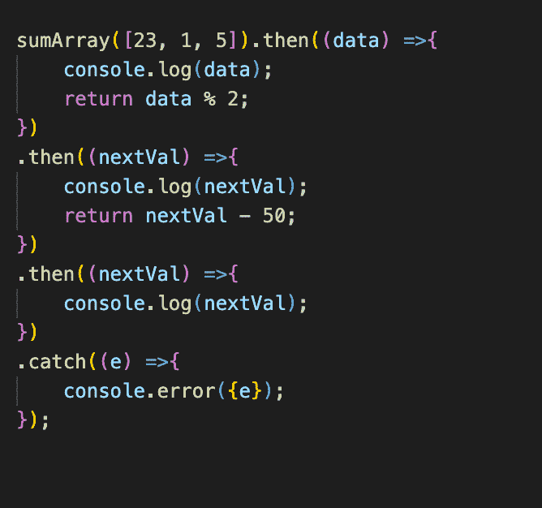

控制台日志如下所示:

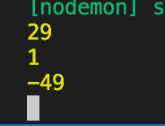

但是如果碰巧有一个错误，比如一个未定义的变量被这些值中的一个减去，error 对象就会显示出来。

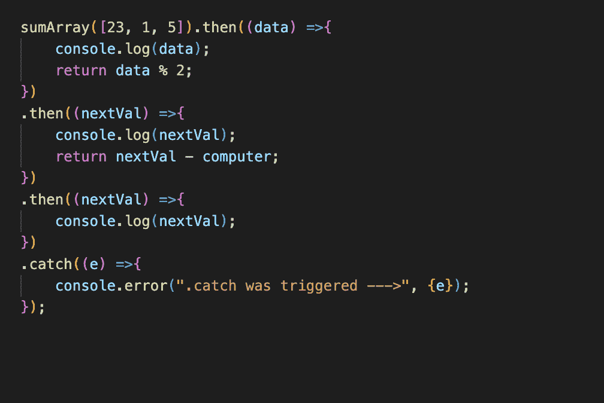

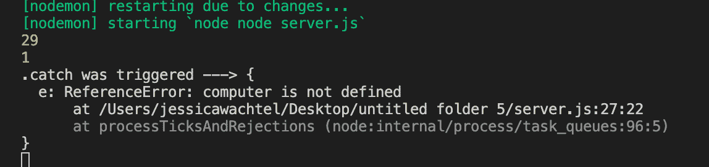

很棒的例子，但是和第一个一样，也不是异步代码。

## **异步示例— HTTP 请求**

对于这个例子，我使用的是星球大战 API。代码如下:

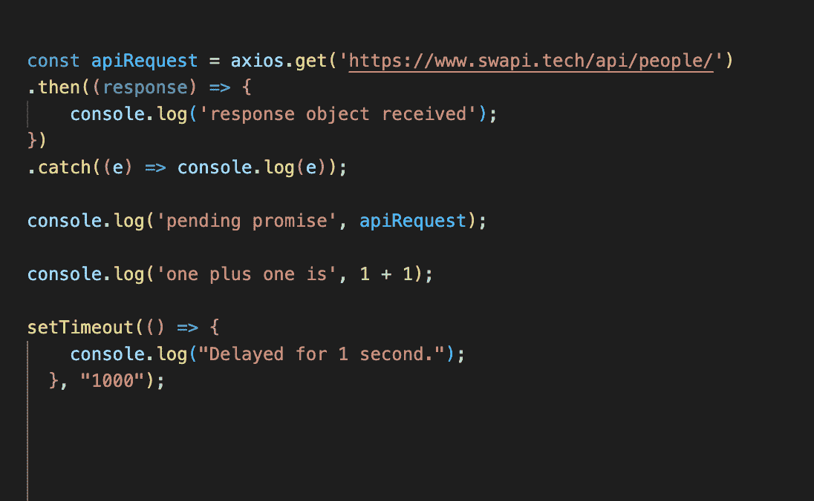

控制台日志如下所示:

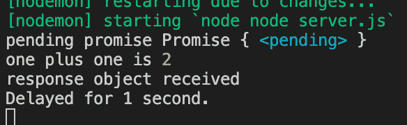

但是，如果代码稍微更改为延迟 1/4 秒，而不是延迟 1 秒:

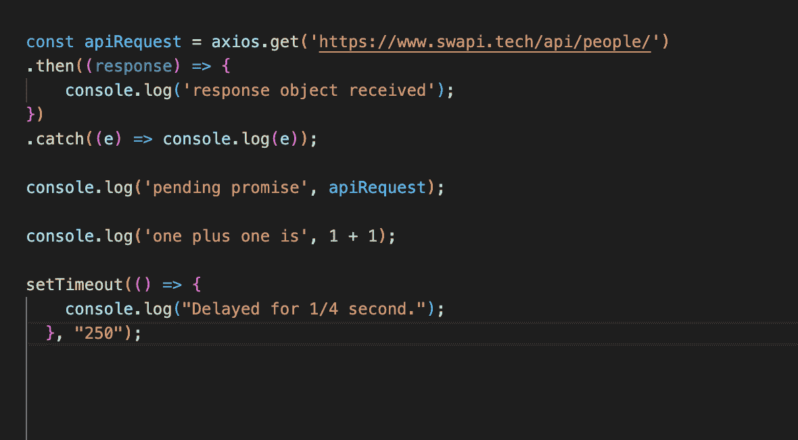

console.logs 将如下所示:

console.logs 如下所示:

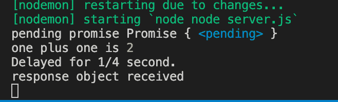

这里有一个在 API 请求中接收数据时的承诺链接的例子。

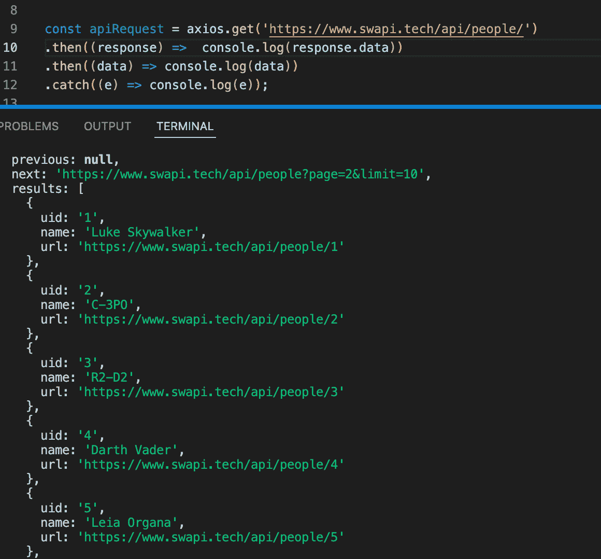

如果一个请求被发送到一个错误的 API，例如: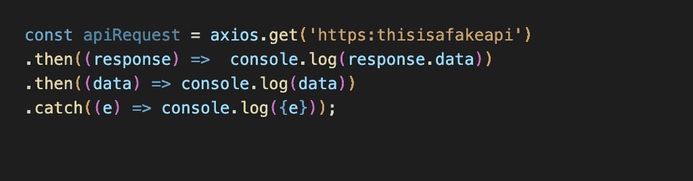

然后，您可以 console.log 一个特定的消息或整个错误对象。这种情况下的错误对象如下所示:

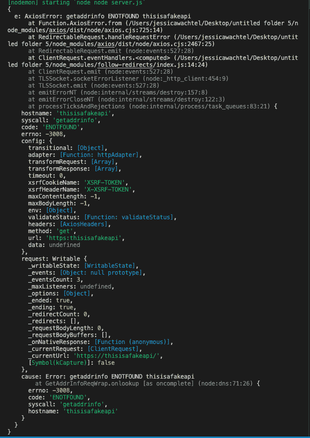

## **附加学习**

这是一个非常简单和基本的承诺介绍。在这最初的停止之后，学习变得相当繁重。为了更深入地了解这些材料，这是一个很好的地方。Codingame 是一个你可以开始使用异步代码的网站，并承诺提供更多的实践学习体验。

<svg xmlns:xlink="http://www.w3.org/1999/xlink" viewBox="0 0 68 31" version="1.1"><title>Group</title> <desc>Created with Sketch.</desc></svg>