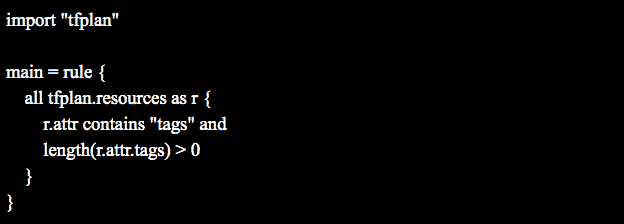
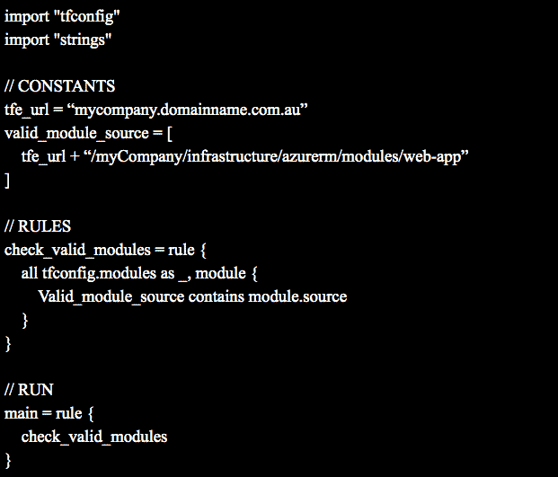

# 澳大利亚 AGL 能源公司对云原生合规性的了解

> 原文：<https://thenewstack.io/what-australias-agl-energy-learned-about-cloud-native-compliance/>

[HashiCorp](https://www.hashicorp.com/?TheNewStack) 赞助本帖。

 [拉克伦·怀特

拉克伦在澳大利亚最大的可再生能源资产私人开发商 AGL Energy 担任 DevOps 架构师。Lachlan 是一名热情的技术专家，专注于 DevOps、自动化和云技术。Lachlan 带领团队完成了 HashiCorp 的 Terraform Enterprise 在澳大利亚证券交易所 50 强中的首次部署。](https://www.linkedin.com/in/lachlan-white/?originalSubdomain=au) 

像大多数大型企业一样，作为澳大利亚领先的能源提供商，我们拥有使用数据中心的悠久历史。大约五年前，我们开始转向云计算。然后，我们成为了微软 Azure 在澳大利亚的首发客户。我们一直在他们的东南亚地区试验云基础设施作为概念验证，但在澳大利亚推出后，我们很快成为了南半球 Azure 的最大消费者之一。

我们最初向云的迁移就像许多其他人一样。有这么多创新和学习的机会令人兴奋。所以，我们的团队试图一次完成。结果是不可避免地积累了技术债务、实践中的差异和控制权之争，从而减少了交付并延长了交付周期。这也意味着，对于如何配置、保护、连接或运行应用程序和基础架构，没有企业范围内认可的最佳实践。那时，我们决定需要自己控制这些移动部件的管理。

## 建立一致性

三年前，我们开始在云中创建内部功能，并定义了该功能将如何为我们的客户带来更好的体验。我们启动了客户体验转型(CXT)，这是澳大利亚公共事业公司有史以来最大的客户转型计划之一。作为该国最大的电力和天然气供应商之一，我们一直在寻找如何利用技术颠覆行业，为我们的客户造福。我们一直专注于如何迭代我们的数字足迹来改善客户体验，使用云技术作为交付工具为我们实现这一目标提供了很大的灵活性。

随着项目的结束，我们的客户对结果非常满意。然而，在内部，我们在云技术方面的成熟度各不相同。我们的数字团队遥遥领先，而我们的一些传统基础架构团队却没有取得如此大的进步。然后，我们开始寻找一种方法，既能借鉴客户体验转型的经验，又能更快、更成熟地采用云技术。

## 规模一致性

去年，我们启动了 AAA 计划(自动化、加速、AGL)。它的创建是为了研究我们如何大规模地使用云，但却是以一种比我们以前更高效、更协作的方式。

哈希公司的产品帮助我们做到了这一点。我们意识到，虽然我们在一家云提供商中占有很大份额，但我们在 Amazon Web Services 中也占有很小份额，这两者所需的技能组合是不同的。我们希望找到一种方法，从战略上最小化这种差异，这就是我们选择使用 Terraform 的原因。

在公用事业公司的规模上自动化基础架构的供应并不是一件容易的事情。我们有许多对正常运行时间要求很高的业务关键型系统。Terraform 支持我们提供所有基础设施，从最小的 API 到最大的 SAP 系统。通过使用 Terraform 和 Packer 等工具，我们已经能够通过创建可在整个企业范围内大规模使用的可重用模块来实现交付的一致性。它使我们能够在不影响一致性的情况下大规模消费云，从而摆脱硬件瓶颈和配置不佳的环境。

## 不断发展的最佳实践

当我们开始加速项目时，核心技术团队有大约 10 到 15 个人在尝试构建这种新的工作方式。在整个过程中，我们与微软建立了牢固的关系，但我们确实在拓展其产品的边界。该团队由具有深厚微软背景的人以及其他具有丰富 AWS 经验的人组成，引发了关于“亚马逊以这种方式解决这个问题”和“微软以这种方式解决这个问题”的有趣讨论。这让我们问“但是最好的方法是什么？”有实现这些目标的抽象吗？

哨兵是我们能够实现我们想要的那种能力的方法之一。

Terraform Enterprise 在其文档中展示的一个简单示例是如何确保资源上的“标签”:

## 对合规的信心

我们还有一批人参与批准服务的使用。每项服务都经过一个流程，以确保它满足我们的安全性和合规性需求，然后才被加盖橡皮图章，以表明它符合我们的企业标准。我们的开发人员总是会更加关注云提供商发布的新功能和新服务，如果它们能够提供额外的功能，他们希望尽快使用它们。

我们以前的工作方式意味着有一个漫长的人工审查和会议过程，以确保服务符合 AGL 标准。当一项服务被批准时，实际上是由部署到服务的工程师或开发人员来保持它的标准，不断地参考可以在云上利用的标准和批准的服务的列表。从文化的角度来看，这不是一种与我们想要的交付能力相匹配的方法。相反，我们在一项哨兵政策中将所有批准的 Terraform 模块列入了白名单。

例如，我们希望确保团队在 Azure 中为 web 应用程序部署批准的模块。我们可以通过以下策略做到这一点:

如果我们的开发人员只使用预先批准的模块，那么策略就可以顺利通过。如果他们引入了我们尚未批准的新资源，则策略检查将会失败并出现错误。

该工作流为我们的基础架构部署提供了一个中心治理点。它确保无论部署如何进行，我们都有一个单一的合规点。只要 Terraform Enterprise 被调用，我们的 Sentinel 策略就会被执行，因为这些策略是通过代码驱动的，所以它不是瓶颈。这一切都是自动化的，所以我们在没有交付时间下降的情况下实现了合规性。

如您所见，在其他控制措施中，我们可以使用 Sentinel 在 Terraform Enterprise 的部署周期中自动管理策略。如果我们需要在多个云中实施类似的策略，我们只需添加另一个模块来查看 AWS 基础设施。

## 治理的协作和集中化

如果引入了我们的开发人员想要使用的新服务，他们可以在策略上打开一个 pull 请求来评估新服务。如果它符合我们的安全性和合规性要求，它将被列入白名单。

为了确保我们的开发人员和工程师能够影响变化，我们需要提升围绕他们的运营模式。我们打开了谁可以做出贡献的大门，然后我们集中管理 it。

这真的是开源的核心，让每个人都能平等地做出贡献。在大型企业中，需要一些控制措施，但是如果我们能够自动管理这些控制措施中的大部分，我们就能够创造出令人惊叹的文化和开发体验。利用像 Terraform Enterprise 这样的工具使我们能够大规模地这样做。

## 后续步骤

去年，我们在 AGL 就如何构建、开发和创新云计算进行了能力建设。接下来的几年是有趣的部分，我们可以开始在这些基础功能的基础上进行构建，并真正获得回报。这些好处通过更快的创新和更快的能力发展传递给我们的客户。

从技术角度来看，我认为继续使用 Sentinel 很有价值。利用最近的更新，比如成本估计，将是我们正在构建的治理的一个可爱的补充。

哈希公司最近推出了一些令人兴奋的工具。金库和执政官对我很有吸引力，绝对是我目前正在玩的东西。

但是我仍然喜欢寻找扩展 Terraform 的方法。Terraform 的优点是，如果没有您想要使用的提供者，您可以构建提供者。如果提供商在那里，您可以添加到它。这是一个非常棒的开源社区。所以，接下来的事情真的只限于你的想象力愿意驱动的东西。

来自 Pixabay 的特征图像。

<svg xmlns:xlink="http://www.w3.org/1999/xlink" viewBox="0 0 68 31" version="1.1"><title>Group</title> <desc>Created with Sketch.</desc></svg>