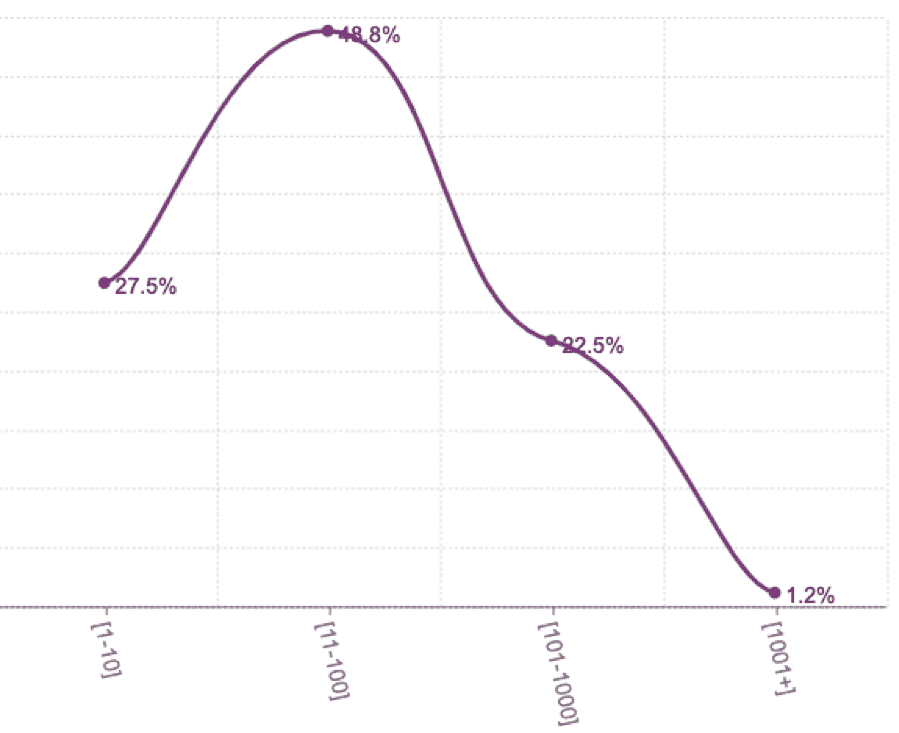

# AWS Lambda 的性能统计揭示了什么

> 原文：<https://thenewstack.io/what-aws-lambdas-performance-stats-reveal/>

如果你有兴趣深入研究 AWS Lambda 和可观测性，我

[hosting a webinar](https://epsagon.com/webinars/aws-and-epsagon-serverless-observability-workshop/)

下周与 AWS 无服务器解决方案架构师 Danilo Poccila 一起。

 [冉 Ribenzaft

不断追逐新技术(比如无服务器)，冉喜欢分享开源工具，让每个人的生活变得更轻松。在他目前的职位上，他是 Epsagon 的联合创始人兼首席技术官，该公司为无服务器应用程序提供监控。](https://epsagon.com/) 

我们希望分享我们对 AWS Lambda 及其生态系统的了解，这是基于 100，000 多个 Epsagon 监控实例以及 Lambda 推出四年多来的经验。

我们涵盖的关键指标包括:

1.  哪些运行时是最常见的；
2.  通常配置和使用了多少内存；
3.  有多少函数超时；
4.  每个帐户的功能数量，以及采用率的提高。

## 配置

设置新功能时要做的第一件事是配置它。有很多配置选项，但我们在下面收集了最有趣的选项

### 存储格局

值得理解的是，内存影响(几乎是线性地)我们的 CPU 和 IO 份额。你可以在这篇[帖子](https://epsagon.com/observability/how-to-make-aws-lambda-faster-memory-performance/)中读到更多，但在下面的图表中，我们可以看到大多数人都是从默认配置(128MB)开始的。第二个配置最多的选项是 1024MB，这是一个非常大的数字——但也是无服务器框架的默认选项。

## **** 工期配置

持续时间配置可能是我最喜欢的配置选项，因为每个开发人员通常使用默认配置或选择一个几乎随机的数字。我们可以清楚地看到，默认配置获得了几乎五分之一的功能。接下来是 30 秒，5 分钟(这曾经是 [15 分钟](https://aws.amazon.com/about-aws/whats-new/2018/10/aws-lambda-supports-functions-that-can-run-up-to-15-minutes/)之前的最长时间)，15 秒，然后是 1 分钟。

## 运行时间

众所周知，Node 和 Python 是 Lambda 的主流语言，但是更深入地挖掘并获得所使用的每个版本的确切数字是很有趣的。Node 8.10 是明显的赢家，有 51.7%的函数使用它。在我们看到 Python 2.7 和 Node 6.10 共享相同的量，Python 3.6 紧随其后之后。前四名几乎覆盖了 90%的运行时间。

## 代码大小

看看代码大小，看看函数变得有多复杂是很有趣的。由于该图几乎是均匀分布的，我们可以了解到 Lambda 函数正被用于几乎任何目的——从最基本的代码到最重要的库代码。这个图表没有考虑[层](https://epsagon.com/product-updates/bring-your-epsagon-layer-to-aws-lambda/)。

## VPC

对于大多数开发商来说，VPC 是一个负担。它需要手动配置，并且会影响冷启动性能(在上一篇 re:Invent 中，我们被承诺冷启动会变得更好)。然而，令人着迷的是，几乎三分之一的功能都在 VPC 内部:

## 表演

现在我们已经了解了一些配置，是时候监控实时性能数据了。随着每月数十亿次调用被分析，我们正在探索函数是如何执行的。本节中的数据将基于上个月的调用。

## 内存使用

Lambda 中的一个大争论是你应该为一个函数配置多少内存。我们已经知道内存会影响函数的整体性能，但是我们很想知道已使用的内存占已配置内存的百分比，以及使用了多少内存:

值得注意的是，我们没有使用最大数量的已定义内存，平均只有四分之一——如果有任何疑问，这绝对是一个准确的指标。我们还可以从(average 和 p50)上使用的内存中看到，通常，代码不需要太多内存，因为最小内存配置是 128 MB。

## 超时设定

确保我们的函数在我们为它们设定的限制内运行不是一件简单的任务。有些人可能认为函数永远不会超时，因为除了一行日志之外，超时不会出现在任何地方。所以，[监控超时](https://epsagon.com/blog/best-practices-for-aws-lambda-timeouts/)很难，但是事实是什么呢？

正如我们所看到的，超过 10%的函数经历了至少一次超时，而超时占总调用的百分比非常低。

## 生态系统

一个 Lambda 函数显然不能独立存在——你需要设置一个触发器，而且你可能有不止一个函数。让我们也来探究其中的一些数字。

### 一个账户中的功能数量

许多人说从单一功能开始真的很容易。话虽如此，看看公司在功能数量上走多远还是很有趣的。在 11-100 的区间内看到巨大的数字是相当令人惊讶的，而且显然开始看到越来越多的公司越过 1，000 的功能标志。

## λ函数数量的增长

一旦客户开始致力于无服务器开发，了解他们的增长率也是很有趣的。我们的数据显示，每个爱普生账户的平均**月环比**增长率为:

## 扳机

触发器允许我们根据特定的事件调用我们的函数。有很多来自其他 AWS 服务的触发器，让我们看看哪些是最常见的。毫不奇怪，API Gateway 是最常见的一种，但是很高兴看到它不是唯一的一种。

## 结论

看到无服务器社区和生态系统的持续增长令人兴奋。我们希望您喜欢发现和学习 AWS Lambda 用户的配置、性能和用法。

<svg xmlns:xlink="http://www.w3.org/1999/xlink" viewBox="0 0 68 31" version="1.1"><title>Group</title> <desc>Created with Sketch.</desc></svg>