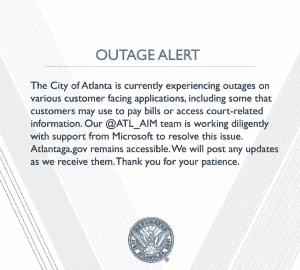

# 我们能从亚特兰大勒索病毒攻击中学到什么？

> 原文：<https://thenewstack.io/what-can-we-learn-from-the-ransomware-attack-on-atlanta/>

勒索软件瘫痪亚特兰大的城市工人网络已经 10 周了，它几乎已经完全恢复了*。但是，在所有关于网上匿名坏演员的危险的新闻报道之后，我们准备好迎接下一次了吗？如果这是我们新的关于网络安全的警示故事，我们学到了什么？*

 *该攻击于 3 月 22 日首次被发现，勤奋的 IT 员工(以及第三方事件响应团队)迅速采取了行动。首席运营官理查德·考克斯[告诉《亚特兰大宪法日报》](https://www.myajc.com/news/local/atlanta-network-almost-recovered-from-cyber-attack-cost-still-unkown/k6srGim85Q8dKwUFPbcDhN/),到五月中旬，亚特兰大市几乎已经完全恢复，除了市法院系统。但仍不清楚他们是否恢复了所有数据。考克斯告诉该报，“我们仍在通过文件了解状况，”并补充说，“这一过程将继续需要相当长的时间。”

作为亚特兰大的新首席运营官，考克斯在袭击发生时刚刚上任四天。据《纽约时报》报道，突然间，该市的 45 万居民——其中近 600 万居住在大亚特兰大都会区——再也无法在线支付水费或交通罚单。"几天来，城市工作人员甚至不允许打开他们的电脑。"

据路透社报道，一些应急小组 24 小时轮班工作，市政府官员在复活节周末工作，试图加快艰难的恢复工作。“警察和其他公务员过去一周一直在努力拼凑他们的数字工作生活，重建审计电子表格，并在手机上开展业务，以应对美国一座城市遭受的最具破坏性的‘勒索软件’病毒攻击之一。”一名议员丢失了 16 年的数字记录，而城市审计员抱怨说，“我硬盘上的所有东西都不见了。”市议会的三名工作人员最终共用了一台旧笔记本电脑，而城市审计员最终带着她的个人笔记本电脑去工作。(为了找到当前项目的细节，她求助于智能手机上的旧电子邮件副本。)

“这座城市从未停止做生意，”一位当地新闻播音员打趣道。“它只是停止了以 21 世纪的速度做生意。”

这次袭击甚至推迟了新市长第一份预算的发布，因为预算规划系统在几周内都处于瘫痪状态。账单未付，法庭关闭。

具有讽刺意味的是，该市目前正试图说服亚马逊在亚特兰大建立他们的新总部。

但该市审计员指出，情况本可能更糟——因为审计员办公室的 18 台计算机中有 10 台没有受到影响。虽然警察局无法访问他们的调查数据库，但截至 3 月底，他们至少能够再次以数字形式提交警方报告。亚特兰大得到了联邦调查局和国土安全部的帮助。

具有讽刺意味的是，亚特兰大在一月份刚刚完成了一项网络安全审计，并开始实施其建议。(路透社(Reuters)报道称，审计“要求更好地保存记录，并雇佣更多技术工人。”)

亚特兰大官员向美联社强调，袭击[没有影响](https://apnews.com/efcf232b7202479e808632557d58774c/Atlanta-city-computer-network-remains-hobbled-by-cyberattack)警察和消防部门的应急响应系统，也没有影响他们的供水安全或亚特兰大国际机场——尽管机场的 wifi 系统“出于谨慎”被暂时关闭，他们的发言人告诉美联社。

没有证据表明任何人的个人信息被窃取，但市长 Keisha Lance Bottoms 仍然敦促系统中有数据的人注意他们的银行账户。

## 同病相怜

亚特兰大并不孤单。根据[美国卫生与公众服务部三月底发布的警告](https://www.aha.org/system/files/2018-04/corrected-HCCIC-2018-002W-SamSam-Ransomware-Campaign.pdf)，到三月底，同一种病毒已经袭击了八个独立的政府或医疗机构，包括科罗拉多州的运输部和印第安纳州的两家医院。尽管有些人恢复得更快，但该机构指出，袭击对患者的服务产生了“实质性影响”，并补充说，这种风险“预计在可预见的未来仍将持续。”

该报告警告称，攻击者似乎专注于几个特定的部门——政府、医疗保健、教育和市政当局——“可能是因为这些系统和网络至关重要，任何宕机都不能也不会被容忍，这增加了受害者支付赎金的机会。网络安全公司 NTT 安全公司告诉《纽约时报》，2016 年美国超过 87%的勒索软件攻击目标是医疗保健行业。另一家安全公司 Recorded Future 的高级情报分析师引用了一个地下论坛，其中一个黑帽组织表示，他们已经开始针对州和地方政府——特别是因为他们的安全措施很差。

《纽约时报》指出，勒索软件攻击还袭击了德克萨斯、阿拉巴马、新墨西哥和北卡罗来纳的城市或州系统[。但在亚特兰大，事情发生了奇怪的转折，袭击者要求 51，000 美元的赎金来解密文件。赎金信息的图像被分享给当地媒体，这无意中向公众透露了联系攻击者的方法。很快，攻击者发现他们自己回答了媒体不必要的问题，给他们留下了自己的问题。](http://www.staradvertiser.com/2018/03/29/nyt/decision-to-pay-ransom-difficult-for-cities-under-cyberattack/)

“当通过暴露的门户网站被问及他们的行为时，萨姆萨姆集团首先要求付费以换取答案，”[报道 CSO](https://www.csoonline.com/article/3266364/security/samsam-group-deletes-atlantas-contact-portal-after-the-address-goes-public.html) ，“后来完全删除了联系表格，称这些问题和其他评论是垃圾邮件。”

尽管各城市经常纠结于是否要支付赎金，“鉴于萨姆萨姆集团的行动，现在还不清楚支付是否可能，因为他们已经删除了通信门户。”今年 4 月，该市发言人[向 ZDNet](https://www.zdnet.com/article/atlanta-spent-at-least-two-million-on-ransomware-attack-recovery/) 证实赎金尚未支付。

## 为什么会这样？

CSO 报告称，亚特兰大为攻击者提供了几个最喜欢的目标，因为“亚特兰大的 RDP 暴露在公众面前，还有 VPN 网关、FTP 服务器和 IIS 安装。”

这座城市已经不是第一次被安全漏洞攻击了。网络安全公司 Rendition Infosec 报告称，去年 5 月，亚特兰大也受到了美国国家安全局泄露的漏洞攻击——这是在微软发布补丁并敦促用户安装补丁一个多月后。“根据我们的数据，我们可以说，对于其规模的组织来说，亚特兰大市在 2017 年 4 月的安全状况不达标，”该公司的创始人[告诉 ZDNet](https://www.zdnet.com/article/atlanta-hit-by-ransomware-attack-also-fell-victim-to-leaked-nsa-exploits/) ，“这使得勒索软件攻击的范围一点也不令人惊讶。”

据 CSO 称，仅紧急信息技术服务就花费了该市 500 万美元，[，尽管 Cox 向《亚特兰大宪法日报》坚持说“如果你深入研究这些数字，许多这些费用不可避免地是我们无论如何都要投资的事情。”该市也有网络攻击保险政策，考克斯告诉该报，该市现在正在与保险公司进行“持续对话”，并外交地补充说，“我们的期望是，我们将能够以非常公平的方式与他们合作。”](https://www.csoonline.com/article/3276584/ransomware/what-does-a-ransomware-attack-cost-beware-the-hidden-expenses.html)

这指向了勒索软件攻击的一大讽刺。CSO 指出，一家医疗中心花费了 1000 万美元[来回应 3 万美元的赎金要求](https://www.csoonline.com/article/3276584/ransomware/what-does-a-ransomware-attack-cost-beware-the-hidden-expenses.html)(计算员工加班和收入损失)

但是亚特兰大市希望比以往任何时候都更加强大，考克斯上周告诉当地新闻频道。“我们一开始就设定了预期，认为这是一个长期的过程……”

“我学到的是，你不能完全保护一个网络，但你可以很好地保护它。我们了解到，市政当局和组织经常遭到攻击，所以我们从未宣称取得了胜利，但我们对自己的进步感到非常满意。”

## 吸取的教训？

回到 11 月，旧金山市在一天内失去了对其 BART 运输系统所有售票机的控制。火车继续运行，每个人都免费乘坐，直到第二天问题被修复。行凶者想要 7.3 万美元的比特币，但“我们从未考虑过支付赎金，”旧金山市交通局的一名发言人说。引用他们的就地备份系统，他补充说，“我们有一个能够完全恢复所有系统的 IT 团队。”

据《纽约时报》报道，这并不总是那么容易。据安全公司 Icebrg 的一位副总裁说，一旦破坏了一个系统，攻击者做的第一件事就是寻找备份系统或软件，并试图删除它。

安全研究员 Brian Krebs 建议[将备份数据离线存储或存储在云中](https://krebsonsecurity.com/2016/11/san-francisco-rail-system-hacker-hacked/)，因为“确保备份不连接到它们正在备份的计算机和网络非常重要……然而，应该注意的是，当系统被配置为持续实时备份时，一些勒索软件实例可以锁定基于云的备份。”

美国联邦调查局还提醒用户验证他们备份的完整性，作为[在线提示清单](https://www.ic3.gov/media/2016/160915.aspx)的一部分。美国联邦调查局还指出，一种变种已经在一天内感染了 10 万台电脑。

看到关于克雷布斯故事的评论很有趣。“在我的电脑店里，我们一个月大约会收到 6 起勒索病毒感染。有时候是感染的奶奶，有时候是酒店的服务器。”

当然，场外也有一些猜测。“伊朗的互联网地址可以访问像旧金山 MTA 这样的系统，这有什么合理的理由吗？”

* * *

# WebReduce

通过 Pixabay 的特征图像。

<svg xmlns:xlink="http://www.w3.org/1999/xlink" viewBox="0 0 68 31" version="1.1"><title>Group</title> <desc>Created with Sketch.</desc></svg>*