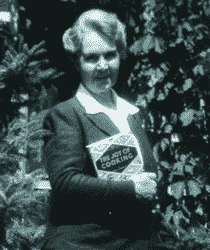

# 什么数据告诉我们“烹饪的快乐”

> 原文：<https://thenewstack.io/what-data-tells-us-about-the-joy-of-cooking/>

不完整的数据和草率的数据分析可能会在以后反噬你。一个最奇怪的例子是，一项学术研究在流行媒体上停留了九年，直到其结论最终受到质疑——被美国经典烹饪书《烹饪的快乐》背后的家庭质疑。

《烹饪的乐趣》作者 Irma s . rom Bauer-via Simon and Schuster

1931 年，Irma S. Rombauer 利用她从丈夫自杀中获得的一小笔保险赔偿金，自行出版了这本广受欢迎的烹饪书的第一版。她的女儿马里恩·朗鲍尔·贝克尔在接下来的 40 年里修订了每一版。国会图书馆将它列为塑造美国的 88 本书之一，并指出其各种版本已售出近 1800 万册。在 1997 年出版的第七版的介绍中，资深编辑玛丽亚·瓜纳舍利记得罗姆鲍尔的孙子伊桑“以罕见的勇气和耐心捍卫了他与生俱来的权利。”伊桑继承了这个家庭对烹饪的热爱，在巴黎上了蓝带学校，“当妈妈在 1976 年去世时，我被委托管理‘快乐’的传统和未来，”他在书的前言中写道。

Guarnaschelli 的介绍承认美国“越来越认识到，我们吃的东西可以让我们感觉更好，活得更长”，并表示这本书经过了精心改编，包括一个全新的营养章节，其中有“健康饮食的合理和实用建议”。他们还为对麸质过敏的人添加了食谱，显示卡路里、胆固醇和脂肪含量的成分表，以及“在食谱中有降低脂肪的替代品，在烘焙部分有减脂食谱。”

所以，当康奈尔大学 2009 年的一项学术研究测试了该书每一版中出现的 18 种食谱，并得出“18 种食谱中有 14 种的总热量增加了”的结论时，这一定很伤人。在一封被广泛引用的公布他们结果的信中，康奈尔大学的两名研究人员报告说，“每份食谱的平均热量增加了 43.7%，从 2123.8 卡路里增加到 3051.9 卡路里。此外，18 种食谱中有 17 种的平均热量增加了 37.4%，从 268.1 卡路里增加到 436.9 卡路里。”

听起来很糟糕，对吧？学者们承认“这项研究的结果在本质上很大程度上是描述性的”，但坚持认为“它们可以作为在家中保持体重的建议的基础。”Irma Rombauer 的曾孙 John Becker 后来告诉《纽约客》“我们认为他可能是对的，食谱中每份食物的卡路里含量可能有所增加。”毕竟，这是一个常春藤联盟的研究机构。“如果我们想质疑康奈尔大学现任系主任的声誉，我想我们会发现一个非常棘手的问题。”

但九年后，他们得知该研究的两位合著者之一正面临着对其研究方法的严厉批评。Brian Wansink 是美国农业部营养政策和推广中心的前执行主任，他在 2016 年写了一篇博文[称赞一名研究生愿意不断重新分析实验数据，直到最终出现一种模式。](https://web.archive.org/web/20170312041524/http:/www.brianwansink.com/phd-advice/the-grad-student-who-never-said-no)

“但科学不应该是这样工作的，”Buzzfeed 的斯蒂芬妮·m·李[上个月](https://www.buzzfeed.com/stephaniemlee/brian-wansink-cornell-p-hacking)写道，他认为显然 Wansink“正在追溯性地创造假设，以适应实验结束后出现的数据模式。”

Buzzfeed 引用了弗吉尼亚大学的一位心理学家的话，他是一位“直言不讳的改革者”，也是开放科学中心的联合创始人，该中心致力于提高研究的可重复性。“这不是科学，这是讲故事，”他抱怨道，随后补充道，“我们的明确目标是‘让我们从数据中获取一些东西，把数据作为一种工具，找到一些有趣的东西，任何东西。’"

Wansink 的研究有时也包含其他严重的错误。一项研究声称，如果苹果上有 Elmo 的贴纸，8 至 11 岁的学生更有可能选择苹果而不是饼干。但即使在论文被撤回并重新提交后，Wansink 向 Buzzfeed News 承认，其方法仍然存在重大错误:“孩子们[实际上是 3 到 5 岁](https://www.buzzfeed.com/stephaniemlee/who-really-ate-the-apples-though)。”(当修改后的研究数据包括诸如“没有零食，没有醒来”和“睡了一觉后没有感到不舒服”等评论时，Wansink 的一位批评者开始怀疑了。)

Buzzfeed 还报道称，Wansink 的合作者“烹饪的乐趣”研究的合作者[已经不再在新墨西哥大学](https://www.buzzfeed.com/stephaniemlee/collin-payne-new-mexico-state)任教，他自 2008 年以来一直在那里担任市场营销副教授。

Rombauer 一家决定是时候重新检查这些数据了。

## 推特和美味

现代的转变是，伊尔玛·龙鲍尔的曾孙现在经营着“烹饪的快乐”推特，并于上个月在网上发表了意见。

四处调查后，他最终发现了[2009 年的一篇文章](https://www.webmd.com/diet/news/20090217/too-much-joy-in-cookbook-calories)，其中列出了 18 种测试过的食谱。在一系列推文中，贝克尔透露，通过应用一些“美国农业部级营养分析软件”，他复制了康奈尔大学研究人员的实验，“他们报告的结果与我们的发现惊人地不同”。

2 月 27 日，他在推特上宣布“我们有大量关于这方面的数据和草稿，并将提供给任何感兴趣的人。”很快，另一位数据分析师介入，康奈尔大学的研究结果将面临詹姆斯·希斯(James Heathers)的复制尝试，他在 Twitter 上称自己为“数据暴徒”。

海伦·罗斯纳在为《纽约客》撰写文章时，称希斯是“一群虚张声势的统计学家中的一员，他们在日常工作之外花时间重新分析媒体友好型研究人员发表的好得令人难以置信的研究——并大声呼吁公众注意他们发现的任何不准确之处。”

希斯在[一篇关于介质](https://medium.com/@jamesheathers/the-joy-of-cooking-the-books-272be736ab5f)的文章中讨论了他的结果，指出“在一天结束时，即使烹饪书上的每一个细节都准备好了，等待着我们，我们仍然需要做出惊人数量的假设来填充像卡路里含量和密度这样的东西。”

希斯也认为康奈尔大学的研究结构存在问题。“为了产生这种分析，服务大小只是…嗯，出现了。没有别的词可以形容它。一半以上的食谱没有列出份量，也没有暗示份量。希斯告诉《纽约客》，“问题不在于加错了。而是没有真正的方法把它加起来。”他的文章指出，每份的份量对你得到的结果至关重要，因为“四个人的夏季沙拉比四分之一的玛氏巧克力棒含有更多的热量。”

但是关于秋葵汤的研究结果有一个更大的错误。"基本上，36 年和 06 年的食谱共享一个名字，除此之外别无其他."一种只是炖鸡，而更现代的版本包含脂肪和多伊尔熏猪肉香肠，并用面粉和油增稠。他后来称之为这项研究的“巨大的秋葵灾难”

最后，虽然最初的研究报告了 44%的卡路里增加，但 Heathers 只计算了相同食谱的 21%的增加——即使这有点误导……Heathers 承认“你可以看到总卡路里有一些非常实质性的增加，但只是针对少数食谱。一个是杂烩，用牛奶代替水(+86%的增长)，另一个是鸡肉 a la king，这是受以下事实的影响:奶油在 36 年的食谱中是可选的(因此不包括在内)，但它的等价物在 06 年的食谱中是强制性的(因此包括在内)(增长了 134%)。

"讨论中的结果取决于这种不稳定性."

Heathers 还批评了样本量小——只有 18 种食谱——向《纽约客》指出，菜炖牛肉食谱的热量多 134 %,而大米布丁食谱的热量少 30%。“那不是一个可靠的模式！”

## 数据挖掘的危险

但这只是冰山一角吗？甚至 Buzzfeed 也承认，“Wansink 的做法是整个社会科学领域令人不安的战略数据处理模式的一部分。”

[un dark 网站](https://undark.org/article/brian-wansink-data-masseur-science/)(由麻省理工学院新闻项目出版)引用了一种被称为[数据挖掘](https://en.wikipedia.org/wiki/Data_dredging)(也被称为 p-hacking)的做法，以及 2015 年的一项研究，该研究发现这种做法“在整个科学界都很普遍”去年 10 月,《纽约时报》杂志解释说，虽然总是有余地排除非常不寻常的结果，增加额外的受试者，或者因为实验故障而排除数据，但“通常情况下，这些决定——总是看起来像是消除噪音的方式——方便地加强了研究结果的效果。"

尽管科学原则坚持所有结果都应该由独立团队验证，“对于大多数社会心理学结果，即使是最有影响力的结果，也没有发生这种情况……无论如何，没有复制的动机:期刊对已经完成的研究大多不感兴趣，失败的复制会让人们(甚至可能是你的顾问)感到不舒服。”

Undark 指出，“虽然嘲笑和羞辱数据按摩师可能会提供一种宣泄的感觉，但这也是对一个复杂得多的问题的一种肤浅的回应，在这个问题上似乎有许多值得指责的行为者。”

《纽约时报》杂志报道称，现在有一场始于 2011 年的改革社会科学研究的运动，这给科学家带来了非常情绪化的影响，“他们被迫面对他们这些年来所做的事情可能不完全科学的恐惧。”

西北大学的社会心理学家伊莱·芬克尔抱怨道:“突然之间，有人给其他人发电子邮件，索要他们的数据，然后写博客指责他们的不良行为。”

* * *

# WebReduce

<svg xmlns:xlink="http://www.w3.org/1999/xlink" viewBox="0 0 68 31" version="1.1"><title>Group</title> <desc>Created with Sketch.</desc></svg>