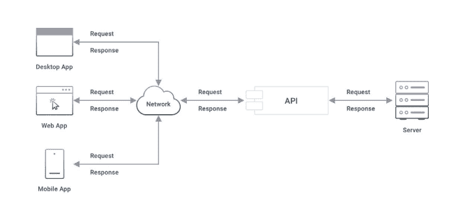

# 在设计和使用 API 之前，开发人员必须了解什么

> 原文：<https://thenewstack.io/what-devs-must-know-about-apis-before-designing-and-using-them/>

 [马可·帕拉迪诺

马可·帕拉迪诺是一位发明家、软件开发者和互联网企业家，住在三藩市。作为 Kong 的首席技术官和联合创始人，他是 Kong 的合著者，负责公司产品的设计和交付，同时还在 Kong 和外部软件社区内提供围绕 API 和微服务的技术思想领导。在孔之前，Marco 于 2010 年共同创立了 Mashape，该公司成为最大的 API 市场，并于 2017 年被 RapidAPI 收购。](https://konghq.com/) 

几十年来，应用编程接口(即众所周知的 API)一直在帮助企业转型为成功的数字发电站。

事实上，在 2002 年，亚马逊创始人杰夫·贝索斯发布了一个 [API 指令](https://nordicapis.com/the-bezos-api-mandate-amazons-manifesto-for-externalization/)，要求他的开发者使用服务接口和共享代码。这一要求引发了我与他人共同创办科技创业公司的旅程，为开发者释放 API 的潜力。在过去的 13 年里，我一直在创建核心基础设施和开源软件，帮助其他人建立业务，开发新的应用程序，并使用 API 提高效率。

如今，API 经济正在全力发展，没有人质疑它们的潜力，就像我在 2009 年成立我的第一家公司——一个名为 Mashape 的 API 市场。疫情以前所未有的速度加速了向数字应用和服务的转变，而且没有回头路可走。事实上，仅从零售行业来看，[到 2025 年，电子商务将比 2017 年翻一番，达到 5.634 亿美元，这证明](https://www.statista.com/statistics/272391/us-retail-e-commerce-sales-forecast/)组织将继续呼吁成为 API 优先的企业。

作为软件架构师、应用程序开发人员或团队领导，在开发成功的 API 策略之前，了解什么是 API 以及为什么它们对您的企业至关重要是至关重要的。我将在下面解决这个问题。

## 什么是 API？

API 是允许计算机程序与另一个程序通信以交换数据或消费某种类型的服务的软件。这些程序可能运行在同一台计算机上，也可能运行在相隔数千英里的不同计算机网络上。

API 连接调用应用程序(客户端)和被调用应用程序(服务)。“服务”可以是一个 web 服务器、一个数据库服务器、一个中间件，甚至是一个用 COBOL 编写的整体应用程序。就客户端而言，它只需要知道如何与 API 通信(端点 URI、协议、所需参数等)。)而不关心服务的底层实现。

API 是用于认证、确认、验证和理解用户输入的程序逻辑。然后，它必须处理请求并响应客户端。

客户端首先向 API 端点发送一个请求——一个查询。

一旦 API 验证了客户端的身份，它就验证请求消息并执行额外的处理。然后，API 将请求传递给服务(有时称为“后端”或“后端应用程序”)。

服务基于请求执行其操作，很可能获取一些被请求的数据。然后，它向 API 返回一个响应消息，其中包括操作的状态(成功或失败)和请求的数据。

API 接收该消息，并将其发送回客户端。

图:一个简单的 API 请求-响应场景(图片由 Kong 提供)

如您所见，这类似于典型的客户端-服务器应用程序或人机交互。

## 通用 API 特性

不管它们是如何被创建或消费的，所有的 API 都有一些标准的特性。

### 定义的接口

API 将有一个定义好的接口。接口至少包括以下内容:

*   API 在网络上的位置。
*   API 可以执行哪些操作。
*   客户端需要向 API 提供什么样的请求和响应消息格式来执行这些操作。
*   与 API 通信的安全性要求。

客户端只能通过这个接口与 API 交互。通常，这些细节是根据一个标准规范来布局的，例如 [WSDL](https://en.wikipedia.org/wiki/Web_Services_Description_Language) 、[拉姆齐](https://raml.org/)或[奥斯](https://spec.openapis.org/oas/latest.html)。

### 消息格式

为了让客户端和 API 相互理解，它们需要在请求和响应消息格式上达成一致。API 提供者将这种格式指定为接口的一部分。例如，该格式可能要求请求消息遵循特定的数据格式(比如 JSON 或 XML)并使用预定义的数据结构。同样，响应也将具有预定义的格式和结构。

### 统一资源定位器

最后，每个 API 都有一个特定的 URL，供客户端和 API 通信使用。URL 包括网络协议(例如 HTTP 或 HTTPS)、主机名和资源路径(例如/v2/myservice)。

### 包装

API 下面的实现是封装的，这意味着使用 API 的开发人员不需要知道它的内部工作原理。开发人员不知道该 API 是否在幕后调用其他 API，也不知道该 API 在内部使用什么数据，或者该 API 的程序逻辑如何处理数据。API 是一个黑匣子，API 消费者所知道的关于 API 的一切都在记录的 API 契约中(接口、消息格式、协议)。

### 语言独立性

因为 API 是黑盒，所以开发人员可以用任何语言实现 API，而不会影响消费者调用 API 的能力。例如，如果您的消费者应用程序是基于 Java 的，它仍然可以调用用。NET 或者 Python。

### 安全检查

最后，编写良好的 API 将具有内置的安全检查。例如，为了防御分布式拒绝服务(DDoS)攻击，大多数公开可用的 API 都有 web 应用程序防火墙或 API 网关之类的保护措施。API 可能还需要安全套接字层(SSL)或传输层安全性(TLS)来加密传输中的数据。API 也可以实现输入验证或要求访问认证(用户名/密码或 API 密钥)。

## 为什么要使用 API？

尽管所有的 API 都有共同的核心元素，但是它们的用途却千差万别。一些组织开发了只能在公司网络内访问的内部 API。其他组织构建供合作企业使用的合作伙伴 API。一些公司为开放或商业用途构建公共 API，以提供对其数据的访问。

### 缩短上市时间

使用 API 的一个明显好处是减少了软件开发的时间和精力。开发人员可以使用已经可用的服务和数据，在此基础上构建新功能。提高开发速度有助于公司保持竞争力并缩短上市时间。

在编写或使用 API 时，没有语言障碍。任何人都可以用任何语言或框架开发 API。类似地，客户端应用程序可以用任何语言编写，独立于用于实现 API 的语言。

### 利用新技术

公司可以使用 API 来利用更新的技术。例如，一个组织可能会用一个分布式的、基于微服务的架构来替换其遗留的、单一的应用程序。假设后端功能被公开为 API。在这种情况下，实现团队可以更改后端架构，以保持对接口契约的忠实。

### 将责任推卸给第三方提供商

Web 应用程序开发人员可以通过使用来自第三方提供商(如谷歌或脸书)的 API 来完全卸载用户认证。这些开发者不再需要担心注册或保存密码。

API 重用的另一个例子是允许用 PayPal 支付的电子商务应用程序。用户授权电子商务应用程序借记他们的 PayPal 账户。一旦获得批准，应用程序调用适当的 PayPal API 来发起支付请求。PayPal 负责交易的其余部分，包括余额管理和转账支付。

### 融入商业战略

公司也发布他们的 API 来提高品牌知名度和盈利能力。例如，每次通过 PayPal 的 API 处理支付时，PayPal 都会保留一笔交易费(类似于银行)。一些企业允许对他们的 API 进行有限的免费访问，而付费订阅则允许完全访问。

## 流行的 API 用例

以下是每天使用 API 的几种方式:

### 云服务

当我们使用云服务(如 AWS、Azure、GCP 或 DigitalOcean)时，我们很少意识到这些不过是大量的 REST APIs。这些 API 帮助我们访问服务提供商的后端基础设施和应用。

每当您启动或关闭虚拟机、将数据保存在 S3 桶中或调用 Lambda 函数时，都会调用云 API。无论您是使用 web 界面、在命令行中工作还是使用 SDK，您都可以向云供应商提供的 API 发送请求。

### 移动应用

两大操作系统(OS)主导着移动设备市场。每个操作系统都通过软件开发工具包(SDK)公开其 API。对于苹果产品来说，[开发者文档](https://developer.apple.com/documentation/)是 iOS 开发者的第一站。同样，安卓也有自己的[开发者页面](https://developer.android.com/docs)。

### 自动化

Zapier 或 IFTTT 等平台允许您在多个服务、应用程序和互联网连接设备之间创建自动化工作流。在幕后，这些平台使用目标系统的 API 来构建工作流。

## 结论

API 已经存在了几十年，但是商业只是现在才释放出它们真正的潜力。事实证明，API 在加速开发周期、为应用程序引入新的创新功能以及最终帮助企业实现目标方面至关重要。

<svg xmlns:xlink="http://www.w3.org/1999/xlink" viewBox="0 0 68 31" version="1.1"><title>Group</title> <desc>Created with Sketch.</desc></svg>