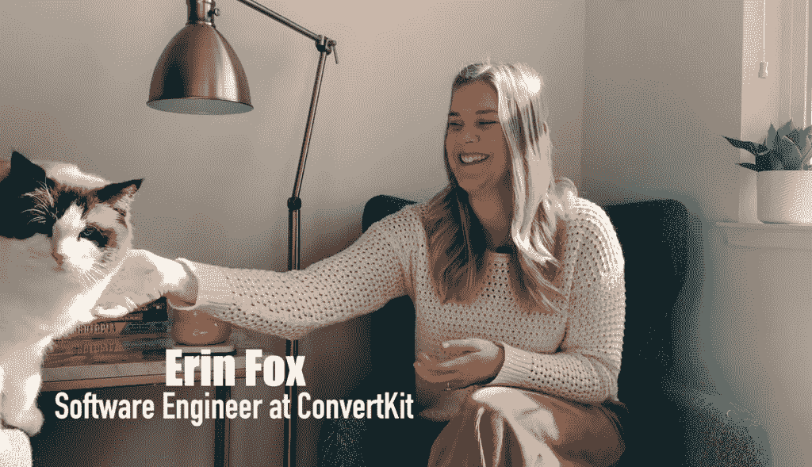

# 优秀的开发者需要什么？这里有一些令人惊讶的答案

> 原文：<https://thenewstack.io/what-do-good-developers-need-watch-some-surprising-answers/>

编程不仅仅是盯着屏幕，部署算法，掌握语法和排除错误。但是，听到其他开发人员分享他们自己的编程职业经历，仍然有一种原始的魅力。

为了满足这种好奇心，一家欧洲求职网站记录了对 12 名不同开发人员的采访，就一些常见的基本问题获得了坦率而随意的回答。编程最初吸引你的是什么？成功需要什么？伴随着一种奇怪的同步性，一些共同的主题开始出现，同时出现的还有一些挑战可能是编程生活方式所特有的。

这一切都被记录在 YouTube 上的一系列视频中，视频名为“Devs Answer”

## 编程的乐趣

这些视频是[蜜罐](https://www.honeypot.io/)的作品，该网站自称是一个以开发者为中心的就业平台，服务于德国、荷兰和欧盟的顶级城市，如维也纳。蜜罐试图将雇主与开发人员、数据科学家和开发人员、数据和机器学习工程师(以及工程领导者)匹配起来，因此该公司对开发人员的生活进行了大量思考。临近六周年之际，Honeypot 开始制作视频系列，捕捉各种各样的开发人员体验。

也有一些惊喜——例如，在[采访](https://www.youtube.com/watch?v=k1HmQH2bFIk&pp=sAQA)[艾琳·福克斯](https://www.linkedin.com/in/erinkfox/)，ConvertKit 的软件工程师。在问一个关于工作与生活平衡的问题时，她的猫萨利打断了她。

但是最后，看到一群程序员，所有人都分享他们对成为一名程序员的快乐的感受，有一种奇妙的肯定。[阿里·斯皮特尔](https://www.linkedin.com/in/aspittel/)([亚马逊网络服务](https://aws.amazon.com/?utm_content=logo-sponsorpage&utm_source=thenewstack&utm_medium=website&utm_campaign=platform) Amplify】的高级开发顾问)[记得她在大学的第一次成长经历](https://www.youtube.com/watch?v=iIlLf8hdMQM&pp=sAQA)。“我觉得这很有趣，你可以在电脑里输入一些东西，电脑就会做你告诉它做的事情。我觉得那真的很神奇。”

[https://www.youtube.com/embed/iIlLf8hdMQM?feature=oembed](https://www.youtube.com/embed/iIlLf8hdMQM?feature=oembed)

视频

PayPal 的高级软件工程师 Shruti Kapoor(同时也是维护和指导 ECMAScript 委员会的代表和 Egghead 的讲师)也讲述了类似的故事。“我对我们如何编写几行代码，然后看到输出感到非常惊讶。这让我觉得，‘我可以创造任何我想创造的东西。’就在那时，我决定要全职做这件事。"

[https://www.youtube.com/embed/oq32PUomubY?feature=oembed](https://www.youtube.com/embed/oq32PUomubY?feature=oembed)

视频

Spittel 甚至将开发人员的生活比作玩乐高。“你可以建造东西、创造和发挥创造力……你也可以一直学习。这就是我喜欢成为一名开发人员的原因。”

至于她不喜欢的东西，她说:“我希望这个社区能更包容一点。但我认为，有很多人在那个领域做了很多伟大的工作，所以希望在未来，这种情况不会再发生。”

听到一系列的故事让人耳目一新，提醒观众不是每个人的经历都是一样的。React 播客的主持人陈宸(前前端架构师)坦诚地承认，他最初成为一名开发人员的原因是“因为我需要钱——简单明了！那不是激情，也不是兴奋，那只是:我需要钱。我们正在走出一个非常糟糕的经济时期，我被解雇了——这就像是在 2010 年。我刚买了房子，我们有了第一个孩子，我失业了，我很绝望。”

但在买了很多书后，他说，“正是通过大量的学习，我意识到我喜欢网络，我喜欢互动，以及它对任何人都可用的事实。它非常民主化。

"就在那一刻，我决定成为一名网页开发者."

[https://www.youtube.com/embed/2ycVP8jpTgQ?feature=oembed](https://www.youtube.com/embed/2ycVP8jpTgQ?feature=oembed)

视频

这也提醒我们，并不是每个人都走传统的编程路线。[高级软件工程师 Randall Kanna](https://www.linkedin.com/in/randallkanna/) 回忆说，她在大学的时候，“很多大学辅导员建议女性不要进入那个领域——所以我没有。”

相反，在获得大众传播学位后，她发现自己找不到工作，甚至连面试的机会都没有，最终她通过代码训练营找到了重返编程的路。“剩下的就是历史了。”

[https://www.youtube.com/embed/zo7bpKc9eX0?feature=oembed](https://www.youtube.com/embed/zo7bpKc9eX0?feature=oembed)

视频

虽然来自 ConvertKit 的 Fox 以通信硕士学位开始了她的职业生涯，但她最自豪的时刻是从一个编码训练营毕业后仅仅两个月就在美国职业足球大联盟找到了一份编程工作——然后打电话告诉她的母亲。“我在一家伟大的公司有一个工程头衔，一个伟大的团队会教我很多东西。能够完成新兵训练营，在两个月内找到一份工作，我感到非常自豪和有成就感——我的工资比以前翻了一倍。”

尽管她不得不贷款来支付编码训练营的费用，但“它真的改变了我的生活，”她说。“因为太多伟大的理由。”

[https://www.youtube.com/embed/k1HmQH2bFIk?feature=oembed](https://www.youtube.com/embed/k1HmQH2bFIk?feature=oembed)

视频

## 善良的重要性

在开发者回答采访中不断出现的一个主题是什么？善良、同理心和与同事沟通的需要。[新美乐股份公司·科廷](https://www.linkedin.com/in/simona-cotin-2ba8747/?originalSubdomain=ch)、[微软](https://www.microsoft.com/en-us/?spl=2)的首席云倡导者指出，程序员的工作“只要对他人有用，就被认为是成功的——所以我们真的需要练习换位思考，这样我们才能设身处地为用户着想！”

[https://www.youtube.com/embed/dWh4tQigIYs?feature=oembed](https://www.youtube.com/embed/dWh4tQigIYs?feature=oembed)

视频

这对你自己的成功也很重要，软件工程师兼教育家肯特·c·多兹回应道。“不管你是一个多么优秀的开发人员。如果你不是一个好人，一个善良的人，一个其他开发人员想和你在一起的人，那么你将很难实现你的目标，推进你的使命。”

微软网络平台团队的 Scott Hanselman 说得更直白，他曾说过“没有人有兴趣和怪人一起工作。”

随之而来的是成为一个好的沟通者的需要，他认为这“实际上对推进技术职业同样重要，甚至更重要。我更愿意和一个中等水平的程序员一起工作，他是一个善良的人，是一个伟大的沟通者，能够解释事情，为他们的团队辩护，为他们自己辩护——而不是一个 10 倍的开发人员，他是一个混蛋。”

[https://www.youtube.com/embed/kcXKyqVS948?feature=oembed](https://www.youtube.com/embed/kcXKyqVS948?feature=oembed)

视频

微软开发工具的首席项目经理 Chris Heilmann 回应了软技能的重要性:“本质上，你必须与人合作。”回顾过去，他发现他职业生涯的很大一部分是他的双重技能:“我是一名开发人员，也可以用非常人性化的语言向非开发人员解释非常复杂的事情。”

[https://www.youtube.com/embed/qE2G8p5HnjU?feature=oembed](https://www.youtube.com/embed/qE2G8p5HnjU?feature=oembed)

视频

为了帮助实现这一目标，CodePen 的联合创始人克里斯·科伊尔(Chris Coyier)鼓励写作——无论是博客、给同事的电子邮件，甚至只是内部维基。“向他人表达你的技术想法将有助于你更好地思考，并有助于他们理解你的思维方式。人们会对你有不同的看法——他们会认为你是一个优秀的思想家，而你正在成为这样的人。写作真的为你打开了职业生涯的大门，我不能再这么建议了。”

[https://www.youtube.com/embed/Ent8w_88T4o?feature=oembed](https://www.youtube.com/embed/Ent8w_88T4o?feature=oembed)

视频

最终是[奥比纳·埃克乌诺](https://www.linkedin.com/in/ekwunoobinna/)(她也是网页设计网站[的技术编辑](https://alistapart.com/)和教育网站 Egghead 的讲师)提供了两个主题的美丽结合——作为程序员的兴奋感和与你周围的人感同身受的需要。“很容易将自己视为神一样的人物，在那里你能够创造一切。

"你忘了身为人也很重要."

[https://www.youtube.com/embed/VdZ4HBCvOA8?feature=oembed](https://www.youtube.com/embed/VdZ4HBCvOA8?feature=oembed)

视频

* * *

# WebReduce

<svg xmlns:xlink="http://www.w3.org/1999/xlink" viewBox="0 0 68 31" version="1.1"><title>Group</title> <desc>Created with Sketch.</desc></svg>