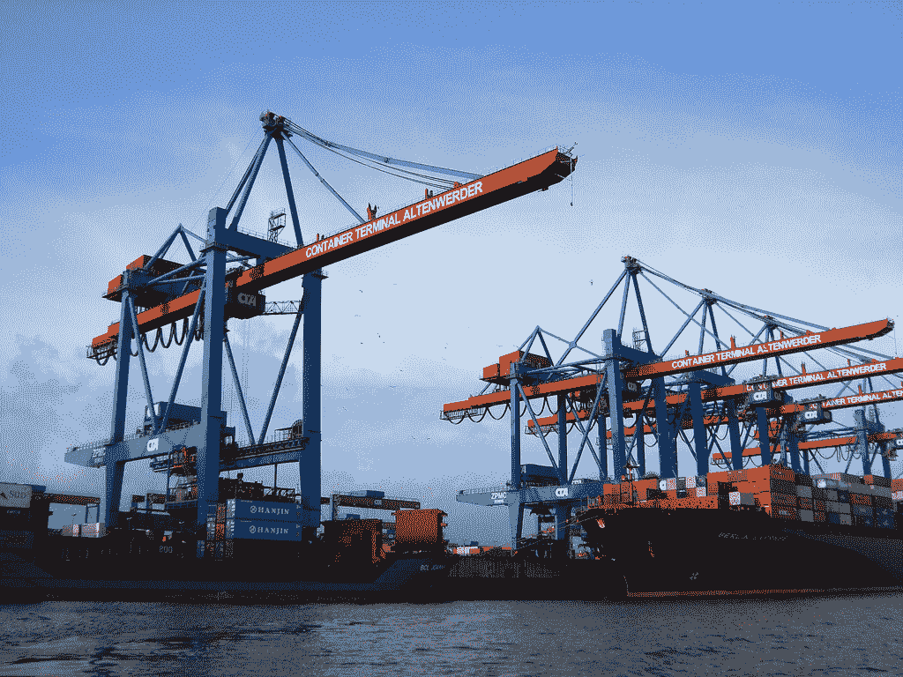

# 码头工人做什么和不做什么

> 原文：<https://thenewstack.io/what-docker-does-and-does-not-deliver/>

**Editor’s Note**

:

*The following post originally appeared on the ActiveState blog under the headline: [Docker and the Application Supply Chain Challenge](https://www.activestate.com/blog/2014/09/docker-and-application-supply-chain-challenge?utm_source=thestack&utm_medium=sponsor&utm_term=&utm_content=sp-dockcontainer&utm_campaign=thestack-cfq4). ActiveState is a sponsor of The New Stack. The post explains why we need to think of containers as not the end result but simply as a means for shipping code. Shipping containers are an apt metaphor for today’s new stack world but in isolation containers are meaningless. The difference is in the ecosystem that supports the container as it moves from its origination to its final destination. *

如果你在 IT 行业工作，你必须睡在石头下才能意识到 Docker 热潮。12 个月前，Docker 还不为人所知，如今它被誉为所有 IT 问题的解决方案——尤其是如何在异构 IT 基础设施之间实现应用程序可移植性这一棘手且长期存在的问题。

在 ActiveState，我们是 Docker 的坚定支持者；事实上，我们相信我们是第一个在 Stackato 3.0 版本中发布包含 Docker 的产品的技术供应商。然而，尽管我们对这项技术充满热情，我们认为 it 人员了解 Docker 能做什么和不能做什么是很重要的。我们对 Docker 缺点的看法可以总结为:Docker 和应用程序供应链挑战。

为了理解这一挑战，研究一下 Docker 用来描述其功能的术语“容器”是很有用的。这个短语在 IT 界已经使用了很多年，用来表达操作系统容器的目的:提供一个结构化的、隔离的应用程序执行环境，可以很容易地从一个地方转移到另一个地方。

这个术语起源于物理世界:它指的是用来将货物从地球的一端运输到另一端的集装箱。这些无处不在的集装箱使得运输货物的效率很高，成本很低，今天我们想当然地认为货物可以快速安全地通过陆地和海洋运输。

然而，正如迷人的历史[“盒子”](https://www.amazon.com/Box-Shipping-Container-Smaller-Economy/dp/0691136408/ref=sr_1_1?s=books&ie=UTF8&qid=1409697419&sr=1-1&keywords=the+box)中所描述的，集装箱在最初被创造出来的时候，并不是很有用。要实现今天集装箱的无缝端到端运输，需要整个货物供应链的变革和创新:

### 专用起重机

这些巨型起重机将集装箱从一个位置转移到另一个位置(例如，从船转移到装卸码头)。这些起重机非常高大和强大，使它们能够承载通常装在集装箱中的数万磅货物。几年前，一艘载着一些起重机从中国到加州奥克兰的船必须等待退潮才能通过金门大桥，这应该会让人们对它们的规模有所了解。

【T2

### 新轨道车

用于运输人工装卸的单个货物的棚车由于转向集装箱而变得过时，因此需要用适合运输全尺寸集装箱的新型平板车来代替。

### 卡车和拖车

为了将单个集装箱运送到期望的位置，必须用卡车将它们运送到交货地点。这就需要新的拖车来固定和运输满载的集装箱，这反过来又需要更大功率的牵引车。

### 集装箱船

集装箱运输的效率和低成本有助于增加全球贸易，因此需要更大规模的运输——因此，有了[号集装箱船](https://en.wikipedia.org/wiki/Container_ship)。这种规模的增长一直持续到今天，导致了所谓的后巴拿马型集装箱船的发展，这种集装箱船如此之大，以至于巴拿马运河需要扩建才能容纳它们。

总之，尽管集装箱无疑是航运业的一个巨大创新，但它需要周围生态系统的创新，以便货物供应链实现集装箱航运的全部潜力。如果没有支持机制，集装箱本身的用处是微乎其微的。凭借更丰富的生态系统，集装箱彻底改变了实物产品供应链。

同样，理解 Docker 类似于运输容器也很重要(事实上，它的标志向运输容器表达了明显的敬意，如下图所示)。

目前对 Docker 的狂热表明了它明显的前景:一种可移植的应用程序执行机制，它运行速度极快，同时所需的资源远少于专用操作系统，而专用操作系统正是当前最受欢迎的可移植执行环境虚拟化所需要的。

然而，正如集装箱本身无法提供其潜在的所有好处一样，Docker 也需要一个功能性的周围生态系统，以便 Docker 用户可以获得他们想要的所有好处。

什么样的周边功能？

以下是我们认为 Docker 实现其作为应用程序推动者的潜力所必需的一些东西——换句话说，这些是 Docker 用户获得端到端应用程序敏捷性的全部好处所需要围绕 Docker 的东西。

### 将开发与运营联系起来

正如我的同事 Phil Whelan 几天前在他的博客文章中写的那样，许多 DevOps 方法的爱好者主要关注等式的操作部分，而忽略或淡化了开发人员这一方。我是这样说的:应用程序的生命周期从开发人员将手指放在键盘上开始，到应用程序投入生产时结束(实际上，它还不止于此——参见下面关于应用程序版本控制的内容)。将应用程序工具和流程与运营工具和流程结合起来非常重要。Docker 为此提供了工具，但是周围的工具和过程需要无缝地支持 Docker 容器跨所有组和通过所有应用程序步骤的迁移。

### 在所有部署环境中实现一致的操作结构

如果周围的生命周期工具是针对单个执行环境进行调优的，那么拥有可移植的执行格式是没有帮助的。开发、部署和管理工具在当前和潜在的未来执行环境中工作是至关重要的。简而言之，如果您的应用程序流程只在 AWS 或您定制的 Kubernetes 基础设施上工作，您就没有真正实现可移植性——您被束缚在一个单一的环境中，尽管您有可移植的执行格式。企业的现实情况是，他们在多种事物上实现了标准化(即，所有企业都在 Oracle 和 SQLServer 数据库上实现了“标准化”，但无疑也有大量 DB2 和 MySQL)。您的应用程序管理系统需要是可移植的，就像您的应用程序执行格式是可移植的一样。

### 支持应用程序版本控制

正如我上面提到的，应用程序的生命周期实际上超出了应用程序发布到生产环境的范围——因为每个重要的应用程序最终都会被修改、改进和扩展。基于 Docker 的应用程序支持应用程序的版本更改，并且您的执行环境能够跟踪新版本并将其发布到生产环境中——顺便说一下，如果发现新版本有问题，能够优雅地回滚到以前的版本，这一点非常重要。Docker 可以简化这一过程，但是它本身没有版本控制功能。开发和操作工具链应该为 Docker 执行环境的使用提供这种能力。

### 支持应用程序 A/B 功能测试

我刚刚提到了版本控制，但是需要注意的是，甚至版本控制的概念也在变化:应用程序正在从很少改变的软件包实例转变为频繁改变的基于组件的微服务以及内部和外部服务的功能服务的集合。因此，至关重要的是，您的应用程序流程能够对生产环境的一部分进行频繁的小规模更改，将一定量的用户流量导向更改后的环境，并逐渐增加运行更新代码的环境的比例，直到整个应用程序更新完毕。显然，Docker 通过提供多个执行环境的简单使用来支持这一点，因此，比方说 90%的 Docker 容器运行旧代码，10%运行新代码，但是，同样，Docker 本身并不提供这一点。有了正确的生命周期功能，Docker 可以被用来支持 A/B 功能测试，但是这依赖于其他产品的功能来实现。

正如您可能猜到的，ActiveState 是 Docker 的早期爱好者，它提供了上述 Docker 之外的功能。我们相信，基于其高效率和执行格式的可移植性，Docker 将彻底改变应用程序世界。认识到它的前景和局限性，我们将 Docker 集成到我们的 Stackato PaaS 产品中，以确保用户获得必要的应用程序生命周期支持，以便他们可以获得基于 Docker 的应用程序环境的全部好处。

Bernard Golden 在 Wired.com 被提名为云计算领域十大最具影响力的人物之一，他在帮助组织有效采用和集成云计算方面拥有丰富的经验。他将帮助 ActiveState 客户应用最佳实践，并在他们利用 Stackato 的云时实现他们的目标。在加入 ActiveState 之前，他是戴尔公司云计算企业解决方案的高级总监。在加入戴尔公司之前，Bernard 是云计算咨询公司 HyperStratus 的首席执行官，该公司为全球的企业和服务提供商提供服务。Bernard 担任一些组织的顾问，这些组织利用他的云计算专业知识来加速他们的成功，例如 Nirmata 和 Cloud Network of Women (CloudNOW)。他是关于虚拟化的四本书的作者或合著者，包括虚拟化傻瓜书，这是有史以来出版的关于该主题的最受欢迎的书，以及亚马逊虚拟网络服务。Bernard 还是 CIO Magazine 的云计算顾问，他备受推崇的博客每月有数万人阅读。他是一位备受推崇的演讲者，并在世界各地的会议上发表演讲。

专用起重机、[轨道车集装箱](https://www.flickr.com/photos/94418464@N08/9175857125/in/photolist-eYQEDc-kErRSk-iYENpE-kEtWgf-iYE2Mx-eZ2XU5-kEskec-fUZyNa-fkFkB8-eYQDPM-f5GXsQ-88xq38-kWBUSH-icxbfu-d7s8Bu-pp8UUF-m5uHTo-ieigQ2-iYCCCa-eYQEka-9FscEi-fGdcL8-e74GyG-fBT7pR-fBT7xK-fGuM89-phMWa9-6z8YNQ-fJiHMU-eYQCVn-f5XnKe-icwNAP-eZ2YRC-f5sJaB-nhPfLR-fFo2FY-ctYwW7-eZ2Zjm-h53JJK-3FGrru-nePvtd-iYEYTA-odS2tv-6gpi8v-pDwPsf-o8yUnT-p6rBHY-ngx9GY-jt9nqE-nvrThw)、[卡车集装箱](https://www.flickr.com/photos/28421567@N04/3377212210/in/photolist-69r6wJ-5Wb67F-36j7zV-e6MU44-36oKju-7ypEJW-phPjYo-ejAKCX-9m1XUF-69r6sW-69r6pu-9jBntf-6wfKhK-bnBekQ-bEsThZ-e1z6rB-9mieUu-79Gfte-nHfbSV-dW7rw5-dME1fm-hV7NJ8-7YTHB3-e9ZHCa-dYJMsZ-eaJP3c-6wRqo-eaQtQ5-9u7Lgb-8nks3p-8gkQ4n-bJRBhr-c1zgUo-c1zhE3-DkXpr-9xiupd-nFXJ2G-5UzmK8-6XTveA-4sp1kU-4tf2iD-6yZnwb-5dv936-7LgsBa-nzDBQ-5B5rUF-iYEYTA-aYxtti-923mFx-dVxmxM)和[集装箱船](https://www.flickr.com/photos/kevtalec/14740806377/in/photolist-osAub6-e8RuW9-8ffvhp-5i8LDQ-8YcDag-7JR9TF-owpee1-cQFNyQ-JWMJF-dqG4Jc-owpev3-8ABe7k-nJrtTS-8xkVJ3-eyj8gx-gLxw7m-fxL1de-aLRP32-fxKZKH-oH3SMw-fxKYWP-qSbck-cFfQ9Y-4MtokT-9pDbxJ-8Ksbvk-cyZ9tY-dTHY9D-cDa6uq-8Kve29-4pjGJG-dVxpep-8Ksbgv-8YcCW4-dh2dAh-8KsaWg-6zgUow-d9vCo1-7gKJV-jT3Eyz-bAAzvW-gLxASe-oK3SiE-oszZQR-7VAzJ8-2AzAVJ-9buvwZ-7r8rWJ-5PwX6W-aRgbwB)的图片通过 Flickr Creative Commons 授权。

<svg xmlns:xlink="http://www.w3.org/1999/xlink" viewBox="0 0 68 31" version="1.1"><title>Group</title> <desc>Created with Sketch.</desc></svg>