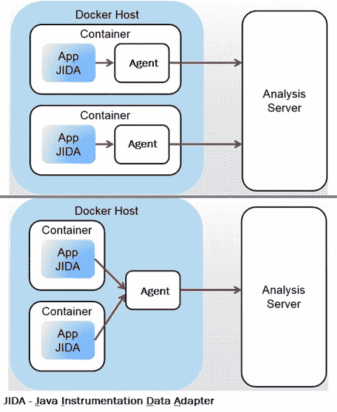
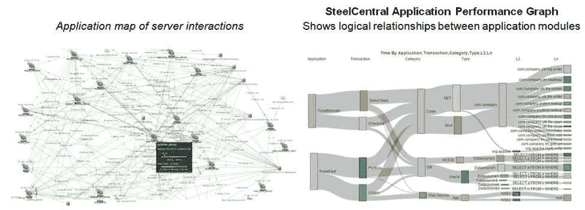

# 有效的云监控是什么样的？

> 原文：<https://thenewstack.io/what-does-effective-cloud-monitoring-look-like/>

 [盖尔·莱文

盖尔·莱文是 Riverbed Technologies 公司解决方案营销总监。此前，她曾在 VMware、Oracle 和 Splunk 以及几家初创公司担任产品营销和营销角色。她的兴趣在于技术对我们今天思考和工作方式的影响。](https://www.riverbed.com/) 

在迁移到云、容器和虚拟机接管一切之前，应用程序性能监控(APM)要简单得多。您可以在特定的机器或处理器上跟踪您的应用程序，并观察它在不同条件下的行为。版本之间相隔足够远，这样您就有时间检测代码以提供必要的调试信息。每隔五分钟进行一次监控，可以为您提供大部分时间所需的信息，并且数据量达到了可以实际收集和分析的人类规模。

我们当时所做的并没有给我们现在需要的信息。您的大部分甚至全部基础设施都在您的控制之外。云提供商提供的性能可见性有限，许多指标不定期收集，从 1 分钟到 15 分钟不等。代码分布在一个动态的、弹性的环境中成百上千的系统中，这使得监控您的过程及其依赖关系变得很困难。工作负载频繁上下旋转，容器和微服务将流程和方法分割成越来越小的部分，导致对象的寿命非常短，并且频繁改变位置。DevOps 流程、敏捷开发和 web 部署加快了发布周期，增加了出错的可能性，几乎没有时间来添加或更新工具。监控数据的庞大数量[大数据](https://www.riverbed.com/blogs/why-a-big-data-approach-is-key-for-apm.html)超出了人类的理解能力，需要新的分析和机器学习。

## 云监控的新模式

操作环境的变化要求应用程序性能监控发生变化，以更好地支持[云监控](https://www.riverbed.com/products/steelcentral/cloud-performance-management.html)的需求。由服务器、处理器、磁盘、内存和其他特定物理属性组成的旧硬件结构的相关性要小得多。相反，现代 APM 工具必须关注逻辑概念，如流程和事务，并捕捉高度动态的关系和依赖关系。监视几个服务器或应用程序不足以让 DevOps 有效运行。今天的 [APM 工具](https://www.riverbed.com/solutions/application-performance-monitoring.html)需要能够监控所有关键业务应用和所有事务的规模，以便团队能够快速检测和解决问题。以一分钟或五分钟为间隔的采样会遗漏太多。我们需要高清晰度的数据捕捉和粒度。由此产生的大数据集需要复杂的分析和人工智能来帮助我们自己的分析和决策。最后，这些工具必须能够感知云，并且可以通过 SaaS 获得，以便能够轻松地与您的应用和基础架构集成。

## 避免盲点

对我来说，现代云监控策略的首要任务实际上是监控所有重要的东西，包括微服务、API、基础设施、网络路径和最终用户体验。不幸的是，大多数组织只监控其业务关键型应用程序的一小部分，以及这些应用程序组件的一个子集，这导致了太多的盲点。值得注意的是，由于对象频繁移动，Docker 容器、微服务和其他组件的采用使得跟踪**一切**变得越来越重要。采样的事务度量很可能完全错过许多短期对象。

由于您不可能检测所有东西，因此高级云监控主机代理需要在操作系统级别运行，自动发现和检测所有进程，无论它们是在虚拟机、容器还是微服务中。Java 和。NET 代理随虚拟机(使用您的映像或 Docker 主机构建)一起启动和关闭，以便您可以随时随地获得应用程序运行的统计数据。需要网络详细信息(如往返时间、吞吐量和重新传输速率)来帮助您快速区分网络和服务器问题。JavaScript 片段和页面标签会自动部署到您的网页上，提供关于页面加载时间和 AJAX 请求的信息，以便详细了解最终用户体验。

## 云监控的大数据方法

云监视器的大数据方法必须支持数据收集以及对大量和各种数据的分析。收集所有这些数据意味着产生的数据集非常大，因此智能云监控代理压缩、缓冲数据，并将其流回 NoSQL 后端。数据流中存在大量重复数据，这使得压缩在降低网络负载方面非常有效。在后端，传统数据库不适合这种数据收集量和速度，因此需要多线程和多队列方法来跟上。在极少数情况下，数据超出发送或接收系统的容量，智能节流会有选择地忽略最不重要的数据。请注意，还应收集元数据(即关于位置、用户或设备的信息)，因为在对复杂问题进行故障排除时，元数据非常有价值。

担心数据的数量、速度和种类会使任何监控解决方案不堪重负，使应用程序变慢，带来不可接受的性能负担，甚至导致它们在负载下崩溃？高效的容器化代理和基于云的 APM 解决方案为收集和处理 Pb 级数据提供了必要的可扩展性。当您使用实际的事务数据和应用程序堆栈详细信息来调查特定问题或故障单时，与您局限于基于抽样子集的平均用户响应相比，这将导致更快的诊断和解决。原因之一是，当您拥有所有可用的必要数据时，没有必要等待形成假设和收集额外的指标。

## 高级分析和机器学习

这种容器化的弹性环境中的数据量超出了人类的理解能力，也超出了电子表格和传统分析工具的能力。模式识别、关联分析和异常检测可以帮助 DevOps 团队识别早期预警信号，找到相关事务，并经常在用户报告之前修复新出现的问题。

通过应用分析，高级 APM 工具可以使用用户会话标识符和通信协议等线索重组事务片段，并将关系可视化为逻辑组，从而更容易跟踪性能依赖关系。然后，您可以通过详细的报告深入了解具体的方法、网络和计算机，从而带领团队快速隔离和修复问题。

在分析 APM 大数据时，机器学习也很有价值。机器学习可以寻找指示性能问题和表面*潜在*原因的特征。这种洞察加速了问题的解决，并基于学习集不断丰富。

## 信任但核实

亚马逊 AWS 和微软 Azure 等领先提供商提供的虚拟专用云(VPC)和其他服务成为另一个需要监控的资源。全面了解用户体验、交易细节和资源可用性对于确保端到端交易按预期执行是必要的。云监控通过终端用户体验细节增强了供应商提供的指标，以快速区分用户设备、云服务器和网络基础设施上的问题，以便您可以解决正确的问题。

随着您转向云服务，您的团队还需要监控服务级别协议(SLA)并优化您的使用承诺。云提供商的 SLA 停留在他们的云边缘，他们的性能和可用性指标并不代表您的用户的实际体验。这就是为什么从每个用户的角度，在整体业务工作流、严重性、相对重要性、地理位置和许多其他分类的背景下，衡量云交付应用程序在屏幕上呈现的性能非常重要。比较不同云提供商和您自己的数据中心上托管的应用程序之间的性能，以及升级前后的性能，以获得最佳结果，这也很有帮助。

## 云监控成功的基本要素

毫无疑问，性能监控比三层架构时代更具挑战性。从服务器和处理器的物理概念发展而来的较老的 APM 工具和技术，很难跟踪您的应用基础设施和成千上万的 web 和移动客户端之间的现代逻辑和虚拟结构。有效的云监控需要一种新的策略，这种策略可以监视所有正在运行的实例，包括虚拟服务器、容器、微服务，甚至进入云实例。大数据的规模需要一种新的 APM 工具来支持云监控，这种工具具有收集所有用户、交易和方法数据的灵活性和能力。寻找这些基本元素，将您的应用程序性能监控带入云时代，并帮助您提供客户所需的性能和可靠性，以及您的组织取得成功所需的性能和可靠性。

通过 Pixabay 的特征图像。

<svg xmlns:xlink="http://www.w3.org/1999/xlink" viewBox="0 0 68 31" version="1.1"><title>Group</title> <desc>Created with Sketch.</desc></svg>