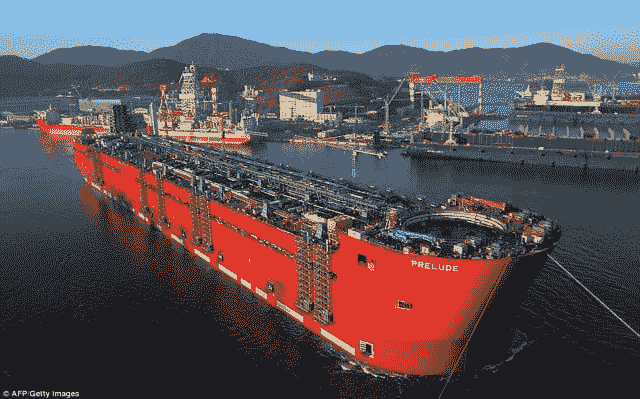

# “上”物联网意味着什么？

> 原文：<https://thenewstack.io/what-does-it-mean-to-be-on-the-internet-of-things/>

这篇文章最初出现在 ActiveState 博客上。汽车、机器人、水族馆——它们和大约 400 亿其他东西将很快被连接起来。那是物联网吗？真的有什么限制吗？

在互联网成为“东西”之前，我就开始涉足物联网。很久以前，我摆弄过将各种传感器和致动器连接到我的 Apple II 和 Amiga 1000 电脑上，并摆弄过 X10 上的电动设备。

最近，在 Jini 和的早期，我和我在 Sun 公司的好朋友兼同事 Doug 一起在圣克鲁斯山区创建了一个“Jini house”。在一年的时间里，我们用 Jini 启用了我们能想到的一切，从冰箱和其他厨房电器，到灯、相机、热水浴缸、运动传感器，甚至一个装有一把热带鱼的大型咸水鱼缸。

水族馆很酷。我们为温度计、氧气/盐度/pH 计、充氧器、泵、灯、照相机，甚至一个类似摩天轮的电动喂鱼器制造了 Jini 传感器和致动器。这个项目的高潮是当我们在日本的时候，在一个会议的舞台上，我们能够从 5000 英里之外观看鱼在周围游动，同时我们给它们喂食并监控水箱。这个项目的低谷是当我们向 Jini 的创造者 Bill Joy 展示网络时，演示神关闭了网络。

因此，我一直饶有兴趣地关注着“物联网”这个东西的出现，在思考它的时候，一堆问题涌入，并继续涌入我的脑海。仅仅是问这些问题就打开了许多隐患，并引发了一堆其他问题。对我来说最大的问题是，在物联网上到底意味着什么？

## 在物联网上到底意味着什么？

物联网上有如此多的东西，但这到底意味着什么呢？物联网上的东西有网卡吗？它有 IP 地址吗？它需要 URI 吗？应该可以 ping 通吧？

如果我在珠穆朗玛峰顶埋一个可 ping 通的网络设备，通过卫星连接互联网，这是否意味着珠穆朗玛峰在互联网上？或者只是碰巧在珠穆朗玛峰顶上的一个网络设备在上网？

## 这不是真正的互联网，是吗？

越来越好了。根据我的理解，互联网是(或曾经是)IP 网络的网络。“IP”这个名称——互联网协议——就暗示了这一点。

但今天的物联网显然远不止互联网协议。所谓的物联网上的大量设备不一定是 IP 设备——许多设备使用各种非 IP 协议通过蓝牙、ZigBee、Z-Wave、通过 USB 的硬连线、X10 和无数其他传输机制进行通信。

随着所有关于 IPv6 的讨论和它所支持的可寻址设备的大规模爆发，有无数种类的传感器和其他设备太小太简单而无法集成 IPv6 堆栈。考虑一个只传输一条数据的传感器，比如一个微型水分检测器或光传感器。这种设备只需要传输一位信息。围绕这样一个简单的设备构建一个庞大复杂的 IPv6 堆栈是没有意义的。

然而，像这样的非 IP 设备正在疯狂地加入物联网。这就对物联网中的“互联网”提出了质疑。

这就引出了下一个问题。

## 什么是事物？

牛津英语词典 [(OED)](http://www.oed.com/) 将一个事物定义为“一个无生命的物质实体，区别于一个有意识的生命体。”

这个定义，如果严格遵循，禁止所有生物加入物联网。如果我想把我的狗放到网上呢？这个领域已经取得了很多进展:看看 Iotera 的 [GPS 追踪器，他们声称这是世界上最小的 GPS 追踪设备。](http://www.iotera.com/)

但是我的狗不是东西，所以它怎么能加入物联网呢？

就此而言，如果我想加入互联网。严格解释物联网中的“事物”一词可以防止这种情况。这句话也来自牛津英语词典，说明了一切:

> “我不是一件东西，不是一件值得珍惜的艺术品。”

所以我反对“物联网”中的互联网和物这两个词

“的”字就可以了。暂时如此。

但是分析这个术语对我来说只是第一步。我还有一堆其他的问题，现在我将肤浅地、不敬地(也许不相关地)回答这些问题，并且不做大量的研究。

## 最大的人造物品是什么？

物联网上最大的人造物品是什么？这可能是 [CERN 大型强子对撞机](http://home.web.cern.ch/topics/large-hadron-collider)，被认为是有史以来最大的人造物体之一。几乎可以肯定它是“在物联网上”(不管那是什么意思——见上文)。

## 最大的移动物体是什么？

物联网上最大的移动设备必须是这种难以置信的巨大[油轮/移动炼油厂](http://www.dailymail.co.uk/news/article-2518943/Worlds-biggest-ship-Prelude-takes-water-time.html)。它还没有完全建成，也不能靠自己的力量移动(所以从技术上来说它不是一艘船)，但它是可移动的，而且是巨型的:它的长度是五个(加拿大)足球场，重达 60 万吨。我挑战你在互联网上找到一个更大的移动设备。

【T2

## 最酷的**事是什么**

物联网上最酷的东西(这里我指的是“令人敬畏”的酷，而不是“冰冷”的酷)必须是来自 Liquid Robotics 的[波浪滑翔机海洋漫游机器人](http://liquidr.com)，部分由 Java 创造者詹姆斯·高斯林设计。这种波浪驱动的冲浪板装有各种传感器，当它探索海洋并将信息发送回其大本营时。

## 最短暂的东西是什么？

查看 Proteus 的可消化传感器。这些小装置是用来和药物一起服用的。它们由胃酸提供动力，当被激活时，会向佩戴在身体上的贴片发送信号。这种补丁通过蓝牙与手机或平板电脑通信，最终传输到云端。
T13

这种让我想起了《骷髅舞》:

> “传感器骨连接到补骨，补骨连接到电话骨，电话骨连接到云骨…”

好了，够了。最终结果是，当您服药或不服药时，您或您的护理人员会收到一封电子邮件。我觉得这既令人惊讶，同时又有点令人不安。

无论如何，这些小传感器是由易消化的成分制成的，在它们被消费后不久，就会完全溶解——并获得我对最短暂事物的投票。

## 最小的东西是什么

我不知道现在物联网上最小的东西是什么。纳米技术领域发展太快，我跟不上，产生了像[纳米技术增强的智能涂料](http://www.engadget.com/2012/01/30/nanotech-enhanced-smart-paint-promises-to-detect-structural-da/)这样的创新，它由微小的传感器组成，这些传感器合作检测飞机和其他船只的结构故障。也许这些是物联网上最小的东西，至少今天早上是这样。今天下午，别的东西可能会超过他们。

## 最丰富的东西是什么？

同样，技术进步太快，无法给出准确的答案。智能电表正在迅速部署到世界上每一个有电的家庭，这可能会轻松超过 10 亿个智能电表。这与世界上的汽车数量大致相同，汽车正在迅速加入物联网的行列。10 亿也与今天使用的手机数量在同一个数量级，而且这个数字每天都在急剧增加。因此，手机可能是物联网上最丰富的东西。今天。明天，谁知道呢？

## 最危险的是什么？

很多东西都很危险:发电厂、水坝、导弹、飞机、武器。把它们放到网络上，它们就容易受到黑客和远程攻击。想象一下，在 TrackingPoint 的 [Linux 驱动的步枪](http://arstechnica.com/gadgets/2013/01/17000-linux-powered-rifle-brings-auto-aim-to-the-real-world/)上使用远程 root shell 可以做什么。或者，如果你在一架 747 飞机的半空中发出“rm -rf /”命令会怎么样？我不知道最危险的事情是什么，但我真的希望无论是谁把它带到网上，都要深思熟虑，确保它的安全。

## 他们继续来

我可以继续下去:

*   最便宜的东西是什么？
*   最贵的东西？
*   最火的东西？
*   最冷的事？
*   最遥远的事？
*   物联网上最古老的东西？

问题不断出现，答案不断变化，我很想听听别人的看法。

## 不要让我开始谈论 IoS！

我承认，我写这篇博客的真正目的不是迂腐地剖析流行词汇的语义。(就像新出现的 IoS——服务互联网——以我的拙见，它只是物联网的一个子集，因为服务不像我的狗，它是一个东西。或者更糟，物联网。但是不要让我开始。)

我在这里的主要目标是讨论一些物联网概念，并解决一些物联网问题。但这真的只是开始。寻求利用物联网的公司将面临许多技术挑战:安全性、传统设备、端口、正常运行时间、路由、SLA、数据泛滥、位置感知、发现和一系列其他有趣的话题。

## 天空是无限的

随着这些天来技术上出现的指数级增长和令人难以置信的进步，在不久的将来可能会出现在物联网上的东西没有尽头。雨伞、烟花、法官的小木槌、昆虫、垃圾桶、锤子、鞋子、石油钻、子弹、风筝、冰球(冰球摄像头)、个人钢琴键——最终将出现在物联网上的东西的性质真的没有限制。

ActiveState 是新堆栈的发起人。

<svg xmlns:xlink="http://www.w3.org/1999/xlink" viewBox="0 0 68 31" version="1.1"><title>Group</title> <desc>Created with Sketch.</desc></svg>