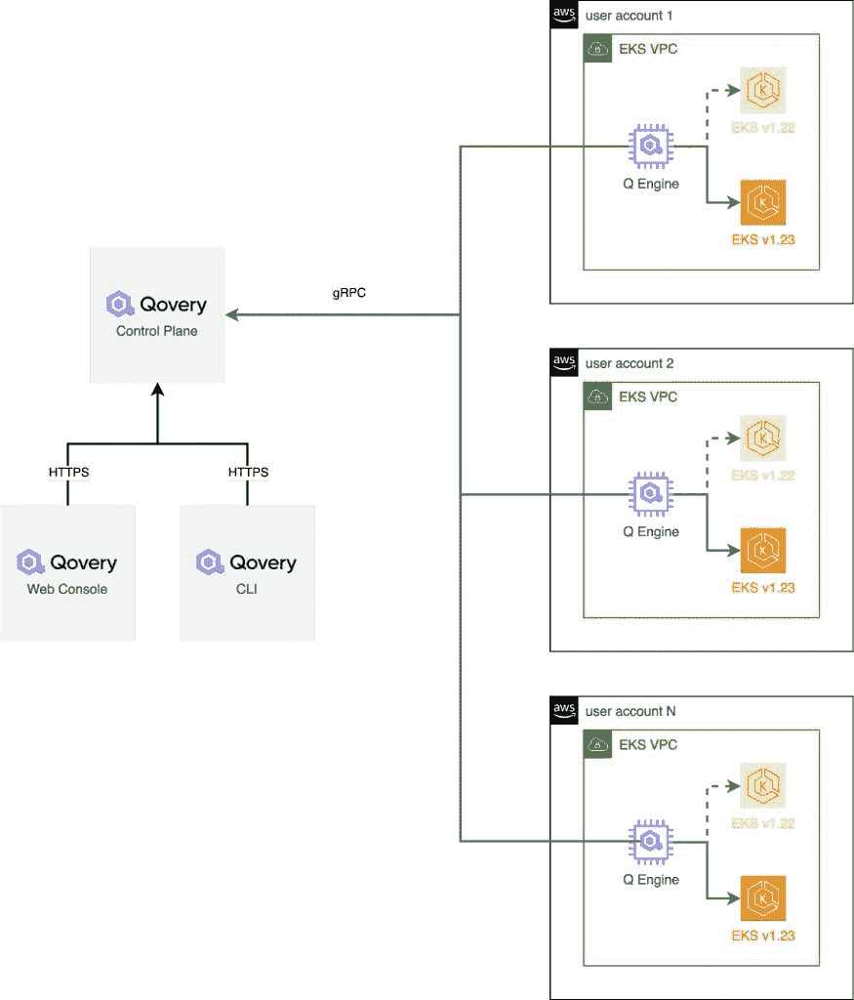
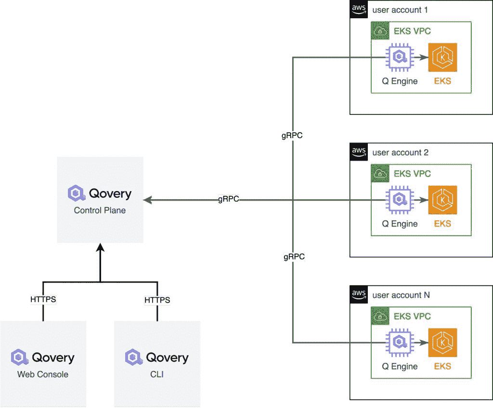
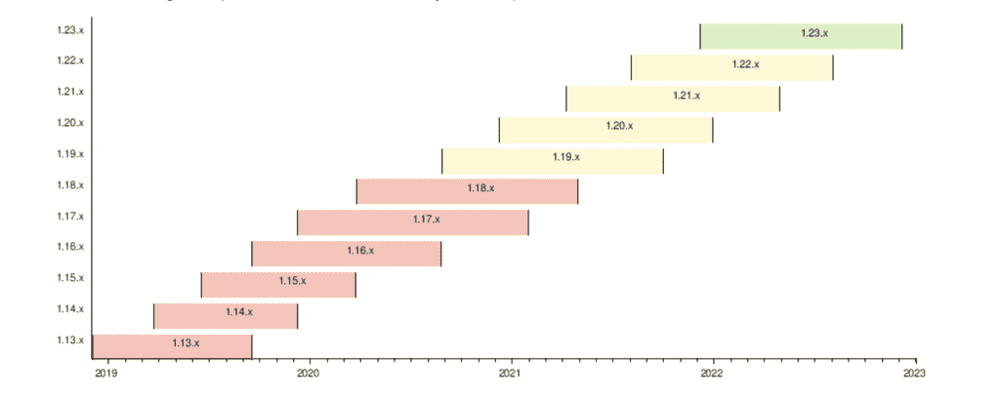
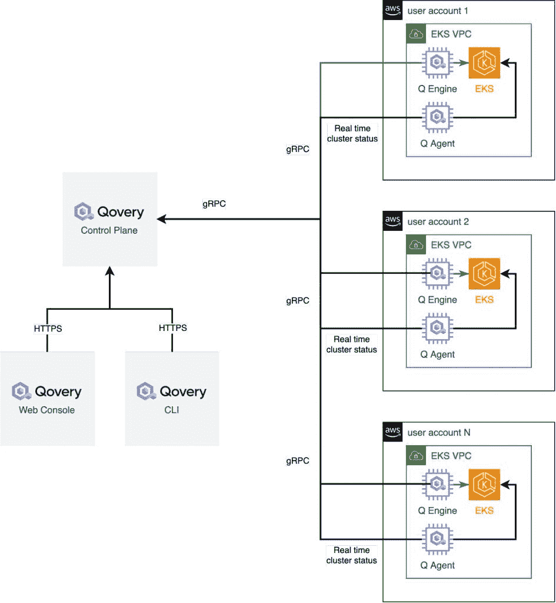

# 管理数百个 Kubernetes 集群需要什么？

> 原文：<https://thenewstack.io/what-does-it-take-to-manage-hundreds-of-kubernetes-clusters/>

**关键要点:**

*   部署生产就绪的 Kubernetes 集群以及投入生产所需的所有依赖项需要几天时间。
*   如果不自动化这个过程，管理大量的 Kubernetes 集群是非常困难的。
*   管理跨几个集群提供者的 Kubernetes 集群更加困难。
*   升级 Kubernetes 集群需要大量的测试，以确保更改不会破坏任何东西。这不仅仅是像通常所说的那样按下“升级”按钮。

 [罗马里奥·菲罗根

Romaric 是 Qovery 的首席执行官和联合创始人，在站点可靠性工程和软件开发方面拥有超过 10 年的经验。](https://twitter.com/rophilogene) 

管理一个 Kubernetes 集群很困难，但是管理全球数百个 Kubernetes 集群又如何呢？

数百个包含多个节点、服务、应用程序和负载平衡器的 Kubernetes 集群。这就是我们在[qo every](https://www.qovery.com/)做的事情；我们管理全球数百个生产 Kubernetes 集群，帮助超过 16，000 名开发人员在 AWS 上部署他们的应用。

但是运行和管理数百个 Kubernetes 集群需要什么呢？这是我将在这篇文章中与你分享的。

## 一些背景

通过 Qovery，每个用户都可以在几秒钟内开始在 AWS 上部署他们的应用程序。目标是将 AWS 转变为流畅的开发者体验。通常，我们的用户来自 Heroku，希望加入 AWS。他们希望拥有 Heroku 的简单性和 AWS 的灵活性。这就是使用 Qovery 的原因。

为了在这条道路上取得成功，Qovery 使用 EKS (AWS 管理的 Kubernetes)来运行和扩展无状态应用程序。每个用户至少有一个或多个 Kubernetes 集群。Qovery 的承诺是获得一个生产就绪的 Kubernetes 集群，这意味着 Kubernetes 的部署、运行和管理由我们负责。负责管理集群的软件被称为 [Qovery 引擎](https://github.com/Qovery/engine)，并且是开源的。

## 部署生产就绪的 Kubernetes 集群

为了在 AWS 上自动部署 Kubernetes，我们创建了一个[开源部署引擎](https://github.com/Qovery/engine)，一个用 Rust 编写的应用程序。基本上，它为 Kubernetes、ingress、自动缩放器、洛基、S3 初始化虚拟私有云(VPC ),以存储 Kubernetes 日志，最后是 Kubernetes。Qovery 引擎使用 Terraform、Helm 和 AWS API。好奇来看看吗？所有文件都可以在[这里](https://github.com/Qovery/engine/tree/dev/lib/aws/bootstrap)找到。在 AWS 上，从零到生产就绪的 Kubernetes 集群需要 30 分钟，而不是几周。

第一次在 AWS 帐户上使用 Qovery 时，会设置一个 VPC 和一个 EKS 集群。一旦完全设置好，就安装了 Qovery 引擎，并连接到 Qovery 控制平面以接收应用程序部署指令。

## 运行 Kubernetes

由于 Qovery 依赖于 AWS (EKS)提供的托管 Kubernetes，因此 Kubernetes 的运行和管理得以简化(无需管理 etcd、主节点和网络覆盖)。AWS 通过照顾负责整个集群完整性的主节点来保证集群始终可操作。

然而，Qovery 在这里的附加值是简化应用部署，并确保这些应用正确运行。如果出现问题，这些应用程序和群集本身的所有信息都会实时报告给用户。这由 Qovery 引擎和我们的 Qovery 代理处理。

## 使 Kubernetes 保持最新

每 10 周发布一个新版本的 Kubernetes。以这种速度，跟上时代是一项挑战。尤其是当重大变化发生时。在生产中进行升级之前，必须在分段集群上测试升级，但这需要相当长的时间。

即使对我们来说。在 Qovery，一个专门的团队负责管理我们用户的 Kubernetes 集群的升级。好消息是，一旦我们做了一次，它对每个集群(几乎)都是一样的。

出于安全原因，Qovery 引擎连接到 Qovery 控制平面，并提取集群更新指令。Qovery 引擎负责更新所有 Kubernetes worker 节点上的最新版本和相关的依赖项(Loki、Ingres 等)。).Qovery 引擎保证集群完全运行，并准备好接收新的应用程序部署。

## 包扎

在本文中，我们看到了 Qovery 引擎是如何管理数百个 Kubernetes 集群的，这是一个用 Rust 编写的开源库。部署、运行和更新大量的 Kubernetes 集群需要大量的时间，并且需要自动化来保证它们的正常运行时间。

<svg xmlns:xlink="http://www.w3.org/1999/xlink" viewBox="0 0 68 31" version="1.1"><title>Group</title> <desc>Created with Sketch.</desc></svg>