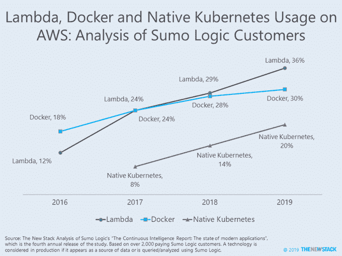
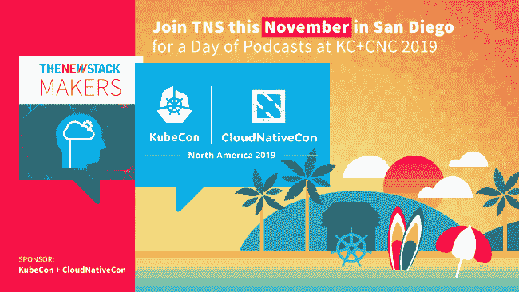

# Kubernetes 超越通用容器的采用

> 原文：<https://thenewstack.io/what-does-kubernetes-need-to-address-in-2020/>

在 KubeCon+CloudNativeCon San Diego 之前，新的 Stack 正在进行一项关于核心 Kubernetes 社区面临的主要挑战的[一题投票。可以在本帖底部参与。](https://www.surveymonkey.com/r/2BQTVW7)

容器作为一个市场不再是爆炸性增长，至少在企业开始采用它的过程方面。在过去的两年里，[Cloud Foundry](https://www.cloudfoundry.org/developer-abstraction-trends-report-2019/)的研究证实了我们已经注意了一段时间的事情，即更多的组织正在部署大量的容器(> 100)。虽然容器采用率可能会停滞不前，但这并不一定意味着 Kubernetes 现象已经准备好效仿。事实上，另一份关于 Sumo Logic 客户的[报告](https://www.sumologic.com/brief/continuous-intelligence-report/)显示，Docker 的使用已经持平，Kubernetes 正在稳步增加新用户。在这些客户中，Sumo Logic 客户、使用弹性容器服务(ECS)的 AWS 客户(包括 Fargate)的比例略有增长(自 2018 年以来增长了 10%)，采用“本地”Kubernetes 的比例上升了 43%。AWS 客户是否会选择 AWS Elastic Kubernetes Service(EKS)还有待观察。

无论您的公司是直接管理 Kubernetes 还是依赖托管服务，大型项目都会继续发展。请对我们持续的 [Kubernetes 报道](https://thenewstack.io/category/kubernetes/)提出看法。

Cloud Foundry 和 Cloud Native Computing Foundation 是新堆栈的赞助商。

通过 Pixabay 的特征图像。

<svg xmlns:xlink="http://www.w3.org/1999/xlink" viewBox="0 0 68 31" version="1.1"><title>Group</title> <desc>Created with Sketch.</desc></svg>