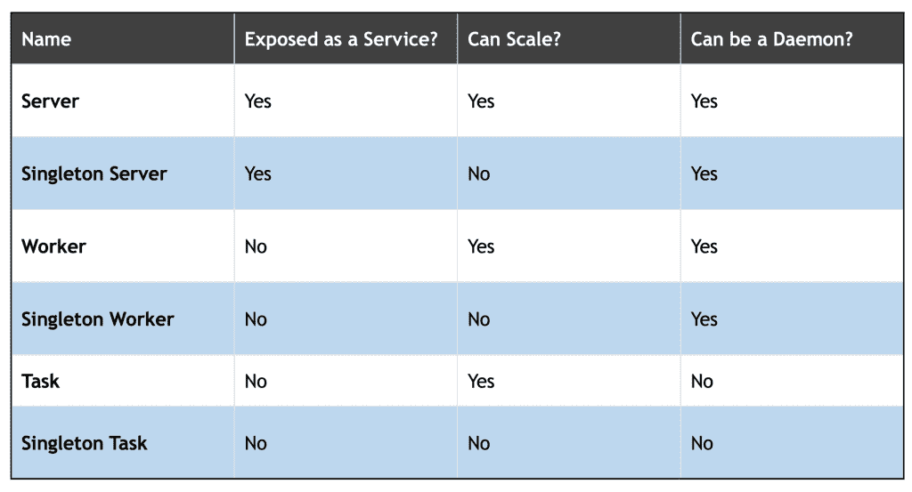
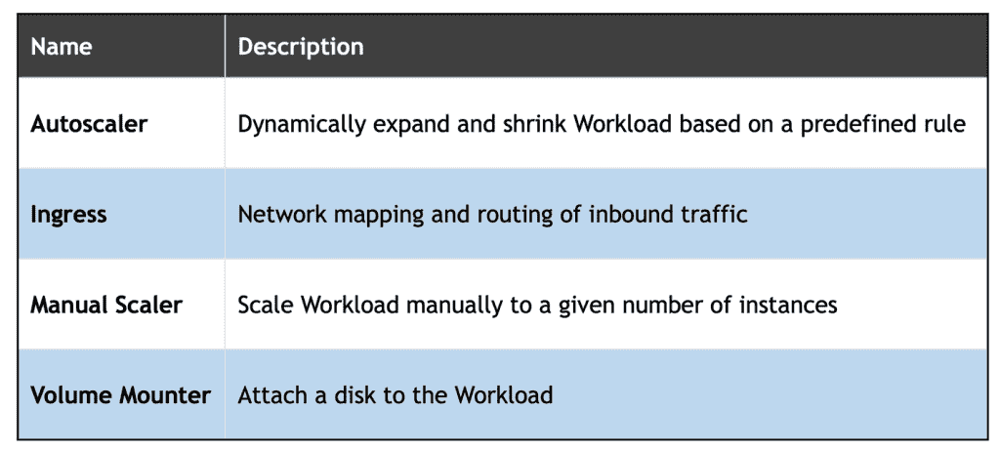

# 开放应用模型(OAM)和 Rudr 对 Kubernetes 开发者意味着什么？

> 原文：<https://thenewstack.io/what-does-the-open-application-model-oam-and-rudr-mean-for-kubernetes-developers/>

上周，微软和阿里巴巴联合推出了 T2 开放应用模型，这是一个定义现代应用的规范，不管它们部署在哪里。 [Rudr 是微软 OAM](/microsofts-open-source-dapr-could-help-developers-build-agnostic-microservice-applications/) 的一个实现，目标是将 Kubernetes 作为运行时环境。

我花了一个周末去理解 OAM 试图解决的问题。我还为 Rudr 重构了一些我最喜欢的基于微服务的应用。这篇文章和下面的教程将帮助一个普通的 Kubernetes 用户理解 OAM 背后的动机。

让我们承认——Kubernetes 是一个复杂的平台，有许多活动的部分。映射和部署一个简单的两层 web 应用程序包括创建存储类、持久卷声明、持久卷、机密、配置映射、服务、部署和入口。生产部署还需要强大的日志记录、监控、安全性、可用性和可伸缩性，这将引导我们实现状态集、网络策略、RBAC、准入控制、水平 Pod 自动扩展等。

对于从传统 IT 环境转型过来的开发人员和管理员来说，Kubernetes 是势不可挡的，也是令人生畏的。即使是那些熟悉集装箱化的 DevOps 专业人员也发现 Kubernetes 是一块难啃的骨头。

> 当转换成可部署的构件时，一个简单的两层 web 应用程序可能有十几个 YAML 文件，这些文件包含属于同一个应用程序的每个对象的定义。

Kubernetes 的核心设计原则之一是对象的松耦合。例如，服务可以独立于 pod 而存在。可以在没有任何消费者的情况下创建持久卷。可以在没有任何后端来服务请求的情况下提供入口。基于一组标签、注释和选择器，这些点在运行时被连接起来。服务会将请求转发给一个或多个符合标准的 pod。入口将流量路由到服务之一的情况也是如此。

Kubernetes 中的每个对象都是自治的，完全独立的。虽然这种设计使 Kubernetes 具有极强的可伸缩性，但它也有缺乏应用程序上下文的副作用。Kubernetes 中的应用程序是协同工作的自治对象的集合。当转换成可部署的构件时，一个简单的两层 web 应用程序可能有十几个 YAML 文件，这些文件包含属于同一个应用程序的每个对象的定义。在单一上下文中管理和维护这些工件是处理 Kubernetes 的最大挑战。

赫尔姆试图通过图表的概念来解决这个问题。但是，即使有了它，您也会在部署后丢失上下文。毕竟，Helm 只是应用程序工作所需的多个 Kubernetes 对象定义的集合。

Kubernetes 面临的另一个挑战是开发商和运营商之间的界限变得模糊。开发人员需要对运行时环境有相当多的了解，以便有效地利用该平台。他们需要理解**配置图**如何对封装在 Pod 中的容器可见。他们需要知道初始化代码的哪一部分应该打包成一个 **Init 容器**。运营商负责确保正确的命名约定，以使服务发现工作。他们需要知道需要传递给 Pod 的正确的环境变量。操作人员应该根据应用程序的特征决定是将容器部署为 ReplicationController、DaemonSet 还是 StatefulSet。在公开部署时，他们需要在集群 IP 和节点端口之间进行选择。

如您所见，开发人员应该熟悉运行时决策，操作人员应该了解软件的设计方面。

OAM 旨在通过以下方式解决这些挑战:

*   为微服务部署带来应用背景
*   开发人员和运营人员之间的关注点完全分离
*   与运行时无关的应用程序建模

在高层次上，OAM 是一种规范，它将属于应用程序的一个微服务或一组微服务定义为一个组件。每个组件都有一个或多个工作负载，可以充当服务器、消费者或运行到完成的作业。每个工作负载可能有一个相关的配置和特征。配置转化为传递给工作负载的参数，特征影响组件的运行时行为。同类组件的集合属于单个应用程序。

OAM 的核心前提是，开发人员的工作结束于从源代码构建容器映像，而操作人员的工作从那里开始。运营团队负责将一组容器映像作为单个应用程序进行配置和部署。

OAM 中的组件旨在使开发人员能够以基础设施中立的格式声明离散执行单元的操作特征。组件定义了 CPU、GPU、内存和磁盘要求以及目标操作系统和架构。

组件中的每个工作量可以是以下类型之一:

该配置通常处理传递给工作负载的参数。例如，发送到应用服务器工作负载的数据库连接字符串是在配置中定义的。

特征定义了工作负载以及应用程序的运行时行为。Rudr，OAM 的参考实现支持以下特征:

如果我们仔细观察工作量和特征描述，它们可以很容易地映射到 Kubernetes。服务器本质上是一个部署，而单体服务器是一个有一个副本的部署。它们都与集群 IP 或节点端口服务相关联。工人和单身工人是没有相应服务的 pod。任务是一个可并行化的 Kubernetes 作业，而单例任务是一个单次运行完成的作业。

类似地，特征映射到 Kubernetes 水平 Pod 自动缩放、入口、部署和持久容量声明。

因此，使用 OAM 和 Rudr，开发人员提交代码并构建容器映像，这些映像转化为工作负载。操作员将工作负载组装成一个组件，并从中定义配置和特征。

从技术上讲，OAM 可以用一个规范来定位虚拟机(IaaS)、平台(PaaS)和容器管理平台(CaaS)。OAM 的每个构造块都可以映射到各自的环境。包含 OAM 定义的 YAML 文件可以部署在任何环境中，无需任何修改。

在本系列的下一篇文章中，我将带您浏览 Rudr 的端到端教程，展示部署 Node.js web 应用程序的组件、配置和特征所涉及的工作流。敬请关注。

贾纳基拉姆·MSV 的网络研讨会系列“机器智能和现代基础设施(MI2)”提供了涵盖前沿技术的信息丰富、见解深刻的会议。在 [http://mi2.live](http://mi2.live/) 上注册参加即将举行的 MI2 网络研讨会。

<svg xmlns:xlink="http://www.w3.org/1999/xlink" viewBox="0 0 68 31" version="1.1"><title>Group</title> <desc>Created with Sketch.</desc></svg>