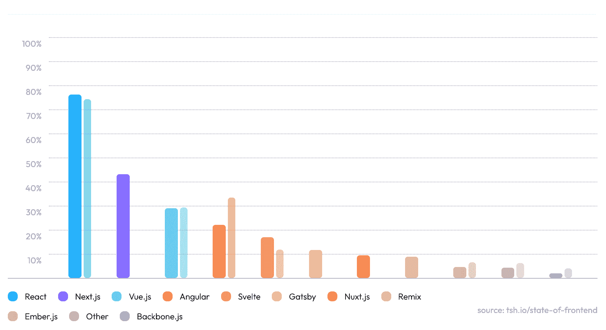
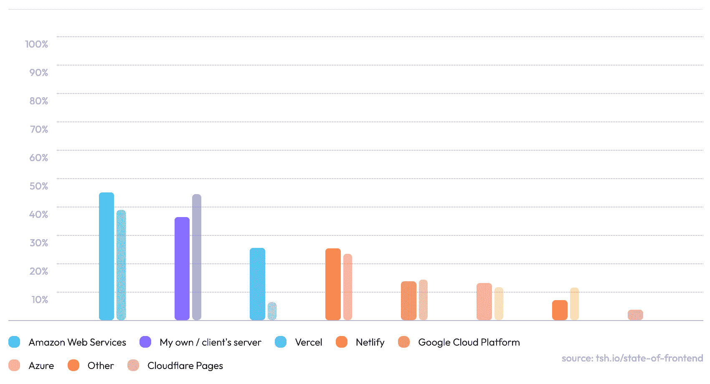

# 埃隆·马斯克收购 Twitter 对开发者意味着什么

> 原文：<https://thenewstack.io/what-elon-musks-twitter-takeover-means-for-developers/>

一个故事占据了本周的头条:埃隆·马斯克[收购 Twitter](https://www.techmeme.com/220425/p17#a220425p17) 。但是从开发者的角度来看，这意味着什么呢？Twitter 开发团队[本周发布了一篇博文](https://blog.twitter.com/developer/en_us/topics/community/2022/innovating-on-the-twitter-api-v2-and-investing-in-our-community)，声称其使命“建立一个服务于公众对话的开放开发者平台”在收购消息后没有改变。但这篇文章似乎更多地是针对马斯克而不是开发者社区，像“我们的路线图保持不变，我们对开发者社区的奉献是坚定不移的”这样的声明听起来像是对新老板的恳求。请不要让我们再次关闭 API 消防水管！

请记住[的艰苦战斗](https://twitter.com/ashevat/status/1519466715540705280)在经历了过去的背叛[之后，Twitter 不得不说服开发者重新构建其平台。Twitter 的 Amir Shevat(开发者平台产品负责人)在这条推文中听起来有点紧张:](https://www.theverge.com/2012/8/23/3263481/twitter-api-third-party-developers)

另一个有趣的问题是 Twitter 的 [Bluesky](https://blueskyweb.org/) 项目将会发生什么，该项目是 Twitter 在 2019 年推出的非营利性倡议，旨在创建一个开放和去中心化的版本。鉴于[所谓的](https://twitter.com/bluesky/status/1518707597532024832)“对 Twitter 未来的兴趣激增”，Bluesky Twitter 账户本周进入线程模式来解决这个问题。它继续强调，蓝天是一家“独立的公司”，“由团队本身所有，Twitter 没有任何控股权。”咻！那就放心了。等等……是个*公司*？！所以它最终也有可能被马斯克收购？是的，但不管怎样，正如 Bluesky 首席执行官 Jay Graber [本周发推文](https://twitter.com/arcalinea/status/1518657789274456065)“我们需要协议，而不是平台。”而开放协议正是蓝天公司致力于构建的。

还需要注意的是，Bluesky 仍然处于发展初期。在本月早些时候马斯克新闻发布之前，该团队在一篇更新帖子中指出，“我们已经开始编写代码来验证想法并迭代一些具体的东西，但一切仍处于完全实验阶段。”

## 本周发展

### 前端状态 2022 报告

基于对 3703 名开发者的调查，这家软件公司发布了其 2022 年前端状态报告。毫不奇怪，React 在“最常用和最喜欢”的框架中名列第一，尽管 Angular 后退了一步(在“最常用和最不喜欢”中也排名最高)。Svelte 和 Remix 被认为是未来最有前途的两个框架。

注:阴影线表示 2020 年前一份报告的结果。

另一个值得注意的结果是，84%的受访者使用 Typescript，43%的人预计它将“取代 Javascript，成为新的前端标准。”

最后，对于应用程序的部署，亚马逊网络服务(AWS)现在排名第一，自 2020 年以来取代了“我自己/客户的服务器”。不过，最大的推动者是 Vercel，它现在的受欢迎程度已经与 Netlify 不相上下。

【T2

### 反应 18.1.0 并计算千字节

React 的最新版本于本周发布， [18.1.0](https://github.com/facebook/react/releases/tag/v18.1.0) 。这似乎主要是上月底发布的 [v18.0](https://reactjs.org/blog/2022/03/29/react-v18.html) 的一个漏洞修复。微软的亚历克斯·罗素(剧透一下，他不是 React 的粉丝)算了一下:

### 福斯托顿被推特移民淹没

Fosstodon 是一个基于乳齿象的社区，由“喜欢自由开源软件(FOSS)的志趣相投的人组成”，它说“在 Elon 购买 Twitter 后，它被 Twitter 移民有效地 DDoS 了。”

“因为我们是 Fediverse 上最大的技术集中的实例之一，许多人要求在 Fosstodon 上有一个帐户，”社区博客本周抱怨道。

“Fe diversity”是一个不断发展的社交媒体协议和产品联盟，使用开放标准进行互联。“我们设法阻止了福斯托顿的崩溃，”博客继续写道，“但为了做到这一点，我们不得不将服务器的容量增加两倍，我们的托管费也从每月 90 美元涨到了每月 220 美元。这意味着我们通常的 6 个月浮动资金已经减少到 3 个月左右。”

这表明，大规模运营一个社交网络从来都不容易，但 Fosstodon 张开双臂欢迎所有新用户是件好事。

### W3C 赢得了艾美奖奖

万维网联盟(W3C)网络字体工作组[获得了 2021 年艾美奖](https://www.w3.org/2022/04/pressrelease-woff-emmyaward.html.en)，“为网络和电视设备定制可下载字体和排版标准化字体技术。”这是 W3C 在过去七年中第三次获得“技术和工程”类别的艾美奖奖。2016 年，它因定时文本标记语言(TTML)标准“有助于确保残疾人，特别是聋人或重听人的需求得到解决”而获奖，2018 年，它因“在网络上实现完整的电视体验，用 HTML5 将视频带到网络上”而再次获奖

### Dev 本周推特

一点耳虫来结束这个星期。谁知道你们这些推特逃亡者会在哪里结束…

<svg xmlns:xlink="http://www.w3.org/1999/xlink" viewBox="0 0 68 31" version="1.1"><title>Group</title> <desc>Created with Sketch.</desc></svg>