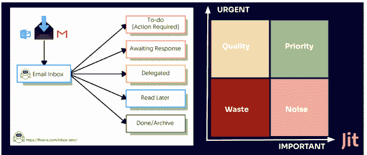

# 在一个阴云密布的世界里，好的安全是什么样子的

> 原文：<https://thenewstack.io/what-good-security-looks-like-in-a-cloudy-world/>

这是关于持续安全性的三部分系列文章的第一部分。

在当今快节奏的现代软件交付世界中，速度在很大程度上是工程组织的主要关注点。这种对速度的关注是最重要的——以开发时间和最终交付时间的形式——已经成为过去二十年工程过程中许多变革的催化剂。这使得工程基础发生了全面的重大变化，从流程到架构、运营和管理，甚至工具和系统。

这些包括从瀑布到敏捷和精益方法的过渡，到将整体分解为微服务，迁移到云，CI/CD 和自动化，等等。这也是精英组织今天使用的许多“作为代码”的工程实践的主要贡献者——基础设施作为代码，配置作为代码，管道作为代码——这一转变的下一阶段尚未实现，即作为代码的安全性。

将工程实践转变为“代码”实践最终使自动化成为可能——将以前的手动过程和框架转变为几乎没有人为错误的自动化过程。事实证明，这是释放当今企业所需的速度和交付的关键。这也是安全性在这一转变中被抛在后面的主要原因，因为找到将安全性自动化和简化为敏捷软件交付的理想方法是一个仍在形成和定义的工程领域。

迄今为止所采用的安全方式只能部分实现这一点 DevSecOps 和 shift left 开始了这一转变。然而，随着过去 20 年来安全领域在工具和研究方面取得的所有进步，现在开始释放[持续安全](https://jit.io)的全部潜力变得可能，这可以而且应该成为高速工程的一部分。

形象地说，虽然安全性通常被认为是工程车轮上的辐条，但在本文中，我们将深入探讨为什么持续的安全性最终会成为具有前瞻性思维的工程团队的高速工程的推动者。

## 安全故障以及如何修复

当它拖垮工程团队时，安全性就开始崩溃，因为它引入了许多新的漏洞和修复，这些都受到同等的重视。在 Jit 中，我们很快就明白了一件事:为了让安全经历这种转变，并让工程师拥有安全，安全管理需要三个关键部分:

*   区别
*   优化
*   补救

总的来说，这些将使工程组织能够实现一个良好的长期安全基线，并持续保持这个基线。这就是我们所说的“持续安全性”，自动化的下一个阶段— CI、CD 和现在的 CS。

一旦理解了这一点并将其集成到开发人员工作流和流程中，组织将能够对安全性进行基准测试，保持这种状态，甚至在不损失上下文或速度的情况下对其进行改进。

### 区别

那么，当我们谈论这三大支柱时，我们指的是什么呢？先说微分。当涉及到安全问题和修复时，能够区分新发现和旧发现是极其重要的，因为这最终也会影响接下来的两个支柱:优先级和补救。

DevSecOps tools 使实时了解我们代码中发生的事情成为可能的事情之一，通过与开发人员工作流保持一致的流程，例如在普遍接受的关口进行修复，如 pull 请求，甚至更早地使用预提交挂钩或 IDE 内警报。在 CD 阶段，我们通过公共 CI 门控来防止问题合并到我们的代码库中的类似方法可以应用于运行时相关的工具。这样，您也可以防止与运行时相关的问题进入生产环境。

因此，如果我们能够在仍在编码或预部署到生产系统时发现安全缺陷，这些缺陷现在就可以在开发人员或运营环境中处理，永远不需要进入待办事项列表。这是我们安全问题类别之间的一个非常重要的区别。

一旦我们立即处理问题，并且当开发人员仍然在上下文中工作他们的代码时，我们就可以转移到更老的问题，那些与已经在生产中运行的代码相关的问题。

### 优化

通过智能噪音过滤对现有漏洞进行优先级排序，您可以帮助开发人员在可能的情况下使用实际解决方案进行补救。安全工程的世界可以从类似的范例中得到启示，如收件箱零方法或艾森豪威尔的紧急/重要范例。

这变得复杂的地方是积压管理。我们需要一种简单可靠的方法来解决积压的重要问题。首先，要有一种方法来首先聚合、记录和过滤来自您的安全链中各种安全工具的许多输出，这种方法基于一种优先机制，该机制会考虑许多不同的参数:

*   是否有修复方法。
*   如果有一个修复，那么进行修复需要付出多大的努力(工时、成本和对生产的影响，如果测试覆盖率只是部分的，这一点尤其重要)。
*   有可能对类似的发现进行聚合和执行批处理操作吗？
*   问题的严重性。

在我们确定了优先级、严重性以及在不造成任何破坏的情况下修复我们的 backlog 中的问题的能力之后，我们可以继续进行支持开发人员拥有的安全性的最后一项工作，即实际的补救工作。

### 补救

由 DORA metrics 量化的精英工程团队是那些具有低 MTTR(平均恢复时间)指标和变更失败率的团队。这意味着他们有先修复的心态。他们不会在危机中陷入什么样的困境；他们会很快着手解决这个问题，然后只在做了必要的事后分析和根本原因分析之后。

安全可以从系统工程的这种方法中学到很多。安全性也需要达到修复优先的安全性。今天的工具引入了大量的噪音和在您的系统(代码/基础设施/运行时)中发现的一长串漏洞，其中很少提供任何关于补救或减轻问题的最佳方法的指导。这是一种被动的安全方法，需要重新思考。我们需要开始采取积极的安全方法，让 it 真正提供价值并兑现良好的基线安全卫生的承诺。

这些补救方法需要与开发人员的工作流保持一致，例如拉请求和指向需要修复的确切代码行或配置。通过提供这种补救洞察，您将使您的工程师能够首先“阻止安全漏洞”，而不必单独研究和了解每个问题，这通常需要安全专业知识。

优先化阶段提供了衍生出你今天、本周或本月需要解决的任务列表的能力。因为我们已经停止了直接的流血，所以假设我们正在尽最大努力尽可能不要在 backlog 中引入任何新的问题。安全性需要经历的另一个思维转变是不要在不确定的发现周围制造噪音。对于工程师来说，如果有一个问题目前无法补救或解决，它只会制造不必要的噪音。因此，尽管这些类型的发现对安全工程了解和跟踪很重要，但在修复可用之前，不应上报给开发人员。

### 持续改进

一旦我们建立了一个良好的流程和工作流来解决现有工具集的新发现和已知发现，我们就可以在其上添加层和控件，并建立一个流程来不断提高我们的安全性。因此，就像最小可行产品(MVP)一样，我们的第一次迭代只是一个起点，我们不断地在它的基础上进行构建，MVS ( [最小可行安全](https://www.jit.io/blog/what-is-minimum-viable-security-mvs-and-how-does-it-improve-the-life-of-developers))方法的工作方式也差不多。构建最基本的安全控制，为您的产品提供所需的基本安全性，一旦您有了围绕检测、优先排序和补救的良好流程和工作流，您就可以不断改进您的安全状况。

## 培养持续的安全思维

持续安全模型引入了一种新的方式来思考如何在工程组织中处理安全问题。对于所有工程师来说，这是一个很好的框架，通过将安全性嵌入到他们的流程中，并为补救提供足够的环境和工具，他们可以更好地掌控安全性。一旦这个过程被很好地建立起来，它就为持续地构建和迭代您的安全状态奠定了基础，就像敏捷产品管理一样——在最小可行的安全思想中。

通过创建先处理新问题的文化，并确保您的问题积压不会增加，您可以为现有问题创建优先顺序和补救计划，这样您就不会处于持续的老鼠赛跑中，在那里您不会取得任何安全进展。一旦你通过停止流血建立了一个基本的安全态势，你就可以开始不断地改进它。

在我们的下一篇文章中，我们将从首席技术官的角度谈论持续安全，以及它所包含的支柱，这些支柱将它从理论带到实践，并确保它在持续一切、CI/CD 和现在的 CS 的发展中是一个真正可行的下一阶段。

<svg xmlns:xlink="http://www.w3.org/1999/xlink" viewBox="0 0 68 31" version="1.1"><title>Group</title> <desc>Created with Sketch.</desc></svg>