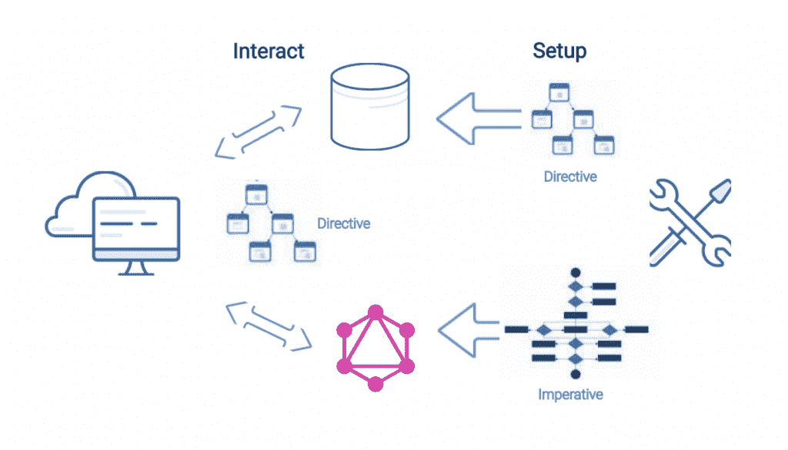

# GraphQL 能从数据库中学到什么

> 原文：<https://thenewstack.io/what-graphql-can-learn-from-databases/>

数据库系统使用声明(告诉我做什么，不要告诉我怎么做)来使设置和交互方面的整体体验令人惊叹。相比之下，大多数 GraphQL 系统只让交互端具有声明性。设置方面很复杂，更糟糕的是，交互的执行并不理想。

完全有可能构建一个两端都是声明性的 GraphQL 系统，因此，设置既简单又能带来更好的执行引擎。

在 StepZen，我们认为 GraphQL 系统应该以声明的方式建立。

## 数据库生活在一个声明性规范的世界里

 [阿南特·金格兰

Anant 是 StepZen 的创始人兼首席执行官，step Zen 是一家初创公司，采用新的方法来简化开发人员访问数据的方式，以增强数字体验。Anant 的职业生涯跨越了 IBM Fellow、IBM 信息管理部门的 CTO、Apigee 的 CTO 和 Google Cloud 的产品负责人，他的职业生涯一直处于数据库、机器学习和 API 创新的前沿。在 StepZen，Anant 正在享受创建一家公司，将他对这些技术的热爱结合在一起，以简化、加速和扩展前端开发。](https://www.linkedin.com/in/anantjhingran) 

数据库管理员(让我们称她为 Alice)使用声明性规范设置系统。当她编写“create table x (a int)”时，她是在告诉数据库系统“什么”，然后 DBMS 以其格式存储数据，创建正确的元数据，等等。(“如何”)。这很容易做到(对 Alice 来说),并且为与数据库交互以获取所需数据的用户带来了更直观的体验和执行。

最终用户(让我们称他为鲍勃)通过一个查询发出*交互*，指定他想要的“什么”(例如，“select * from x，其中 a = 1”)。然后，数据库系统(DBMS)将其转换为“如何”(例如，了解(a)上有一个索引，使用(a)扫描 x 需要 5 个单位，而线性扫描所有记录需要 20 个单位，因此使用索引扫描)。这种执行很容易，也很理想，因为 Alice 已经声明了她想要什么。

双方——设置和交互——都是声明性的，因此易于编写和编码。它们聚集在一起，使交互的执行达到最优。



## **大多数 GraphQL 实现只有一半是声明性的**

交互的一面是声明性的，所以 Bob 可能会说:

```
{

customer  (email:  "john.doe@example.com")  {

name

address

}

}

```

然而，任何语言的典型 GraphQL 库，无论是 JavaScript、Java、Go 等等。，使*设置*侧被编程。Alice 必须编写解析器，解析器是描述如何获取每条数据的编程片段。

这有两个问题:

1.  这个程序很难编写和正确运行，并且变得很难维护。例如，需要管理密钥。需要处理错误。需要将访问控制编入程序。一切都可以做到，但要付出代价。技能、时间和复杂性的成本。
2.  同样糟糕的是，因为这些编程代码片段对于 GraphQL 库来说是不透明的，所以它确实扰乱了交互方面。例如，无法知道获取一段数据需要多少成本，也无法重写执行计划。数据库的所有魔力都消失了。查询的声明性规范符合编程设置，然后嘭！东西会堵塞。

## **我们真的需要设置端也是声明性的**

假设您在设置过程中声明解析器是:

*   `customer: default database lookup`
*   `orders (customerId): default database lookup`
*   `Customer.orders: call orders (customerId)`

代码写起来要简单得多。并保持。错误情况由 GraphQL 系统处理。密钥封装在`default database lookup`中。访问控制 Bob 真的可以访问这些信息吗？—还通过将逻辑分解到 GraphQL 系统中得到简化。另一种方法是传递身份验证信息，并将其留给各种后端来处理授权。

与其将身份验证信息传递给各个后端，并让每个后端单独处理授权，不如将逻辑分解到 GraphQL 系统中。

有很多优化的机会。比如你要求:

```
{

customer  (location:  "NY")  {

address

name

orders  {

date

}

}

}

```

您可以向数据库发出一个查询，而不是数百个查询，每个客户一个，查询类似于:

```
select customer.name,  customer.address,  order.date from customer

join order on  (order.customerId  =  customer.customerId)

where customer.location  =  "NY"

```

(确切的语法稍微复杂一点，但是完全可以由系统来完成。)

如果你认为所有这些只是在后台是一个数据库的情况下，那绝对不是真的。此类声明性陈述:

*   `weather(lat,lon):curl https://openweathermap.org?lat=$lat&lon=$lon`
*   `user(name):graphql https://graphql.github.com?user=$user`

达到同样的目的。它们向 GraphQL 系统声明“做什么”才能解决问题。它为 Alice 带来了一个更简单、更易维护的 GraphQL API，Alice 的工作就是设置它。

但是因为它对 GraphQL 系统不再是不透明的，它也为 Bob 带来了更好、更安全和更优化的交互。

你可以吃蛋糕并且拥有它。

正如你可能已经猜到的，我们坚信双方都是声明性的。让我们试试[步骤](https://stepzen.com/signup)。

<svg xmlns:xlink="http://www.w3.org/1999/xlink" viewBox="0 0 68 31" version="1.1"><title>Group</title> <desc>Created with Sketch.</desc></svg>