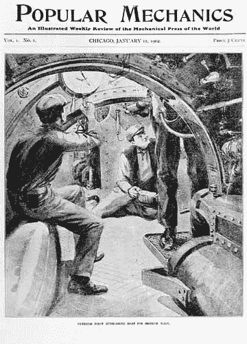
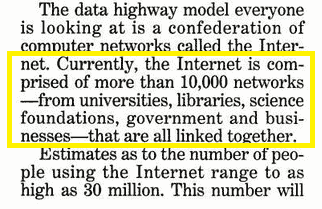

# 当大众力学试图预测未来时发生了什么？

> 原文：<https://thenewstack.io/what-happened-when-popular-mechanics-tried-to-predict-the-future/>

随着互联网上个月庆祝其 50 岁生日，大众机械师网站全力以赴，在他们称为“[互联网周](https://www.popularmechanics.com/internet-week/)的活动中发表了一系列特别文章它包括了 20 世纪 90 年代的“[最令人畏缩的互联网指南](https://www.popularmechanics.com/technology/g29553715/cringe-internet-guide-videos/)，以及他们的“[互联网历史上最伟大的 50 个时刻](https://www.popularmechanics.com/culture/web/g29622347/greatest-moments-internet-history/)”

但是也有一组有趣的他们对未来的预测，有些是对的，有些是错的，提醒我们人类在 21 世纪会是什么样子。

该网站的 [*关于我们*页面](https://www.popularmechanics.com/about/a45/about-us/)解释道:“自 1902 年以来，大众力学一直是你的世界如何运作的权威”，并表示他们一直致力于为读者带来“关于创新和发明的最新消息”

《大众力学》第一期封面，1902 年

因此，他们对过去预测的汇编提供了一个迷人的机会，让我们看到我们对未来的希望——也看到了一个几乎从未发生的世界，从从未完全实现的充满希望的技术时刻推断出的存在。有六个来自 20 世纪 90 年代的预测，当时互联网刚刚开始获得普遍接受，还有两个可以追溯到 20 世纪 80 年代的预测(加上一个来自 2000 年，一个来自 2005 年)。

那么，关于未来，大众力学 T16 错了什么——他们又对了什么？

## 虚拟现实

似乎虚拟现实总是成为许多未被预测到的主题。虽然对飞机上新的飞行娱乐选择也有相当准确的猜测，但 1995 年 4 月*大众机械师*的一篇文章设想了成熟的虚拟现实主题公园，他们现在把这个预测描述为一个失误。他们在 10 月份写道:“虚拟现实仍在视频游戏世界中兴起，”他们承认，“首批采用者正在推动增长，但你的普通消费者可能没有 Oculus 耳机。也许这个未来只是还没有到来。”

然后是“1997 年 1 月:我们担心互联网会消亡的时候。”那篇报道警告说，“堵塞、停滞和堵塞，互联网在自身成功的重压下面临崩溃的危险。”(引用约吉·贝拉的一句名言，开篇讽刺道“互联网如此繁忙，以至于没有人再费心去上网了。”)该网站在 10 月份写道，现在注意到互联网从未崩溃，尽管重要的是要记住，即使是 1997 年的那篇文章也用大量的乐观来对冲其可怕的声明。“尽管互联网成长的烦恼显而易见，解决方案也不容易实施，但互联网正在变得和电话网络一样重要——太重要了，不能让它成为自己成功的牺牲品。”

其他预测带回了科技史上一些被遗忘的死胡同。很久以前，回到 1997 年，有一个产品叫做网络电视。web(当时)主要是静态的、基于文本的文档。( [1997 年的文章](https://books.google.com/books?id=X2YEAAAAMBAJ&pg=PA30&lpg=PA30&dq=%22webTV+will+start+the+ball+rolling+by+building+a+proprietary%22+webTV+popular+mechanics&source=bl&ots=dGsC1-uS0s&sig=ACfU3U04wphGGSZZaa6eG9Cj0JTK3rVoHg&hl=en&sa=X&ved=2ahUKEwjnhLCwwNnlAhWT4J4KHYzEBwoQ6AEwAHoECAAQAQ#v=onepage&q&f=false)指出，“当然，今天视频存在于互联网上，作为小而粗糙的图像，下载起来要花很长时间。”就在那个时候，WebTV 刚刚被微软收购，它拥有自己专有的“VideoFlash”技术，只能在自己的“专有的、非基于 IP 的网络”上工作。(尽管从好的方面来看，“如果它足够受欢迎，它可以缓解互联网上的一些拥堵。”)该杂志的电子编辑拿起笔警告说，这种趋势“可能会把互联网撕成两半。”然后他们的标题作者甚至更加强调了这一预测，写道“PC/电视融合*将*打破互联网。”

没有。没有发生…

还有一项 90 年代的技术似乎让杂志的预言家们眼花缭乱。1993 年的一篇专栏文章描述了 20 世纪 90 年代的手持“个人数字助理”(或 PDA)，并自豪地指出，“居住在未来科幻小说系列*《星际迷航》和下一代*中的克林贡人、费伦吉人和其他种族称之为 PADDs(个人接入显示设备)。”那是一个早期采用者迷恋苹果手持设备 Newton 的时代，他们在 10 月份的文章中笑着总结了他们 1993 年的观点，称其为“笔远远优越”，尽管现在回想起来，他们承认“基于我们今天拥有的智能手机，这一预测……相当不正确。PDA 是一个令人激动的时刻……”

最令人惊讶的是，那篇 1993 年的文章没有预见到我们现在在辉煌的未来享受的*语音*助手——一项甚至连*星际迷航*都预见到的技术。尽管该杂志在 10 月份承认 PDA 是“一种原型 iPhone”，所以他们至少在寻找正确的设备类别。

通常很明显，他们对未来的预测显然植根于他们那个时代的技术。他们的下一个预测是从 1994 年 1 月开始的，想象我们“通过苹果牛顿式的个人通讯器”访问信息高速公路，这与预测苹果 iPhone 非常接近，但仍然过度投资于基于手写笔的界面的想法，以及通过我们的个人电脑和电视。(这是一个被证明非常准确的预测。)它还正确地预测，手机接入互联网的能力“可能会刺激许多类型的无线设备的发展。”幽默的是，它还告诉读者，这些奇妙的设备将神奇地能够传输一切，从视频…到传真。

## 回到未来

阅读这些旧文章会让人想起一个早已过去的时代，那时“互联网”这个词仍然是大写的。

那篇 1994 年的文章谈到了电影点播、在线课程，甚至通过视频电话看医生——所有的预测都成真了。它还正确地预测你观看的电视节目将被跟踪，以便提出建议——尽管它也无法抗拒进行不可避免的比较。“在不久的将来，电视将具备像苹果公司的牛顿个人通讯器这样的产品所展示的那种学习能力。”

在另一点上，这篇文章还想象我们打印出一份报纸，并简单地在我们的无线电脑上访问它——或者在我们的“牛顿型个人通讯器”上

幸运的是，在我们真实的未来，你可以在网上找到 1994 年的那篇文章。

但是这本集子中最有趣的时刻之一是《T2》，2005 年的一期试图预测 2025 年的技术。编辑的一份说明吹嘘道，他们的预测至少通常是正确的。“我们可能没有发明互联网，但早在 1950 年，我们就预测到有一天我们会通过电视屏幕购物。”

不可避免地，他们接着做出了一些极其错误的预测。“我们将去火星，美国国家航空航天局代理局长说……氢将至少成为我们一些汽车的燃料。太空旅馆真的会把巧克力绑在他们的零重力枕头上。”离那些精心设计的预言实现只剩下五年时间了——尽管公平地说，太空旅游业似乎正在加速发展。在 10 月的最后几天，维珍银河创始人 Richard Branson 敲响了纽约证券交易所的开市钟，这一噱头让他的公司成为了第一家在纽约证券交易所上市的商业航天公司。据新闻报道，该公司希望明年开始飞行，已经有 603 名客户报名参加了 25 万美元的高层大气飞行(在那里他们可以体验几分钟的失重状态)。谁知道 2025 年我们会在哪里？

尽管有趣的是，2005 年的《大众力学》杂志预测维珍银河将在 2008 年首次运送付费乘客进入亚轨道飞行…

2005 年那期杂志还做了另一个非常具体的预测。“到 2025 年，100 万美元可以买到一个真正的假期:在近地轨道上呆五天。该酒店可能类似于国际空间站，也可能是一个更容易发射的充气结构。”虽然到目前为止我们只有 Roomba，但他们也预测到 2025 年，“机器人将打扫我们的房子，为我们打仗。”(文章指出，事实上，Roomba 早在 2005 年就已经上市了，所以这似乎是一个可靠的猜测。)

那篇文章甚至预言我们将和机器人一起踢足球，用四个马达驾驶汽车。但是他们是从已经存在的机器人足球世界杯推断出来的，到 2005 年，已经有 387 支足球队(来自 37 个不同的国家)争夺世界冠军。在 1997 年启动，它宣布了[一个首要目标](https://www.robocup.org/objective/)。“到 21 世纪中叶，一支完全自主的人形机器人足球队将赢得一场符合国际足联官方规则的足球比赛，对手是最近一届世界杯的获胜者。”

2005 年特刊还设想了一种扫描食品条形码的冰箱，这样它就可以自动显示里面所有东西的清单——以及保质期——甚至可以创建购物清单。甚至有一个幽默的部分，他们设想 2025 年的房主问题。“上周，在移动了一段墙之后……我发现我的互联网连接失败了。现在，我每天都要重启我的房子好几次来重新连接……”(原来，问题是由冷热自来水的活动墙部分引起的变形引起的。)它还预测到 2025 年空中出租车——虽然看起来人类正在[朝那个方向迈出第一步](https://knpr.org/npr/2019-03/flying-taxis-seriously)，但他们的预测更具体。“到 2025 年，由 13，500 架四座经济型微型喷气式飞机组成的机队将以经济舱机票的价格提供空中出租车服务。要想从波兹曼游览杜布克，乘客可以跳上一架微型喷气式飞机，直飞而不需要在中转站转车。

但令人鼓舞的是，2005 年也有一些非常正确的预测。“到 2025 年，人们将从几乎任何地方访问电影、新闻等内容，就像我们今天打手机一样容易。”它还预测了国民身份证、节水“双冲水”厕所和声控电视。

在 2005 年，我们将“从今天的娱乐即事物的世界进入未来的娱乐即服务的世界”，阅读这样的预测是很有趣的 V. Michael Bove Jr .，2005 年是麻省理工学院媒体实验室的主任，他预测“你会付一定的钱，可以接触到大量的东西”，并补充说“它会一直跟着你。”这是对消费者云的一个很好的定义。

或者，正如《大众机械师》在 2005 年设想的那样，“一个无处不在的超级网络将识别你的一体化便携式设备——它可能不比一个储物柜或手表大——以提供对几乎任何地方的音乐和视频的访问……”

也许比我们人类发明的技术更令人惊奇的是我们在它们到来之前预测它们的能力…

* * *

# WebReduce

<svg xmlns:xlink="http://www.w3.org/1999/xlink" viewBox="0 0 68 31" version="1.1"><title>Group</title> <desc>Created with Sketch.</desc></svg>