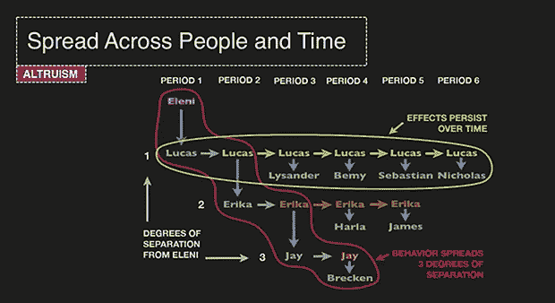
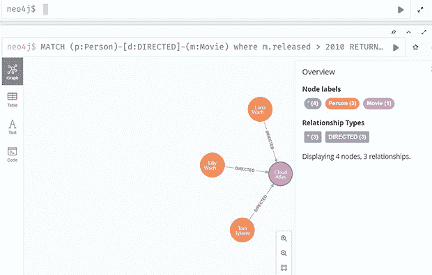
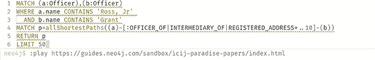
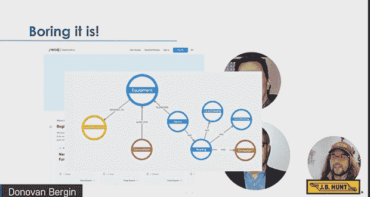
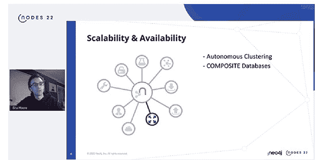
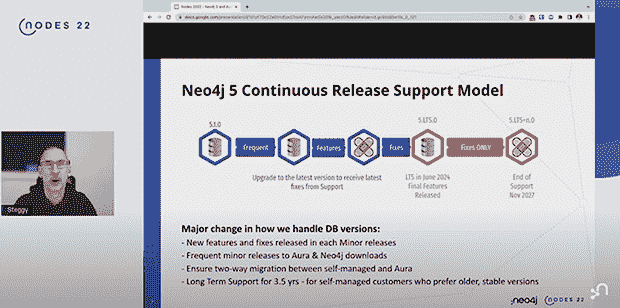

# 在 Neo4j 的 NODES 22 大会上我学到了什么

> 原文：<https://thenewstack.io/what-i-learned-at-neo4js-nodes-22-conference/>

我们只能说，[数据科学](https://thenewstack.io/why-data-jobs-are-hot-and-how-to-get-one/)发生了很多事情，特别是人工智能/机器学习辅助的数据科学。它已经对许多领域的计算现实应用产生了深远的影响，包括科学、经济、工业应用和医疗保健。

从很多方面来说，我们正处在学习什么是可能的尖端。 [Gartner 预测](https://www.gartner.com/en/newsroom/press-releases/2021-03-16-gartner-identifies-top-10-data-and-analytics-technologies-trends-for-2021)到 2025 年，80%的数据和分析创新将使用图表技术，而 2021 年这一比例为 10%，这将促进整个组织在业务层面的快速决策。

与此同时，用于数据科学的工具——更具体地说，数据可视化和图形表示——正在推动这些进步。

在 11 月举行的 Neo4j 年度开发者虚拟会议上， [Neo4j 的](https://neo4j.com/?utm_content=inline-mention)产品经理 [Luke Gannon 说:“](https://www.linkedin.com/in/lukegannon)[图表数据](https://thenewstack.io/the-3-underrated-strengths-of-a-native-graph-database/)科学是当你想回答问题时，不仅仅是用你的数据，还有数据点之间的联系。”。

“这真的很重要，因为当你有这些联系时，它们允许你回答新的问题，比如谁是最重要的，或者对一件事来说什么是最好的选择，或者接下来会发生什么？"

图形数据科学只是数据科学保护伞下更令人兴奋的主题之一。图形数据库、数据可视化、人工智能/人工智能管道和应用程序是 NODES 22 涵盖的用例。该会议也是该公司标志性技术的一个重要新版本 [Neo4j 5](https://neo4j.com/product/neo4j-graph-database/whats-new-neo4j-5/) 的发布会。

以下是我在 NODES 22 学到的关于数据图表和数据科学的可能性。

## 社会关系:比你想象的更强大

会议期间描述的许多数据用例显示了应用于涉及人类受试者的数据分析的 ML 如何阐明网络中的交互如何对人类行为产生重大影响。“社会传染”一词恰当地适用于这些情况，表明社会关系之间的直接和间接行为不仅可以改变个人行为，还可以改变整个群体的总体行为。

基于群体网络中的关系数据得出推论和模式的能力可能有高尚或邪恶的目的。在疫情的早期阶段，接触点数据对于帮助[追踪新冠肺炎患者](https://thenewstack.io/the-challenges-to-building-a-predictive-covid-19-model/)的传染源特别有用。

另一方面，俄罗斯政府支持的团体经常使用机器人来影响行为，其目标是美国和欧洲容易受宣传影响的人，以及可能对其网络中的其他人有强大影响力的人。

大多数用例通常介于善意和恶意这两个极端之间，例如使用数据图来确定社交网络中对其他人购买产品最有影响力的人。

“人类嵌入在社交网络中。这些网络遵循非常特殊的生物学、心理学、社会学和数学原则。考虑到这一点为我们提供了获得行为新见解和改变的巨大机会，”耶鲁大学教授和自由科学顾问[尼古拉斯·a·克里斯塔基斯](https://www.linkedin.com/in/nicholas-christakis-07a01ba5/)在主题演讲中说。

“我们可以利用对社交网络结构和功能的理解来干预在线和离线世界，以增进我们的健康和福祉，我们的公共政策和我们的业务。”

克里斯塔基斯说，通过数据科学更仔细地研究人类及其网络是如何嵌入的，涉及到焦点向“干预的外部性”的转移。“它让我们探索当我们干预一个群体时，我们如何不仅影响我们的目标人群，还影响他们周围的所有其他人。”

利用数据图表、分析和可视化工具，克里斯塔基斯揭示了一些关于人类行为如何影响其他与他们没有直接联系的人的惊人结果。

事实上，他说，“我的实验室在过去几年中得出的最奇怪的结果之一”是在他使用简单的人工线性网络追溯个体之间的互动序列之后。这项研究分析了利他主义的影响以及它们如何影响直接和间接的社会关系。

“我们能够发现的是，这种利他效应可以在人与人之间传播，”他说。

杰伊如何对待布雷肯取决于埃勒尼如何对待卢卡斯，尽管杰伊和布雷肯都没有见过或与线性卢卡斯互动。

社会传染可以适用于任何社会环境。克里斯塔基斯说，与会者中的两个成员如何对待彼此，可能取决于观众中的另外两个成员如何对待彼此，即使这两个人都没有与对方的任何其他成员互动过。

“这是社会传染的实验文件，”他说。

## 应用程序界面可能简单但功能强大

数据科学，尤其是数据可视化和[数据图表工具](https://thenewstack.io/illuminating-the-anonymous-with-neo4js-graph-database/)的快速采用不仅归功于它们的强大，还归功于它们的易用性。Neo4j 利用这一趋势，支持传统数据科学领域之外的项目，支持 IT 部门之外的应用。

一个典型的例子是:一群记者使用 Neo4j 等数据科学工具追踪与秘密海外账户有联系的 40 多万个人的联系。德国记者弗雷德里克·奥伯迈尔和巴斯蒂安·奥伯迈尔[为《南德意志报》撰写了这个项目。](http://bastianobermayer.de/)

“天堂文件”记者进行的数据查询示例。

记者们使用 Neo4j 图形数据库使他们能够更好地可视化和分析个人和组织之间的联系，如隐藏的离岸银行和公司。与 SQL、 NoSQL 或其他类型的数据库相比，现在只需几个命令行就可以更直观、更智能地访问这些数据点。

NODES 22 通过演示和演讲展示了 Neo4j 如何通过使用其平台和工具、数据图表和可视化来继续改进，如何以可扩展的方式实现图表数据计算和可视化。

通过利用机器学习，Neo4j 现在可以用于运行不同的算法和流程，涉及数十亿个节点和关系。ML 管道可以与 Python 和其他 ML 框架集成，而不同的数据库集可以集成到单个数据可视化面板中。

Neo4j 的功能，如数据推断和治理，可能是创新的，但图形和其他数据可视化应该易于使用。供应链和运输服务提供商 J.B. Hunt Transport Services 部署 Neo4J 的图表数据可以用“无聊”来形容，J.B. Hunt 的技术解决方案架构师 [Donovan Bergin、](https://www.linkedin.com/in/donovan-bergin)在他的演讲中承认。

但这正是他的公司有时需要的，他补充说:“我们建立了一个无聊的图表:你只是得到了你的设备。你有手术和其他我今天不能谈论的事情。”

J.B. Hunt 使用图形数据来监控设备，通过[遥测](https://thenewstack.io/linux-foundation-introduces-a-telemetry-policy-for-all-projects/)和传感器读数进行位置跟踪，如果电压过低，设备就会发出警报，如果温度过高或过低，或者如果“我们走错了方向”，传感器就会发出读数，Bergin 说。

所提供的其他数据可以包括通过铁路或其他链路的不同枢纽或节点连接的可视化。数据科学可用于确定和预测不同节点对物流的重要性。

## Neo4J 做出了重大改进

Neo4j 的主要版本 [Neo4j 5](https://neo4j.com/product/neo4j-graph-database/whats-new-neo4j-5/) 提供了许多新功能，例如允许用户集成多个数据图以及对可扩展性和灵活性的改进。使用 Neo4J 的图形查询语言 [Cipher](https://neo4j.com/docs/getting-started/current/cypher-intro/#:~:text=Cypher%20is%20Neo4j's%20graph%20query,how%20to%20go%20get%20it).) 对驱动程序、查询功能和图形进行了改进，其他改进集中在索引上。该平台的最新版本还旨在简化 Neo4j 集群的运行和管理。

Neo4j 的[Stu Moore](https://www.linkedin.com/in/stujamesmoore)产品经理说，自主集群功能“可能是数据库中最复杂的集群架构之一”，它支持集群内的弹性。

“string 技术中的关键创新和变化是，你不再需要在集群中的每一台服务器上运行数据库的副本，”Moore 说。

另一个关键特性是在 Neo4j 5 中如何默认打开服务器端路由，以便在云上使用负载平衡器和其他网络技术。通过它，查询在内部被路由到适当的数据库管理服务器。

Neo4j 5 代表了图形数据库管理提供者的一个新的发布模型。以前，每个新版本后面都有增量错误修复或安全补丁，代表主版本的后续版本。

然而，图形数据库产品专家约翰·斯缇格曼(John Stegeman)在他的会议演讲中说，新的发布模式“真的会更像你所期待的以持续方式发布软件的云优先厂商”。

新的发布模式将遵循 Neo 的托管云平台 [AuraDB](https://neo4j.com/cloud/platform/aura-graph-database/) 的模式。“这一直是我们对 Aura 产品所做的，作为 5.1、5.2、5.3 等的新功能。随着时间的推移，或多或少会持续出现。

Stegeman 说:“Neo4j 5 的变化是，我们将这种体验带到了自托管社区:人们在自己的数据中心运行 Neo4j，或者在云供应商上自我管理自己的部署。”

Neo4j 5 将不再支持数据库查询的入口和出口(B 树)索引，取而代之的是更加优雅灵活的[范围和点索引。Stegeman 说，这代表了 Neo4j 5 的“重大”变化。](https://neo4j.com/docs/cypher-manual/current/query-tuning/indexes/)

Neo4j 5 旨在作为该公司的一个出发点，因为它寻求改进并跟上 NODES 22 中描述的许多用例所需的扩展和性能需求。

Moore 在他的演讲中说:“这对于我们来说真是一个令人兴奋的发布，不仅仅是因为我们正在提供的功能，还因为这是我们第一次同时发布我们的整个 Neo4j 产品平台。”

## 数据科学既美丽又可怕

如今，任何稍微熟悉数据科学的人都知道它如何改变了许多行业的计算和应用。但是，在许多方面，这次会议传达的不是说了什么，而是没有说的。

Christakis 指出，过去影响社会联系和影响的推理和分析如何能够用于社会公益——而没有深入研究这些非常强大的 ML 辅助应用程序如何也可以用于邪恶的目的。

此外，正如会议讨论所反映的那样，与过去相比，数据科学在未来将对许多行业产生更加深远的影响。看到接下来会发生什么肯定会令人兴奋。

## 从这里去哪里

<svg xmlns:xlink="http://www.w3.org/1999/xlink" viewBox="0 0 68 31" version="1.1"><title>Group</title> <desc>Created with Sketch.</desc></svg>