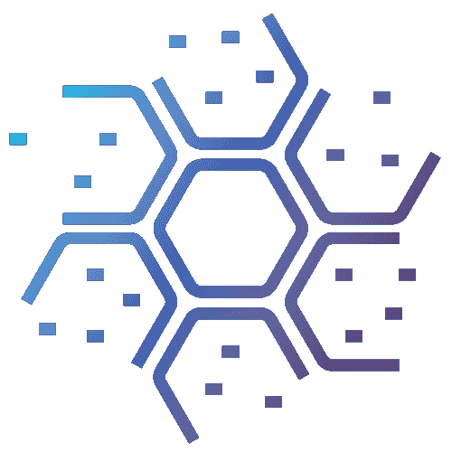
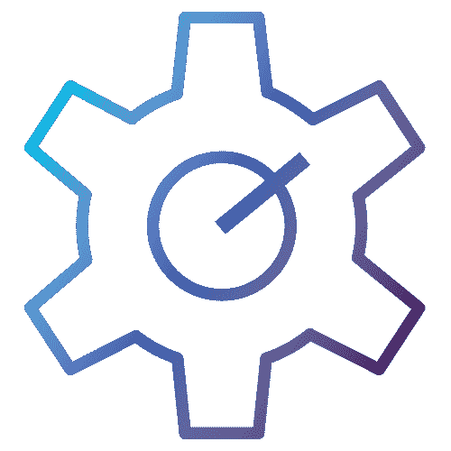
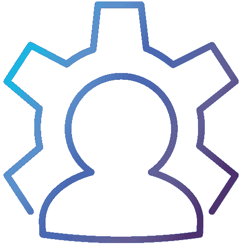
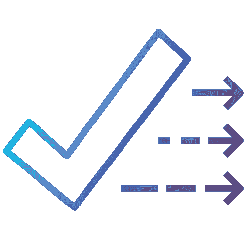
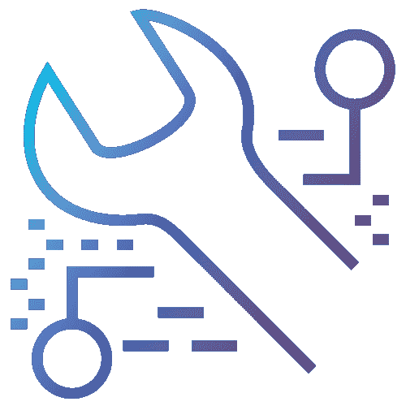
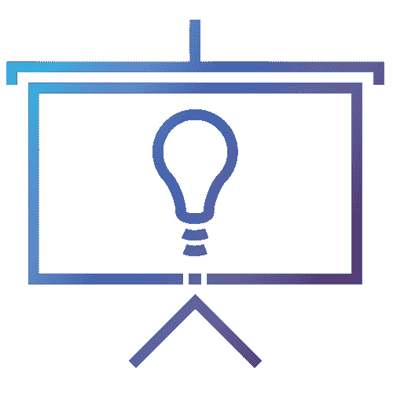
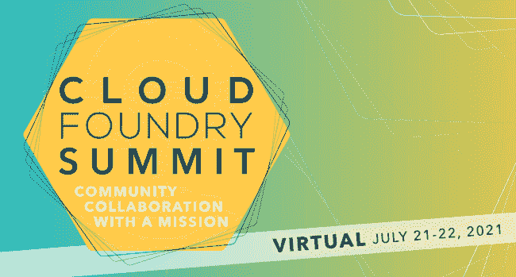

# 我所期待的:2021 年云铸造峰会

> 原文：<https://thenewstack.io/what-i-look-forward-to-the-cloud-foundry-summit-2021/>

## 我们的库贝根源

 [拉姆·艾扬格

Ram 实际上是一名工程师，本质上是一名教育家。在他作为一名开发人员的旅程中，他被推上了技术福音传道者的位置，并且从那以后再也没有回头看！他喜欢帮助世界各地的工程团队发现新的和创造性的工作方式。](https://www.linkedin.com/in/ramanujank/) 

先说我们的 Kube 根。Kubernetes 从根本上改变了软件工程团队对云基础设施的看法。Kube-readiness 主导着所有社交空间的对话。各种规模和形式的团队都在争先恐后地寻找将容器编排应用到软件生命周期的好方法。大型企业团队正在寻找更好地管理其容器策略的方法，并为适度扩展做准备。较小的团队和创业公司正在寻求制定一个面向未来的战略，并从一个有很长跑道的技术选择开始。这两种团队都希望 Kubernetes 满足他们的迫切需求。

虽然 Kubernetes 确实为这两类团队提供了最相关问题的答案，但是当且仅当围绕它构建了一个更大的平台时，这个工具才变得可用。几个团队正在花费宝贵的工程资源来构建定制平台，以使 Kubernetes 对他们的组织可用并发挥作用。无论这些团队是大是小，这种利用模式都意味着在核心产品上工作的时间更少，更不用说将来额外的维护和更新工作了。

## 2021 年云铸造峰会

在我看来，将工程团队从构建平台以提高 Kubernetes 可用性的工作中解放出来，是[云铸造](https://www.cloudfoundry.org/)的一大胜利。这是 2021 年云铸造峰会的大主题。特别是，大会上的几次会谈都集中在改进 Kubernetes 的操作体验上，我将在本文中重点介绍这一点。

### Kubernetes 云铸造的内容、原因和方式

我想提及的第一个会议是“携手更好，云铸造改善 Kubernetes”，由来自 Stark Wayne T1 的云工程师凯文·于滕主讲。本次讲座将回顾许多团队目前正在经历的迁移之旅，并提供 Cloud Foundry 如何减轻团队正在经历的许多痛苦的背景。这个演讲的精彩补充是“什么时候选择 CloudFoundry 而不是 Kubernetes？”来自 [anynines GMBH](https://www.anynines.com/) 的 Julian Fischer。他将提供围绕 Cloud Foundry 和 Kubernetes 做出技术选择的背景知识。

俗话说“布丁里有证据”。在题为“深潜:小题大做”的演讲中，[康卡斯特](https://business.comcast.com/)的 Ian Bush 和独立顾问 Neville George 讨论了在使用 Cloud Foundry 部署和运行的 Kubernetes 集群上运行由微服务组成的应用程序的所有方面。本次演讲的内容源自运营 Cloud Foundry 和 Kubernetes 的实际经验。预计它将充满在野外获得的经验教训。

### 使用 Cloud Foundry 处理第 2 天的问题

下一组会谈涉及第 2 天有关平台运营的相关问题。Cloud Foundry 可以极大地简化工程团队在调试、日志聚合、获取指标、事件响应和 RBACs 方面的工作流。排名不分先后，以下是一系列讲座，这些讲座将帮助工程师了解 Cloud Foundry 如何简化第 2 天问题的处理:

*   anynines GmbH 的 Patrick Hartz，“使用 Sidecar Buildpacks 收集应用容器指标”
*   “在 Cloud Foundry 中远程调试 Java 应用程序”，Subhankar Chattopadhyay 和 Shashank Mohan Jain，他们都来自 SAP
*   VMware Tanzu 团队的 Mona Mohebbi 和 Merric de Launey 表示:“更新角色:首次推出新的空间应用支持者角色
*   VMware 的 Dave Walter 博士和 Andrew Wittrock,“将快速 CVE 响应融入 K8s 的 CF”
*   “深潜:全速前进:在高日志吞吐量和最小日志损失的情况下运行 Loggregator 的故事”，Jovan Kostovski，SAP

### 帕克托建筑包:一种特殊的成分

通过使用由 Cloud Foundry Foundation 运营的开源项目 [Paketo Buildpacks](https://paketo.io/) ，简化开发人员体验的重要作用成为可能。它是一个跨不同语言和框架提供同质构建体验的工具。作为前几年介绍 Paketo Buildpacks 的讲座的后续，今年来自 [VMware](https://tanzu.vmware.com/tanzu) 的两位工程师 Sophie Wigmore 和 Forest Eckhardt 将深入探讨 Paketo 项目。他们的演讲将集中在 Paketo Buildpacks 的一个特定方面，即材料清单，并且通常围绕安全性和实用性。

### CF 的可扩展性和敏捷性

可扩展性和迁移对于任何寻求采用新技术的工程团队来说都是非常重要的。峰会上的一些讨论应能让我们深入了解 Cloud Foundry PaaS、其相关服务产品和 CF API 如何支持迁移以及如何适应新的产品。以下演讲深入探讨了 CF API、迁移以及在全新的云原生世界中扩展核心 CF 功能的新方法:

*   “深度潜水:移动是困难的——没有影响(或背痛)的迁移，”自由互助保险公司的 Stacy Kirkland 和 Tom Mitchell，Stark & Wayne
*   “如何使用云铸造任务在服务之间迁移数据”，海托尔·梅拉·德·梅洛，anynines GmbH
*   “奇怪的一对——跨平台服务，以铁匠和粗花呢为例，”凯文·于滕、斯塔克和韦恩

### 培训和学习

在采用新技术的过程中，团队文化是最不受重视的领域之一。这一直是一个技术难度很大的领域，云铸造也不例外。对于那些认为非技术挑战和技术挑战一样有趣的人来说，请不要错过 anynines GmbH 的 Martín Valencia Flores 题为“零云铸造经验的入职人员的挑战:新人的观点”的演讲本次演讲包含了数百名开发者首次参与 Cloud Foundry 生态系统的趣闻轶事。

## 注册参加峰会

Cloud Foundry Foundation 邀请人们参加 2021 年 Cloud Foundry 虚拟峰会。这是一个完全在线的活动，你可以舒舒服服地坐在沙发上参加。我们相信，今年的峰会对小型、中型和企业团队都有很大的帮助。这里有一个到[活动页面](https://www.cloudfoundry.org/events/summit/cfsummit2021/)的链接和一个到[注册页面](https://www.cvent.com/d/8jqqs8/4W)的链接。该活动将于 7 月 21 日至 22 日举行。在活动的前一天(7 月 20 日)也有一个非会议。新当选的技术监督委员会主席、Cloud Foundry Foundation 基金会执行董事 Chip Childers 的主题演讲，以及围绕包容性和多样性的有趣活动都包含在峰会的日程中。

如需更多信息，欢迎致电 events@cloudfoundry.org[联系我们。](mailto:events@cloudfoundry.org)

<svg xmlns:xlink="http://www.w3.org/1999/xlink" viewBox="0 0 68 31" version="1.1"><title>Group</title> <desc>Created with Sketch.</desc></svg>