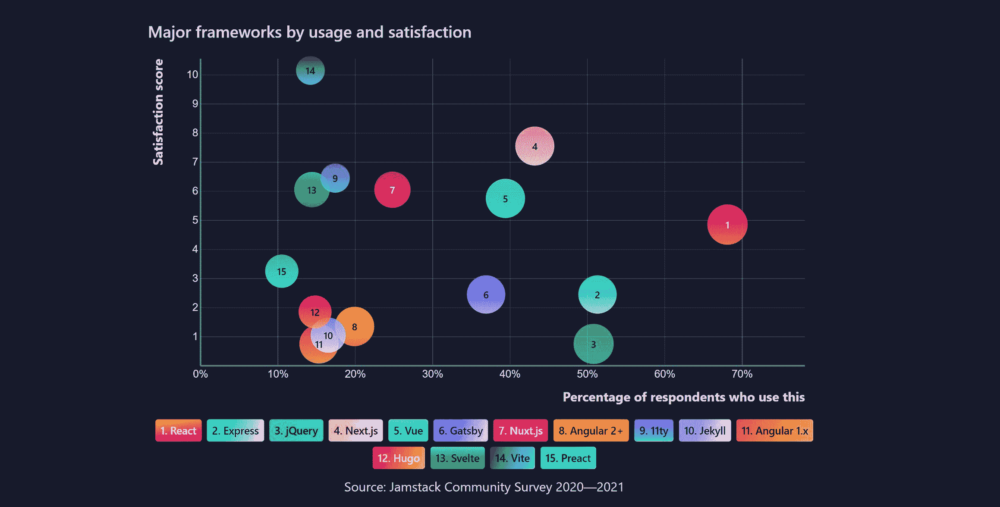
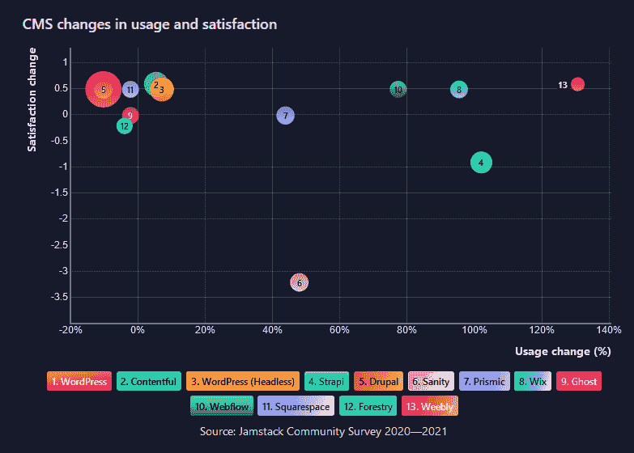

# 如果所有前端开发人员都是 Jamstack 开发人员会怎么样？

> 原文：<https://thenewstack.io/what-if-all-frontend-developers-were-jamstack-developers/>

编辑注意:这篇文章已经更新，以反映无头 WordPress 更适度的增长数字。

也许不是所有的 web 开发人员都关注前端，但似乎现代 web 开发和 [Jamstack](https://thenewstack.io/the-sweetness-of-jamstack-javascript-apis-and-markup/) 齐头并进。超过 7000 人参加了 Netlify 赞助的 [Jamstack 社区调查 2021](https://jamstack.org/survey/2021/) ，45%的人自称是前端开发人员。总的来说，这个社区中 96%的人使用 JavaScript，68%的人使用 React，60%的人使用 TypeScript。

Netlify 声称自己是[技术不可知论者](https://thenewstack.io/why-netlify-is-tech-agnostic-and-its-role-in-jamstack-development/)，并警告不要过度概括研究结果，但我们注意到一些值得注意的趋势。

从报告中可以看出，无头版 WordPress 的使用并没有增加，2021 年只有 20.1%到 21.6%的受访者使用它。几乎两倍多的受访者仍然使用传统的 WordPress 实现，而不是 headless 版本，尽管这一数字与 2020 年相比有所下降。与 2021 年相比，Prismic、Wix、Sanity、Strapi、Weebly 和 Webflow 的受访者使用它们的人数都比去年增加了至少 40%。[分离架构的希望是有道理的](https://thenewstack.io/why-decoupled-architectures-now-make-sense-for-wordpress/)，但实现这一目标还有一段路要走。

## **如果所有前端开发人员都是 Jamstack 开发人员会怎么样**

*   [Jamstack 社区调查 2021](https://jamstack.org/survey/2021/) 基于 7，000 多名受访者，其中 45%的人是前端开发人员，另外 32%是全栈开发人员。相比之下，最近的堆栈溢出调查中有 27%的人说前端开发人员是他们的工作角色之一，最新的 JetBrains 关于开发人员生态系统的报告中有 58%的参与者从事前端 web 开发项目。
*   **Javascript、TypeScript 和 React 定义 jam stacker**:96%的调查使用 Javascript，68%使用 React，60%使用 TypeScript。如果你想沿着记忆之路旅行，请阅读我们 2017 年的文章，“[为什么 TypeScript 越来越受欢迎](https://thenewstack.io/typescript-getting-popular/)”是的，我们知道语言和框架之间的区别，但是让我们暂时把它放在一边。如果你使用 JavaScript 和 React 或 TypeScript，你可能会做前端 web 开发。
*   这项调查的重点是 Netlify 的社区，所以不要对 web 开发人员做太多的概括是很重要的。然而， [Netlify](https://jamstack.org/survey/2021/community-survey-2021-methodology.pdf) 可信地宣称拥有 200 万用户。如果全球有 2500 万开发者，这意味着 8%的开发者可能是网络用户。如果是真的，那真是令人印象深刻。在过去一年的几项调查中，超过 20%的前端类型开发人员在与托管相关的问题中提到了它。
*   正如我们在 6 月份报道的那样， [Cloudflare、Netlify 和 Vercel 等公司与超大规模云提供商](https://thenewstack.io/cdn-providers-rival-hyperscale-clouds-for-web-developers-deploying-jamstack/)竞争部署 Jamstack 的 web 开发人员。采用某种类型的站点生成器或无头 CMS 并不一定定义了这种类型的现代 web 开发。这些开发人员更有可能使用无服务器架构。事实上，在这项研究中，功能即服务和容器技术的采用几乎处于同一水平。这也符合我们在 WebAssembly 调查中看到的趋势，这并不奇怪，因为它们共享相似的架构。术语 [#Wamstack](https://kontent.ai/blog/the-rise-of-jamstack) 还没有流行起来，但也许有一天会流行起来。

## 更多阅读

<svg xmlns:xlink="http://www.w3.org/1999/xlink" viewBox="0 0 68 31" version="1.1"><title>Group</title> <desc>Created with Sketch.</desc></svg>