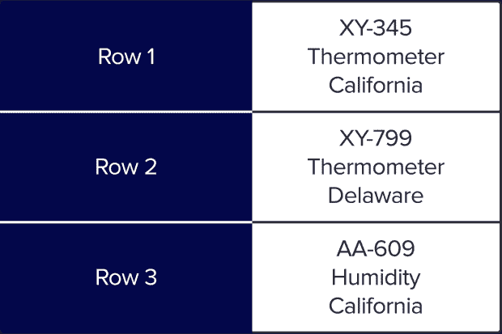

# 什么是列数据库，什么时候应该使用列数据库？

> 原文：<https://thenewstack.io/what-is-a-column-database-and-when-should-you-use-one/>

在为您的应用程序选择数据库时，有许多不同的选项。一个常见的讨论似乎是高级 SQL 与 NoSQL 数据库的争论，即数据应该存储在关系数据库中还是存储在 NoSQL 的替代数据库中，如[键值](https://www.influxdata.com/key-value-database/?utm_source=vendor&utm_medium=referral&utm_campaign=2022-12_spnsr-ctn_column-database_tns)、[文档](https://www.influxdata.com/document-database/?utm_source=vendor&utm_medium=referral&utm_campaign=2022-12_spnsr-ctn_column-database_tns)或[图形](https://www.influxdata.com/graph-database/?utm_source=vendor&utm_medium=referral&utm_campaign=2022-12_spnsr-ctn_column-database_tns)数据库。

另一种选择是通过使用列数据库来彻底改变事情。在本文中，您将了解为什么做出这样的选择是有意义的，以及列数据库的一些优点和缺点。

## 什么是列数据库？

顾名思义，列(或柱状)数据库在磁盘上存储组织成列而不是行的数据。以物联网传感器为例，基于行的数据库将数据存储在磁盘上，如下所示:

列数据库将组织相同的数据，以便每个列值在磁盘上依次存储:

列数据库的主要优点是，由于提高了压缩率，它可以显著减少存储数据所需的磁盘空间。此外，[列数据库](https://www.influxdata.com/glossary/column-database/?utm_source=vendor&utm_medium=referral&utm_campaign=2022-12_spnsr-ctn_column-database_tns)在处理分析型查询时比传统的基于行的数据库快得多。

## 为什么列数据库适合分析工作负载？

那么，改变数据的存储格式到底是如何提高性能的呢？与传统数据库相比，有几个因素导致列数据库能够为[在线分析处理(OLAP](https://www.influxdata.com/glossary/olap/?utm_source=vendor&utm_medium=referral&utm_campaign=2022-12_spnsr-ctn_column-database_tns) )工作负载提供好几个数量级的性能。

第一个原因是改进的压缩。这是因为列数据库能够对每种数据类型使用最佳压缩算法，因为每列都是相同类型的数据，而不是一行混合数据类型。这不仅降低了磁盘上的存储成本，还提高了性能，因为需要更少的磁盘寻道，更多的数据可以放入 RAM。

列数据库提高性能的另一种方式是实际存储同一列的多个不同版本，这些版本按不同的顺序排序，以便为某些查询提供更快的筛选和选择。

列数据库还可以通过许多其他方式来提高性能。这里有几个例子:

*   查询数据时的自适应索引
*   矢量化处理
*   优化和更高效的色谱柱连接
*   列的后期具体化

这些优化的结果可以在这个可视化测试中看到，该测试是作为分析列数据库性能的[论文](https://stratos.seas.harvard.edu/files/stratos/files/columnstoresfntdbs.pdf)的一部分完成的。根据 TPC-H 数据仓库基准数据集，列数据库的性能比传统的行结构数据库快 10 倍。

该图显示了哪些优化对列数据库的性能有最大的影响，在这种情况下，延迟具体化提供了最大的提升。

## 列数据库性能权衡

与计算机科学中的几乎所有事情一样，当涉及到列数据库性能时，也要进行权衡。它们针对[分析](https://www.influxdata.com/use-cases/real-time-analytics/?utm_source=vendor&utm_medium=referral&utm_campaign=2022-12_spnsr-ctn_column-database_tns)工作负载进行了优化，并且从设计上来说，不太适合关系数据库所设计的传统在线事务处理(OLTP)工作负载。

最大的性能牺牲是在试图更新特定数据点或写入单个数据点的情况下。对于列数据库，您希望尽可能批量插入数据。

列数据库还会对读取查询造成影响，在读取查询中，您会像使用关系数据库一样获取一行中的所有数据。因为必须重新构建每一列来创建整行，所以性能会受到影响。

## 列数据库用例

列数据库非常适合需要分析大量数据的任何情况。让我们来看看一些常见的用例。

### 商业智能

列数据库对于[分析](https://www.influxdata.com/time-series-analysis-methods/?utm_source=vendor&utm_medium=referral&utm_campaign=2022-12_spnsr-ctn_column-database_tns)销售数据是完美的，因为它们允许你以多种方式划分信息。这可以帮助你识别你可能没有看到的趋势和模式。例如，您可以使用列数据库按位置、品牌或产品类别比较不同产品在一段时间内的销售数字。

### 应用程序性能监控

[应用程序性能监控](https://www.influxdata.com/solutions/application-performance-monitoring-apm/?utm_source=vendor&utm_medium=referral&utm_campaign=2022-12_spnsr-ctn_column-database_tns)是使用列数据库帮助提高软件可靠性和性能的另一种常见情况。通过跟踪和分析有关应用程序运行情况的数据，您可以在问题导致应用程序崩溃或变慢之前发现问题。这可以帮助您避免停机，并确保您的用户获得最佳体验。通过使用列数据库，您可以存储更细粒度的数据以获得更深入的见解，同时由于出色的数据压缩而降低了成本。

### 物联网

越来越多的[联网设备](https://www.influxdata.com/glossary/iot-devices/?utm_source=vendor&utm_medium=referral&utm_campaign=2022-12_spnsr-ctn_column-database_tns)被部署，其中许多正在收集用于分析工作负载的数据。列数据库可以用来存储这些数据，用于实时警报，也用于生成[预测](https://www.influxdata.com/time-series-forecasting-methods/?utm_source=vendor&utm_medium=referral&utm_campaign=2022-12_spnsr-ctn_column-database_tns)，以提高许多不同行业的效率。

## 专用列数据库示例

到目前为止，我们已经从较高的层次上了解了列数据库及其优势。尽管所有列数据库大体上都具有相同的特征，并且可以有效地用作通用数据仓库或数据湖，但在本节中，我们将研究如何针对更具体的性能特征对它们进行调优和优化。

### InfluxDB IOx

[InfluxDB IOx](https://www.influxdata.com/blog/influxdb-engine/?utm_source=vendor&utm_medium=referral&utm_campaign=2022-12_spnsr-ctn_column-database_tns) 是针对 [InfluxDB](https://www.influxdata.com/products/influxdb-overview/?utm_source=vendor&utm_medium=referral&utm_campaign=2022-12_spnsr-ctn_column-database_tns) 的开源列存储引擎，针对处理时序数据进行了优化。[时间序列](https://www.influxdata.com/what-is-time-series-data/?utm_source=vendor&utm_medium=referral&utm_campaign=2022-12_spnsr-ctn_column-database_tns)数据在性能方面提出了一个独特的挑战，因为用户希望以从性能范围的相反方面过滤[数据库](https://www.influxdata.com/time-series-database/?utm_source=vendor&utm_medium=referral&utm_campaign=2022-12_spnsr-ctn_column-database_tns)的方式来查询数据:

*   仅需要几列数据的分析型查询，如从传感器获取过去一周的平均温度。
*   关系型查询，用户需要过去 5 分钟内来自许多不同传感器的所有可用信息。

时间序列数据也往往以海量形式到达，这需要快速接收能力，以便可以快速索引和查询数据，从而进行实时监控和警报。此外，许多用户希望能够长期存储这些数据，以便进行历史分析和预测，而不会倾家荡产。

InfluxDB 允许用户通过管理数据的生命周期并在热存储和冷存储之间移动数据来获得历史数据的快速性能，同时通过对不经常查询的数据使用更便宜的对象存储来降低存储成本，从而两全其美。

实现这一目标的一个关键部分是通过构建和贡献像 Apache Arrow、DataFusion 和 Parquet 这样的项目来完成的。Arrow 允许数据在内存中以及在数据库的不同部分之间移动时保持压缩的列格式。Parquet 用于高效的持久存储，而 [DataFusion](https://www.influxdata.com/glossary/apache-datafusion/?utm_source=vendor&utm_medium=referral&utm_campaign=2022-12_spnsr-ctn_column-database_tns) 提供高性能查询和 SQL 支持。许多其他主要项目和供应商也在基于 [Parquet](https://thenewstack.io/an-introduction-to-apache-parquet/) 和 Arrow 构建，这也实现了与更广泛的大数据生态系统的集成和兼容性。

### 阿帕奇德鲁伊

[Apache Druid](https://github.com/apache/druid) 是一个具有底层列数据结构的实时数据库。Druid 适用于典型的数据仓库类型的工作负载，就像您对列数据库的期望一样，但是它也优先考虑低延迟响应时间，并且通常用于交互式用户界面之类的事情。

### DuckDB

[DuckDB](https://github.com/duckdb/duckdb) 是一个为 OLAP 工作负载设计的进程内数据库，本质上是为分析而设计的 SQLite。DuckDB 使用列矢量化处理来运行 SQL 查询，具有很高的性能，并且可以轻松嵌入到应用程序中。DuckDB 的主要卖点是，在大多数 OLAP 数据库要么是云托管的，要么需要大量安装过程的情况下，它很容易在本地设置和运行。

## 为工作选择合适的工具

最终，技术决策归结为对您的用例有意义的东西。从长远来看，选择数据库可能是构建应用程序时最重要的选择之一，因此了解所有可用的选项并选择最适合的选项是有意义的。

如果您正在处理主要用于分析的大量数据，列数据库可能是一个不错的选择。

<svg xmlns:xlink="http://www.w3.org/1999/xlink" viewBox="0 0 68 31" version="1.1"><title>Group</title> <desc>Created with Sketch.</desc></svg>