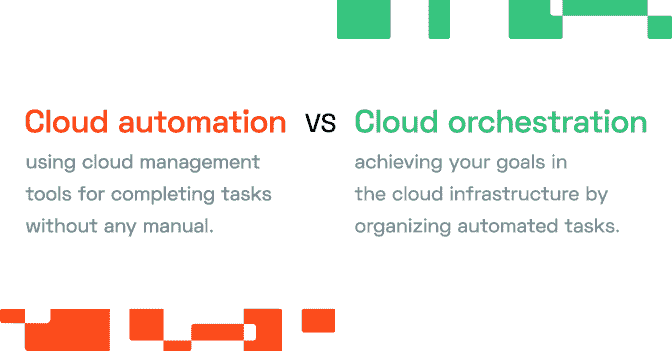
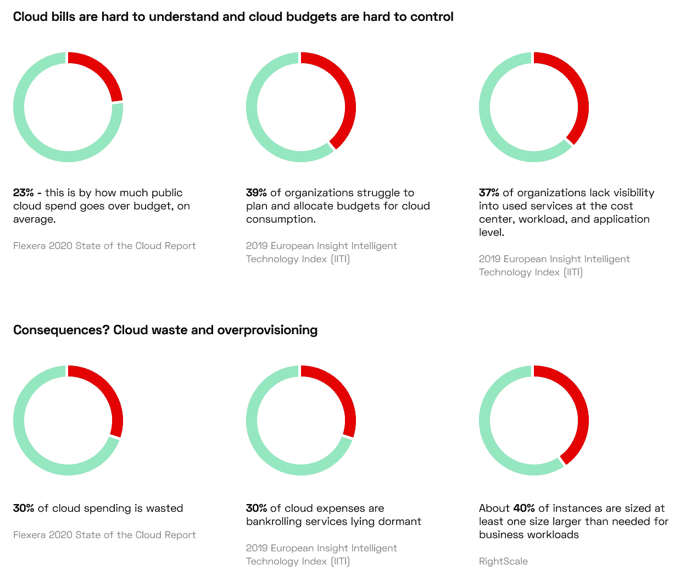
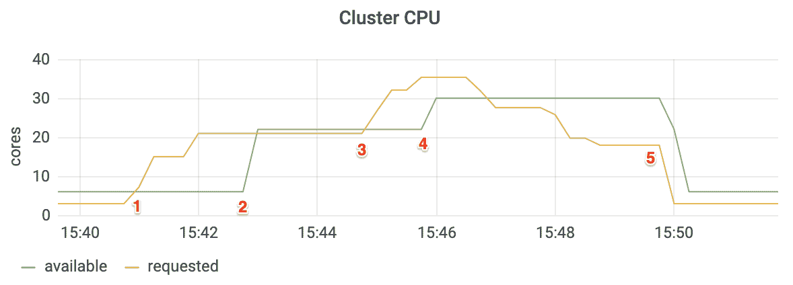

# 什么是云自动化，它对 It 团队有何益处？

> 原文：<https://thenewstack.io/what-is-cloud-automation-and-how-does-it-benefit-it-teams/>

 [劳伦特吉尔【at CAST AI 联合创始人兼 CPO 劳伦特负责产品和业务开发。他是 Zenedge 的联合创始人兼首席产品和商务官，该公司于 2018 年被甲骨文收购。Laurent 也是 Viewdle 的首席执行官和联合创始人，该公司于 2012 年被谷歌收购。](https://www.linkedin.com/in/laurentgil/) 

手动扩展、供应和配置云资源的团队冒着犯错误的风险，这些错误可能会影响他们系统的性能或可用性。幸运的是，有一种方法可以解决这个问题:那就是自动化。

云自动化解决方案减少或消除了您的团队在配置虚拟机、创建虚拟机集群、设置虚拟网络等方面投入的所有手动工作。

你只能想象公司通过自动化可以节省多少时间。但那只是冰山一角！

请继续阅读，了解整个科技行业最具影响力的云自动化用例。

## 云自动化的 7 大优势

### 1.不再有错误

通过自动化云设置，您可以消除部署和管理云工作负载中涉及的所有重复和手动工作。让我们面对现实:手工工作效率低下且容易出错。这通常会导致可能影响工作负载可用性的故障排除。

### 2.降低基础设施成本

通过最大限度地减少管理基于云的运营所涉及的人力，您将加快流程。更少的错误意味着花在诊断和故障排除上的时间更少，而花在开发新事物和创新上的时间更多。

### 3.卓越的安全性

手动云部署可能会导致安全漏洞，从而使您的应用程序和公司面临风险。此外，将敏感作业自动化也是一个好主意。您不需要那么多团队成员登录任务关键型系统，因此人为错误和帐户违规的风险大大降低。

### 4.通向现代发展之路

如果您想要简化部署流程并实施真正现代化的开发运维，您需要自动化。基础设施即代码(IaC)、紧密的反馈循环和持续交付——它们都依赖于自动化。

### 5.所有的云优势

云自动化工具允许在自动化存储和备份、安全性和合规性管理、配置和设置更改以及代码部署等领域充分利用云基础架构。

### 6.更智能的备份

自动化在保护您的系统免受风险(无论是设备故障还是网络攻击)方面发挥着至关重要的作用。为了提高您的恢复能力，您可以在云上自动备份，或者将您的内部基础架构自动备份到基于云的环境中。

### 7.加强治理

手动或临时启动系统的团队让管理员的生活变得困难，因为他们对正在运行的内容缺乏了解。自动化将标准化引入到流程中，使管理员能够集中查看和更好地控制基础架构。

## 云自动化与云流程编排–它们是一回事吗？

理解云自动化和流程编排之间的区别对于构建智能自动化战略至关重要。

云自动化意味着使用云管理工具来完成任务，无需任何手动操作。云流程编排就是通过组织这些自动化任务，在更广的层面上实现您的目标。

在云流程编排中，您连接底层任务来创建流程，并在整个基础架构中跨多个系统或位置协调它们。

云自动化可以是一个独立的计划，但是将这两种方法结合起来会带来最好的结果。

## 证明其价值的云自动化用例

### 1.减少浪费和云蔓延

云自动化工具可以关闭未使用的实例，以降低您的云成本，并降低云资源过度调配或蔓延的风险。

不再有孤立的实例或影子 IT 项目意味着不再有给你带来零价值的开支。云自动化解决方案在识别僵尸基础设施方面非常出色，可以在问题滚雪球般变成月底的巨额云账单之前解决问题。

### 2.调配云资源

当您面临数百种选择时，为工作选择合适的虚拟机是很困难的。哪些性价比最优？

实例选择算法可以为您调整云资源的大小和规模。自动化解决方案处理大量数据，以确定最佳实例类型。

下面是一个示例场景:

假设您正在 Kubernetes 中运行一个电子商务应用程序。然后，您可以添加一个负责自动配置的解决方案:

1.  15:41，你的网上商店开始有很多访问者。自动化解决方案创建了一些新的 pod 来处理传入的流量。但是豆荚没有地方运行，所以你需要新的 CPU 核心。
2.  没问题！该解决方案只需两分钟即可自动添加一个新的 16 核节点。
3.  15:45，你的店出现了更多的流量。该工具会在一分钟内自动添加一个额外的 8 核节点，以确保您的应用能够处理流量。
4.  一旦流量减少，解决方案会立即让两个节点退役，以避免资源浪费。

### 3.促进基础设施即代码(IaC)

开发基础设施即代码(IaC)是自动化的另一个关键用例。在 IaC 中，IT 基础设施是在配置文件中定义的。它会根据配置自动启动。

借助云自动化，您可以扩展 IaC 来控制几乎所有的基础设施方面，并协调更复杂的系统。

自动化流程可以定义常见的配置项目，如虚拟机、容器或虚拟专用网络。然后，他们将应用程序组件和服务加载到配置项中，并将它们放在一起以构建更好的操作环境。

### 4.支持混合云

[混合云](https://cast.ai/blog/multi-cloud-vs-hybrid-cloud-whats-the-difference-and-why-does-it-matter/)需要在内部和公共云系统之间进行仔细集成。云自动化解决方案也可以减轻你的负担。

他们可以在本地数据中心和云资源之间同步资产，以实现云爆发，当您的应用程序超出本地资源时，将负载转移到云。

云自动化还打开了灾难恢复场景的大门，远程站点镜像本地环境。

## 您的团队为云自动化做好准备了吗？

团队可以通过实现云自动化节省大量时间和精力。它更具可扩展性、安全性和速度，允许您创建更加可预测和可靠的工作流。

您是否正在自动化云资源的调配、管理或扩展？您是否计划尝试一些自动化运营流程？在 Twitter 上与我们[分享你的经历。](https://twitter.com/cast_ai)

如果你使用 Kubernetes 并在亚马逊 EKS 上运行，你可以通过生成一份免费的[节省报告](https://cast.ai/eks-optimizer/)来检查你可能在云账单上节省多少，从而开始你的自动化之旅。

<svg xmlns:xlink="http://www.w3.org/1999/xlink" viewBox="0 0 68 31" version="1.1"><title>Group</title> <desc>Created with Sketch.</desc></svg>