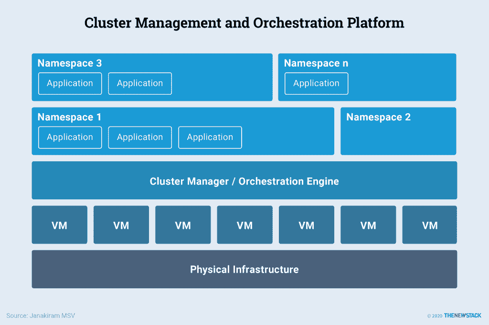

# 什么是容器编排？

> 原文：<https://thenewstack.io/what-is-container-orchestration/>

影响现代基础设施的两个趋势是容器和 DevOps。DevOps 生态系统发展到提供持续集成、持续测试、持续部署和持续监控，这提高了软件开发的速度。容器的采用与成熟的 DevOps 最佳实践相结合，实现了大规模快速部署。

虽然容器有助于提高开发人员的工作效率，但编排工具为寻求优化开发和运营投资的组织提供了许多好处。容器编排的一些好处包括:

*   高效的资源管理。
*   服务的无缝扩展。
*   高可用性。
*   低规模运营开销。
*   大多数编排工具的声明性模型，减少了更多自主管理的摩擦。
*   运营风格的基础设施即服务(IaaS)，但像平台即服务(PaaS)一样易于管理。
*   跨内部和公共云提供商的一致运营体验。

IaaS 被运营商选择用于控制和自动化。开发者更喜欢 PaaS 的灵活性、规模和生产力。容器编排工具带来了两全其美:自动化和规模。

## 为什么需要大规模的容器编排

容器解决了开发人员的生产力问题，使得 DevOps 工作流无缝。开发人员可以创建一个容器映像，运行一个容器，并在该容器中开发代码，以将其部署在本地数据中心或公共云环境中。然而，这种对开发人员生产力的无缝引入并不能自动转化为生产环境中的效率。

生产环境通常与开发人员笔记本电脑的本地环境有很大不同。无论您是运行大规模的传统三层应用程序还是基于微服务的应用程序，管理大量容器和支持它们的节点集群都不是一件容易的事情。编排是实现规模化所必需的组件，因为规模化需要自动化。

云计算的分布式特性带来了我们对虚拟机基础架构的认知范式转变。“牛与宠物”的概念——将集装箱视为一个牲畜单位，而不是一种喜爱的动物——有助于重塑人们对集装箱和基础设施性质的思维模式。

容器和运行它们的基础设施都是不可变的——在这种范式中，容器或服务器在部署后永远不会被修改。如果需要以任何方式更新、修复或修改某些东西，则提供从公共映像构建的新容器或服务器，并进行适当的更改，以替换旧的容器或服务器。这种方法相当于在奶牛场管理牛。

另一方面，传统服务器甚至虚拟机都不是一成不变的——它们更像宠物，因此不是一次性的。所以他们的维护成本很高，因为他们不断需要运营团队的关注。

不可变的基础设施是可编程的，这允许自动化。基础设施即代码(IaC)是现代基础设施的关键属性之一，其中应用程序可以通过编程方式提供、配置和利用基础设施来运行自身。

> 基于 IaC 的容器编排、不可变基础设施和自动化的结合提供了灵活性和可伸缩性。

## 容器编排平台的特性

将这一概念付诸实践，containers at scale 扩展并完善了伸缩性和资源可用性的概念。

典型的容器编排平台的基本特性包括:

*   资源管理。
*   服务发现。
*   健康检查。
*   更新和升级。

容器编排市场目前由 Kubernetes 主导。它已经获得了企业、平台供应商、云提供商和基础设施公司的认可。

容器编排鼓励使用微服务架构模式，在这种模式中，应用程序由更小的、原子的、独立的服务组成——每个服务都是为一个任务设计的。每个微服务被打包成一个容器，逻辑上属于同一个应用的多个微服务在运行时由 Kubernetes 编排。

Kubernetes 的兴起导致了基于容器编排和管理平台的新的细分市场的产生。从存储到网络，从监控到安全，有一种新的公司和创业公司正在构建容器本地产品和服务。在本系列的后面，我们将重点介绍这个新兴生态系统中云原生平台和初创公司的一些构建模块。接下来，了解一下 [Kubernetes 架构](/how-does-kubernetes-work/)。

通过像素的特征图像。

<svg xmlns:xlink="http://www.w3.org/1999/xlink" viewBox="0 0 68 31" version="1.1"><title>Group</title> <desc>Created with Sketch.</desc></svg>