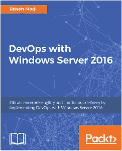

# DevOps 是什么？

> 原文：<https://thenewstack.io/what-is-devops/>

 [里泰什·莫迪

里泰什·莫迪目前在微软担任高级技术传道者，他在那里确保开发者、初创公司和公司在使用技术的努力中取得成功。在此之前，他是微软服务和埃森哲的架构师。他对技术充满热情，对微软和开源技术都很感兴趣。他认为应该采用最佳技术来解决业务挑战。他在社区中非常活跃，并在国家和国际会议上发言。他是一位知名的行业领袖，并且已经是一位出版作家。他是 T-Hub 和 IIIT 海得拉巴创业孵化器的技术导师。他拥有 20 多项认证，是微软认证培训师。](https://www.linkedin.com/in/ritesh-modi) 

如今，业界对于 DevOps 的定义还没有达成共识。每个组织都制定了自己的 DevOps 定义，并尝试相应地实施。他们有自己的观点，并且倾向于认为他们已经实现了开发运维，如果他们已经实现了自动化，配置管理已经启用，他们正在使用敏捷流程，或者它们的任意组合。

DevOps 是关于软件系统的交付机制。它是将人们聚集在一起，让他们协作和交流，一起朝着共同的目标和愿景努力。它是关于承担共同的责任、义务和所有权。它是关于实施培养集体和服务意识的过程。它使交付机制能够在组织内带来敏捷性和灵活性。与流行的观点相反，DevOps 与工具、技术和自动化无关。

自动化作为实现敏捷过程的使能器，诱导团队内部的协作，并帮助更快更好地交付。

互联网上有多种 DevOps 的定义，但它们并没有提供完整的定义。DevOps 不提供框架或方法。它是一组原则和实践，当在组织、约定或项目中使用时，实现 DevOps 和组织的目标和愿景。这些原则和实践并不强制要求任何特定的过程、工具和技术或环境。DevOps 提供了可以通过任何工具、技术和流程实现的指导，尽管有些技术和流程可能比其他技术和流程更适合实现 DevOps 原则和实践的愿景。

尽管 DevOps 实践可以在任何向客户提供服务和产品的组织中实现，但出于本书的目的，我们将从任何组织的软件开发和运营部门的角度来看待 DevOps。

那么，DevOps 是什么？DevOps 定义如下:

*   它是一套原则和实践。
*   它从软件系统的开始就把开发人员和操作团队聚集在一起。
*   它以一致和可预测的方式一次又一次地向最终客户提供更快、更高效的端到端价值交付。
*   它缩短了上市时间，从而提供了竞争优势。

如果您仔细观察 DevOps 的定义，它并不表示或涉及任何特定的过程、工具或技术。它没有规定任何特定的方法或环境。

在任何组织中实施 DevOps 原则和实践的目标是确保利益相关者(包括客户)的需求和期望得到高效和有效的满足。

当满足以下条件时，客户的需求和期望得到满足:

*   客户得到了他们想要的功能。
*   客户可以随时获得他们想要的功能。
*   客户可以更快地获得功能更新。
*   交货质量很高。

当一个组织能够满足这些期望时，顾客就会感到高兴，并保持对组织的忠诚。这反过来增加了组织的市场竞争力，从而产生更大的品牌和市场价值。它对组织的顶线和底线有直接的影响。组织可以在创新和客户反馈方面投入更多，为其系统和服务带来持续的变化，以保持相关性。

任何组织中 DevOps 原则和实践的实施都受其周围生态系统的指导。这个生态系统由组织所属的行业和领域组成。

DevOps 的核心原则如下:

*   协作和交流
*   对变化的敏捷性
*   软件设计
*   失败得又快又早
*   创新和持续学习
*   自动化流程和工具

DevOps 的核心实践如下:

*   连续累计
*   结构管理
*   持续部署
*   连续交货
*   持续学习

DevOps 并不是一个新的范例。然而，它在最近一段时间获得了大量的人气和牵引力。到目前为止，它的采用处于最高水平，越来越多的公司开始了这一旅程。我特意将开发运维作为一个旅程来提及，因为在开发运维中有不同的成熟度级别。虽然成功地实现持续部署和交付被认为是这个旅程中最高的成熟度，但是采用源代码控制和敏捷软件开发被认为是最低的。

DevOps 首先谈到的事情之一是打破开发和运营团队之间的壁垒。它带来了多个团队之间的密切协作。这是为了打破开发团队只负责编写代码并在测试后将其传递给运营部门进行部署的思维模式。这也是为了打破运营在发展活动中没有任何作用的思维模式。运营应该影响产品的规划，并且应该知道即将发布的特性。他们还应该不断地向开发人员提供关于任何操作问题的反馈，以便可以在后续版本中修复这些问题。他们应该对系统的设计有一些影响，以改善其整体功能。类似地，开发应该帮助操作团队部署系统，并在事件发生时解决它们。

该定义谈到了更快和更有效地向利益相关者交付系统的端到端交付。它并没有说交付应该有多快或多有效。它应该足够快，这取决于组织的领域、行业、客户细分等。对于一些组织来说，足够快可能是每季度一次，而对于其他组织来说，可能是每周一次。

从 DevOps 的角度来看，这两种类型都是有效的，他们可以部署任何相关的流程和技术来实现他们的特定目标。DevOps 不能决定目标是什么。组织应根据其整体项目、项目和愿景确定 DevOps 原则和实践的最佳实施方式。

该定义还谈到了端到端的交付。这意味着从系统的规划和交付到服务和运营的一切都应该是 DevOps 实现的一部分。这些过程应该在应用程序开发生命周期中允许更大的灵活性、模块化和敏捷性。虽然组织可以自由地使用最适合的过程，例如瀑布、敏捷、看板等等，但是通常组织倾向于使用基于迭代的交付的敏捷过程。这允许在更小的单元中更快地交付，与大的交付相比，更容易测试和管理。

DevOps 一次又一次地谈论以一致和可预测的方式向最终客户交付软件系统。这意味着组织应该使用自动化不断地向客户交付更新和升级的特性。如果不使用自动化，我们就无法实现一致性和可预测性。手动工作应该减少到零，以确保高度的一致性和可预测性。自动化还应该是端到端的，以避免故障。这也表明系统设计应该是模块化的，在保持可靠性、可用性和可伸缩性的同时允许更快的交付。自动化测试在一致和可预测的交付中扮演着重要的角色。

实施前面提到的实践和原则的结果是，组织可以满足客户的期望和需求。这样的组织可以比其竞争对手发展得更快，并通过持续的创新和改进进一步提高其产品和服务的质量和能力。

<svg xmlns:xlink="http://www.w3.org/1999/xlink" viewBox="0 0 68 31" version="1.1"><title>Group</title> <desc>Created with Sketch.</desc></svg>