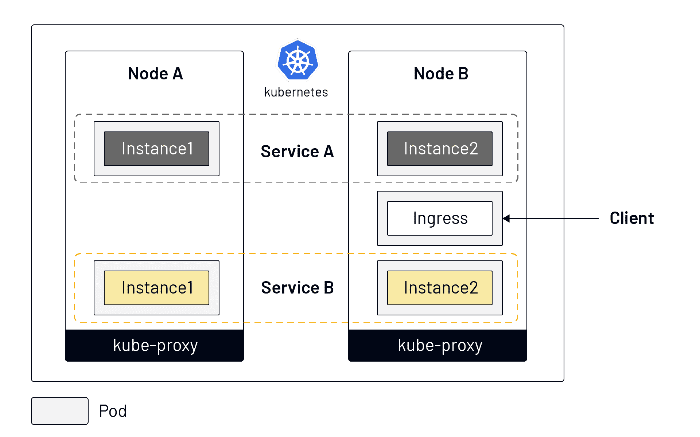
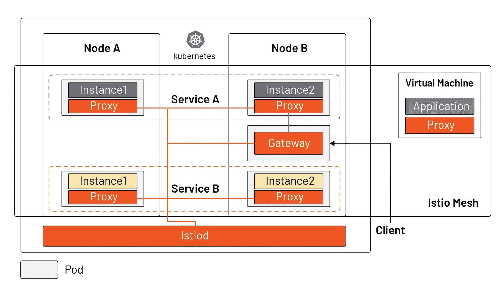

# Istio 是什么，Kubernetes 为什么需要它？

> 原文：<https://thenewstack.io/what-is-istio-and-why-does-kubernetes-need-it/>

Istio，[最受欢迎的服务网格实现](https://www.cncf.io/blog/2020/03/04/2019-cncf-survey-results-are-here-deployments-are-growing-in-size-and-speed-as-cloud-native-adoption-becomes-mainstream/)，是在 Kubernetes 之上开发的，在云原生应用生态系统中有着与 Kubernetes 不同的定位。本文不是直接向您介绍 Istio 所提供的东西，而是解释 Istio 是如何产生的，以及它与 Kubernetes 的关系。

## 为什么会有 Istio？

 [吉米·宋

Jimmy 是 Tetrate 的开发者倡导者，CNCF 大使，ServiceMesher 和 Cloud Native Community(中国)的联合创始人。他主要关注 Kubernetes、Istio 和云原生架构。](https://www.linkedin.com/in/jimmysongio/) 

为了解释 Istio 是什么，了解 Istio 产生的背景也很重要，即为什么会有 Istio？

微服务是一个组织问题的技术解决方案。Kubernetes/Istio 是一种技术解决方案，可以解决迁移到微服务所带来的问题。作为微服务的可交付成果，容器解决了环境一致性的问题，并允许在限制应用程序资源方面有更大的粒度。它们被广泛用作微服务的载体。

谷歌在 2014 年开源了 Kubernetes，在接下来的几年里呈指数级增长。它成为一个容器调度工具，用来解决分布式应用程序的部署和调度问题——允许您将多台计算机视为一台计算机。由于单机的资源是有限的，互联网应用在不同的时间可能会出现流量洪水(由于用户规模的快速扩张或者用户属性的不同)，因此需要计算资源的弹性很高。单机显然不能满足大规模应用的需求；反过来说，一个非常小规模的应用程序占用整个主机将是一种巨大的浪费。

简而言之，Kubernetes 定义了服务的最终状态，并使系统能够自动达到并停留在该状态。那么，在部署应用程序之后，如何管理服务上的流量呢？下面我们将看看 Kubernetes 是如何进行服务管理的，以及它在 Istio 中是如何变化的。

## 你在 Kubernetes 是怎么做服务管理的？

下图显示了 Kubernetes 中的服务模型:

【T2

从上图我们可以看出:

*   同一服务的不同实例可以被调度到不同的节点。
*   Kubernetes 通过服务对象将一个服务的多个实例组合起来，统一外部服务。
*   Kubernetes 在每个节点中安装一个 kube-proxy 组件来转发流量，它具有简单的负载平衡功能。
*   来自 Kubernetes 集群外部的流量可以通过 Ingress 进入集群(Kubernetes 有其他几种公开服务的方式；例如节点端口、负载平衡器等。).

Kubernetes 被用作集约资源管理的工具。然而，在为应用程序分配资源后，Kubernetes 并没有完全解决如何确保应用程序的健壮性和冗余性，如何实现更细粒度的流量划分(不是基于服务的实例数量)，如何保证服务的安全性，或者如何管理多个集群等问题。

## Istio 的基础知识

下图显示了 Istio 中的服务模型，它支持 Kubernetes 中的工作负载和虚拟机。

从图表中我们可以看出:

*   Istiod 充当控制平面，将配置分发到所有 sidecar 代理和网关。(注:为简化起见，图中未画出 Istiod 和 sidecar 之间的连接。)
*   Istio 支持从应用层到集群中其他支持网格的服务的智能应用感知负载平衡，并绕过基本的 kube-proxy 负载平衡。
*   应用程序管理员可以通过声明性 API 操纵 [Istio 服务网格](https://thenewstack.io/why-do-you-need-istio-when-you-already-have-kubernetes/)中的流量行为，就像他们在 Kubernetes 中管理工作负载一样。它可以在几秒钟内生效，而且他们无需重新部署就可以做到这一点。
*   入口被网关资源取代，网关资源是一种特殊的代理，也是一种重用的边车代理。
*   可以在虚拟机中安装边车代理，以将虚拟机带入 Istio 网格。

事实上，在 Istio 之前，人们可以使用 SpringCloud、网飞操作系统和其他工具，通过在应用程序中集成 SDK，以编程方式管理应用程序中的流量。Istio 使流量管理对应用透明，将该功能移出应用，并作为云原生基础设施移入平台层。

Istio 通过增强云原生应用的流量管理、可观察性和安全性来补充 Kubernetes。由谷歌、IBM 和 Lyft 于 2017 年推出的服务网格开源项目在三年内取得了很大进展。Istio 核心特性的描述可在 [Istio 文档](https://istio.io/latest/docs/concepts/what-is-istio/#core-features)中找到。

## 摘要

*   服务网格是 TCP/IP 的云原生等价物，解决应用程序网络通信、安全性和可见性问题。
*   Istio 是目前最流行的服务网格实现，依赖于 Kubernetes，但也可扩展到虚拟机负载。
*   Istio 的核心由控制平面和数据平面组成，Envoy 是默认的数据平面代理。
*   Istio 充当云原生基础设施的网络层，对应用透明。

通过 Pixabay 的特征图像。

<svg xmlns:xlink="http://www.w3.org/1999/xlink" viewBox="0 0 68 31" version="1.1"><title>Group</title> <desc>Created with Sketch.</desc></svg>