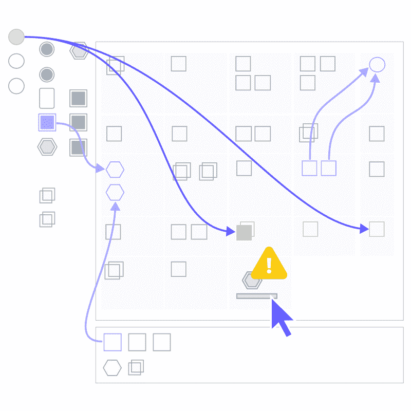
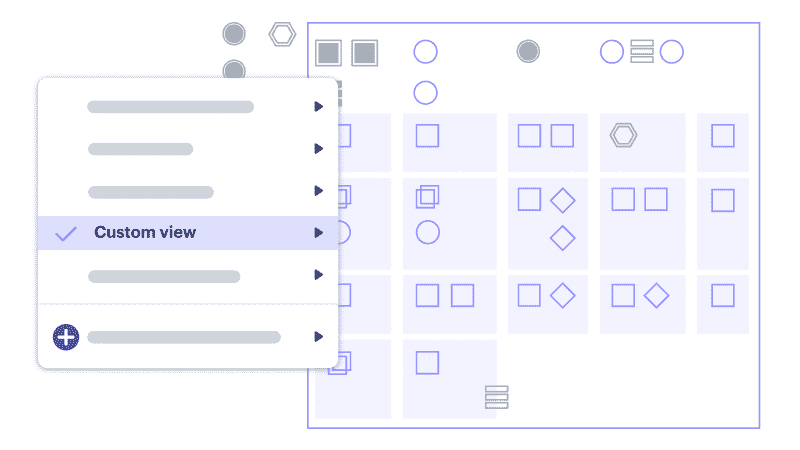

# 什么是实时、协作的云可视化？

> 原文：<https://thenewstack.io/what-is-real-time-collaborative-cloud-visualization/>

 [丹律师

丹律师，Lucid Software 的首席产品官，热衷于通过令人愉快的方式解决问题来创造价值。在 Lucid 之前，他在 Adobe、Ancestry 和 Vivint 领导产品和设计组织。](https://www.linkedin.com/in/dan-lawyer-75919b/) 

协作发生的时间和方式，尤其是在混合工作环境中，与业务成功直接相关。对于 IT 专业人员来说，在云中工作没有什么不同。允许您的团队共同可视化您的云环境为实时协作开辟了可能性，这可以简化您的云未来的规划，帮助识别和减轻安全风险，并确保云资源的最佳利用。当您支持团队在您的云环境中实时协作时，他们可以更快地识别和响应任何问题，以确保合规性和安全性。

## **实时可视化**

实时、[协作云可视化](https://lucid.co/?utm_content=inline-mention)首先要能够准确地看到您的云环境。对您的云环境的准确可视化可确保每个团队成员都以相同的理解进行操作，并在同步和异步工作期间保持一致。

要开始这一过程，请编制您当前云环境的清单。根据你的云提供商——亚马逊网络服务(AWS)、微软 Azure 或谷歌云平台(GCP)——你可能需要确定可用的管理控制台，以及你是否需要编写脚本来从你的云环境中获取资源类型的数据。然而，公司应该使用自动化的库存工具，因为管理控制台和脚本会导致一个耗时的过程——这违背了**实时**协作的理念。

一旦你编制了你的清单，是时候想象一下了。使用自动化的云图表解决方案，您可以将库存转变为云环境的准确动态图像。最佳图表解决方案将具有提高灵活性和实时更新的功能，以确保内部讨论和目标反映您的云环境的最新状态。

Lucid 的实时事件响应软件

## **实时协作**

随着越来越多的公司[将他们的日常流程过渡到云](https://www.gartner.com/en/newsroom/press-releases/2021-11-10-gartner-says-cloud-will-be-the-centerpiece-of-new-digital-experiences)，在未来几年，能够在云基础设施上作为一个团队工作将变得极其重要。当需要实时协作时，可视化协作解决方案将使 IT 部门和非 IT 决策者的生活更加轻松。这可能包括安全问题的意外出现或关于云环境未来状态的规划讨论。

让我们来看看其中的一些使用案例，在这些案例中，实时云协作通过合适的数字解决方案得到增强，可以更快地发现和解决您的云环境中的问题。

假设您的云基础架构中存在安全问题或故障。解决问题的第一步是确定具体问题，然后评估损失。

如果您支持与数字可视化平台的实时协作，您应该能够过滤云环境的元素，并查看云中的正确关系，准确指出哪些区域可能受到违规或故障的影响。

这种精确的准确性可以推动关于可能的安全威胁以及如何着手减轻威胁的更大范围的对话。此外，没有通常来自手动评估云环境中许多组件的猜测。

您还可以使用可视化协作解决方案来推动关于您的云在未来会是什么样子的讨论。能够在云的当前状态和云的潜在未来状态之间切换，可以推动与高管决策者的讨论，这有助于确保对云环境的任何更新都不会造成资源浪费。

Amido 的高级顾问 Dusan Nitschneider 知道云协作的价值。他和他的团队与许多公司合作，提供高效创新的云原生解决方案。这意味着每次他们为客户解决一个问题时，他们必须以一种容易理解的方式，从内部和外部向客户解释他们是如何完成这项任务的。

根据 Nitschneider 的说法，每次他的团队完成一个项目，他都必须展示云架构图，准确地解释他们如何为客户的问题构建解决方案。如果没有一个支持实时、自动化可视化的平台，他将被迫手动构建这些图表，这将延迟简化的协作流程。

Nitschneider 说:“我们将不得不花时间根据记忆或检查代码来重新创建工件，试图了解你实际上做了什么，以及作为移交的一部分有什么。”“现在我们可以导入我们的体系结构了，这为我们节省了几天甚至一周的时间。你知道它是准确的，而不是(手动操作时)总会漏掉一件事。”

在快节奏的云环境中运营的公司无法承受生产中的错误或延迟。自动化的实时云可视化和协作有助于减少错误，同时使云环境中的协作成为更加无缝的体验。

Lucidscale 的自定义视图。

## **支持实时协作具有持久的效果**

维护、更新您的云环境并对其进行故障排除是 IT 人员和非 IT 人员之间的团队工作。这意味着使用材料将云翻译成所有利益相关者都能容易理解的语言。当您通过虚拟化实现实时云协作时，您就可以让您的企业做好准备，以适应不断变化的数字环境和客户不断发展的需求。

<svg xmlns:xlink="http://www.w3.org/1999/xlink" viewBox="0 0 68 31" version="1.1"><title>Group</title> <desc>Created with Sketch.</desc></svg>