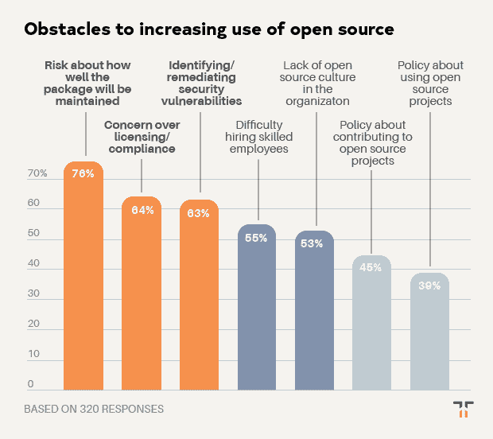

# 开发者对开源最大的担忧是什么？

> 原文：<https://thenewstack.io/what-is-the-biggest-concern-developers-have-about-open-source/>

Tidelift 赞助了这篇文章。

*2019 年 6 月，Tidelift 和 New Stack 联合开展了一项专业软件开发人员调查。近 400 人回答了他们今天如何使用开源软件，是什么阻碍了他们，以及什么工具和策略可以帮助他们更有效地使用它。特别是，通过这次调查，我们有兴趣了解[一个受管理的开源战略](/how-managed-open-source-boosts-developer-productivity-and-saves-money/)如何帮助开发人员节省时间、加快开发速度并降低风险。*

 [克里斯·格拉姆

克里斯是 Tidelift 的营销主管。Chris 在创建开源技术公司方面拥有超过 20 年的经验，包括在 Red Hat 和技术品牌代理 New Kind 各工作了 10 年，在那里他帮助创建了 Ansible、NGINX 和 Anaconda 等品牌。](https://tidelift.com/) 

在本帖中，我们分享八个关键发现中的第二个。如果你不想等待剩下的结果，你可以点击下面的链接下载完整的调查报告。

**发现 2:开发人员对开源最大的担忧是关于项目在未来如何维护的风险。**

在这次调查中，我们询问开发人员，一系列常见的问题在多大程度上阻碍了他们在组织中扩展开源的使用。在我们强调的问题中，最紧迫的属于维护、安全、文化和许可类别。

也许从这个问题中最清楚的发现是，46%的受访者表示，关于软件包在未来如何维护的风险是一个主要或中度障碍，另有 30%的人表示这是一个次要障碍。只有 18%的人表示这对他们来说根本不是障碍。

> 46%的受访者表示，关于软件包在未来如何维护的风险是一个主要或中度障碍，另有 30%的受访者表示这是一个次要障碍。

阻止开发人员扩大使用开源软件的下一个最紧迫的问题是对安全漏洞的识别和补救。超过三分之一或 37%的受访者表示，这是一个主要或中度障碍，另有 25%的人认为这是一个次要障碍。

关于许可和合规性问题的调查结果与我们之前调查的[结果相吻合](https://blog.tidelift.com/what-professional-open-source-users-care-about-most-survey-results-part-2)，其中一些组织认为这是一个严重的障碍，而其他组织则认为这是次要的。作为一个确定的障碍，这个问题排在维护风险之后，但 30%的受访者只认为它是一个较小的障碍，所以没有上面强调的其他问题那么紧迫。

最混杂的反应是围绕组织中的开源文化问题。许多人(43%的受访者)根本不认为这是一个问题，但 53%的人认为这在某种程度上是一个障碍。这一发现表明，许多组织已经接受了开放源码友好的文化，并从中获益，而其他组织则落后了。

这个问题的发现强调了开放源码开发新策略的机会，如[管理的开放源码](/how-managed-open-source-boosts-developer-productivity-and-saves-money/)，以减少维护、安全和许可风险。像 Red Hat、Elastic 和 Cloudera 这样的公司很久以前就认识到，帮助企业成功部署开源技术的方法是[对未来做出承诺](https://blog.tidelift.com/why-do-people-pay-for-open-source)，这些承诺在这三个领域都是值得的。让这些保证不仅适用于操作系统和数据存储，还适用于应用程序开发人员使用的大量开源组件，这是商业开源最有希望的机会之一。

*点击这里查看本系列的[调查结果#1](/theres-one-thing-stopping-developers-from-using-open-source-even-more/) :尽管有压倒性的优势，但对可靠支持可用性的担忧抑制了开源的采用。想在一份报告中获得完整的调查结果吗？现在就让他们过来。*

<svg xmlns:xlink="http://www.w3.org/1999/xlink" viewBox="0 0 68 31" version="1.1"><title>Group</title> <desc>Created with Sketch.</desc></svg>