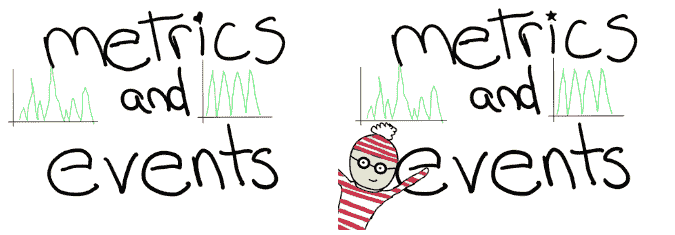
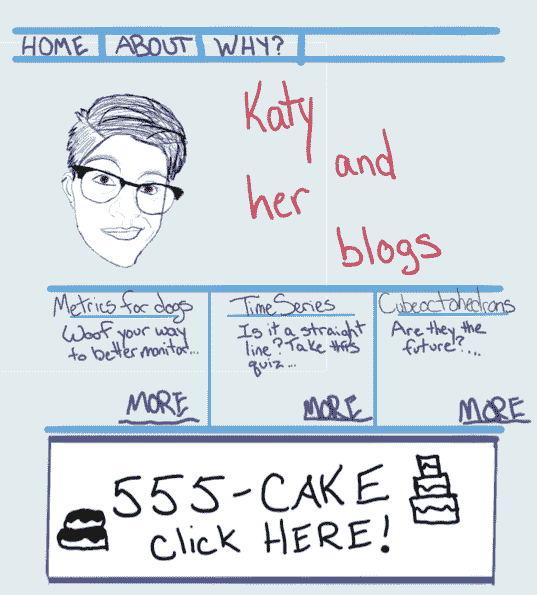

# 度量和事件的区别是什么？

> 原文：<https://thenewstack.io/what-is-the-difference-between-metrics-and-events/>

当我们采用监控技术和工具时，我们会从系统中收集各种类型的数据。例如，我们可能希望同时看到应用程序指标、数据库日志和网络流量。我们并不总是谈论这些类型数据的区别，所以今天我们讨论一个我最常被问到的问题:指标和事件之间的区别是什么？

## 技术差异

 [凯蒂·法默

凯蒂和她的丈夫以及两条狗住在加州的奥克兰(其中至少有一条会和她聊一些有趣的科技话题)。她喜欢试验代码，破坏东西，并试图修复它。她在科罗拉多州丹佛市的图灵软件与设计学院学习编码，这给了她一个绝好的机会，在她知道如何修复之前就把东西弄坏了。](https://www.influxdata.com/) 

指标和事件是两种不同类型的时间序列数据:规则的和不规则的。常规数据(指标)在时间上均匀分布，可用于预测等流程。不规则数据(事件)是不可预测的，尽管它们仍然按时间顺序发生，但事件之间的间隔是不一致的，这意味着使用它们进行预测或平均可能会导致不可靠的结果。

基本的区别在于，指标是定期发生的，而事件不是。假设我正在监控我的个人网站——我想跟踪响应代码以确保该网站可用，所以我会频繁地收集它们。然后，我可以查询这些响应代码指标，以计算出我的站点宕机的时间百分比(因为它太受欢迎了)。但是我也想知道用户什么时候点击广告。我不知道这个点击会在什么时候或者会不会发生，所以定期收集没有意义。如果我在过去的一年里点击了 12 次，平均每个月就会有一次，而不管它们是否都发生在 10 月(我受欢迎的高峰期)。

是时间序列遇上八卦！

为了使用事件数据进行预测或平均，必须将其转换为常规数据。如果你对时间序列数据建模感兴趣，我推荐阅读这篇关于塑造和分析数据的 [博客](https://medium.com/@ATavgen/time-series-modelling-a9bf4f467687) 。如果你正在使用 InfluxDB，你可以在这里 看到一个处理不规则时间序列数据 [的例子。](https://www.influxdata.com/blog/working-with-irregular-time-series/)

因为指标和事件是不同类型的数据，这改变了数据库如何有效地存储和压缩正在接收的数据(例如，不同类型的数据可能需要不同的压缩算法)。这就是为什么在 InfluxDB，我们强调跟踪指标和事件的能力——不是每个系统都可以做到这两者，也不是每个系统都针对这两者进行了优化。理想情况下，我们的数据库完成了它的工作，我们不必担心它处理数据的方式。我们可以将指标和事件发送到 InfluxDB，而无需知道或关心数据库如何区分这两者。

## 实际差异

我们与数据交互的方式取决于数据是规则的还是不规则的，所以有时我们确实需要知道我们正在收集的数据是指标还是事件。例如，度量可以用于聚合，因为我们有在时间上均匀分布的数据。我们不希望使用不规则的数据来寻找聚集，因为它们不会在时间上均匀分布，并且它们会返回一些无用的结果。

## 监控指标和事件

我想密切关注我的存钱罐。现在，我只关心一个指标:总资金。任何人都可以把钱放进我的存钱罐，所以我想以一分钟为间隔报告总资金。这意味着每一分钟，我的数据库都会收到一个数据点，其中包含时间戳和我的存钱罐中的总资金量。

她叫欧奇，是一名优秀的会计。

现在，我想为我的存钱罐跟踪特定的事件:存款和取款。当存款发生时，我的数据库将收到一个带有“存款”标签、时间戳和存款金额的数据点。类似地，当取款发生时，我的数据库将收到一个带有“取款”标签、时间戳和取款金额的数据点。

这个非常简单的数据集确保我的存钱罐报告的资金总额与存款和取款总额相匹配。这和我父母平衡支票簿的方法一样，也是我在零售生涯中关闭收银机的方法。

想象一下，这也是网上银行背后的基本理念。我们可以添加更多的元数据来为事件添加细节，比如将用户 ID 附加到存款或取款上。

## 结论

度量和事件是互补的。监控这两者的能力比以往任何时候都更加必要，不应该让数据科学家能够做到这一点(尽管数据科学家非常酷)。

<svg xmlns:xlink="http://www.w3.org/1999/xlink" viewBox="0 0 68 31" version="1.1"><title>Group</title> <desc>Created with Sketch.</desc></svg>