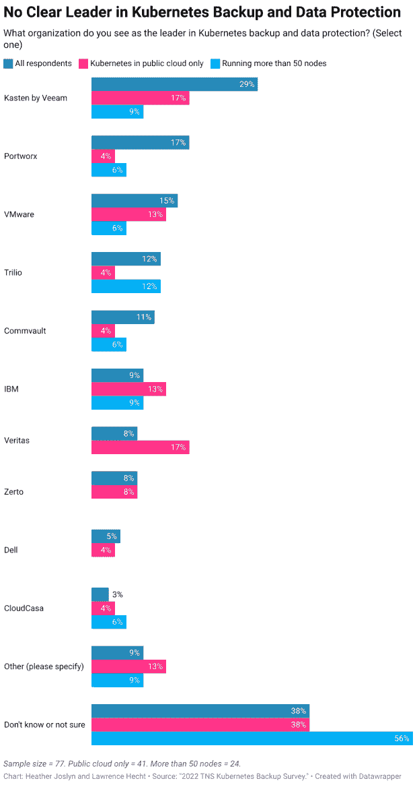

# VMware、Kasten、Portworx 在 Kubernetes 备份调查中名列前茅

> 原文：<https://thenewstack.io/what-is-the-leading-kubernetes-backup-data-protection-vendor/>

随着围绕 Kubernetes 和云原生技术的工具生态系统继续蔓延，甚至一些最常用该技术的 IT 专业人员也可能会迷失在其中。

例证:在一项新的调查中，56%的参与者表示他们的组织至少运行了 50 个 Kubernetes 部署节点，他们不知道或不确定哪个供应商被认为是 Kubernetes 备份和数据保护领域的领导者。

这明显低于 38%的受访者持相同观点。

调查受访者最常提及的三家 Kubernetes (K8s)备份和数据保护供应商是:

这项调查由 New Stack 代表其所有者 Insight Partners 于 10 月和 11 月在网上进行，包括来自 106 名 TNS 读者的回复。在参与调查的人中，34%的人认为自己是开发运维专家，30%的人表示他们的职责与备份或数据保护无关。

## 对停机时间的容忍度低

考虑到该研究还显示出对停机时间的容忍度较低，关于由哪些供应商处理 Kubernetes 备份和数据保护的普遍困惑显得尤为重要。

根据结果:

*   一旦发现问题，52%的受访者组织要求“故障切换/恢复”决策应在 15 分钟或更短时间内完成。
*   与 44%的其余调查参与者相比，这部分调查对象也更有可能使用 PostgreSQL 获取实时生产数据(67%)。他们对停机时间的低容忍度可能是导致这一决定的一个因素。
*   在混合云中运行 Kubernetes 的组织中，60%的受访者表示恢复时间不到一小时；另有 28%的人说这样做至少需要一个小时。

调查结果还提供了 k8 是如何使用的一瞥。总体而言，报告中 82%的参与者使用 Kubernetes 来管理和编排容器化的应用程序。超过一半(51%)的受访者表示，他们仅在公共云上运行 Kubernetes，而 40%的受访者表示，他们在混合环境中部署 k8，包括公共云和内部环境。

其他发现包括:

*   Kubernetes 的部署规模相当大:43%的受访者表示，他们部署了超过 50 个节点。
*   拥有大量 Kubernetes 实现的公司更有可能在 Kubernetes 上运行现有的应用程序。拥有超过 50 个节点的用户中有 94%报告在 K8s 上运行现有的应用程序，相比之下，其他所有人中只有 67%的人这样做。

本次调查的[原始数据](https://docs.google.com/spreadsheets/d/12W9lE81AmUGelDW0Cuh3GXwSJucH8pNleBQSfIX4Et8/edit?usp=sharing)已有。

<svg xmlns:xlink="http://www.w3.org/1999/xlink" viewBox="0 0 68 31" version="1.1"><title>Group</title> <desc>Created with Sketch.</desc></svg>